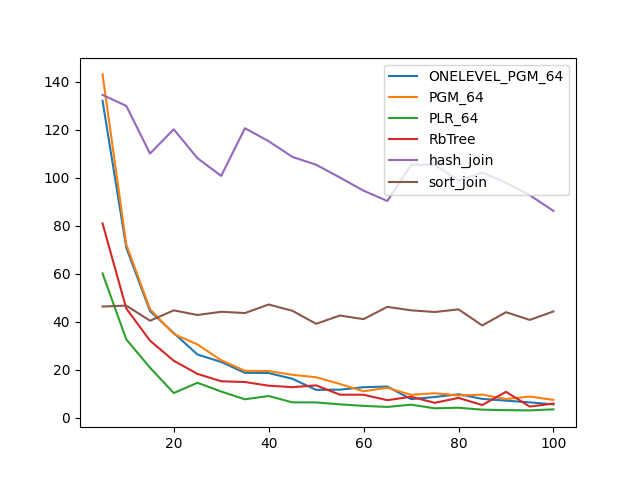
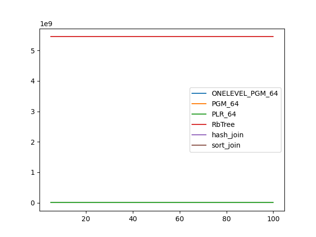
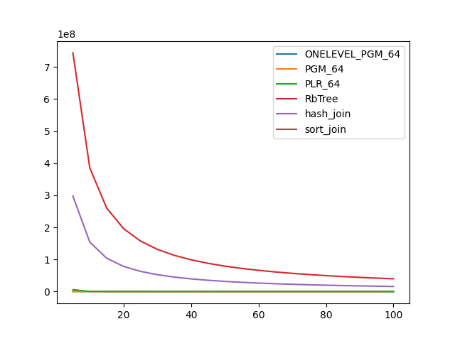

### duration_sec

|   0 |   ONELEVEL_PGM_64 |    PGM_64 |   PLR_64 |   RbTree |   hash_join |   sort_join |
|----:|------------------:|----------:|---------:|---------:|------------:|------------:|
|   5 |         132.026   | 143.006   | 60.1464  | 80.9706  |    134.479  |     46.3577 |
|  10 |          70.8674  |  72.1991  | 32.6717  | 45.5363  |    129.906  |     46.7528 |
|  15 |          44.4884  |  45.2849  | 20.9205  | 32.1652  |    110.031  |     40.4513 |
|  20 |          35.3184  |  34.9589  | 10.3422  | 23.7938  |    120.148  |     44.7717 |
|  25 |          26.3904  |  30.5774  | 14.6252  | 18.3263  |    108.117  |     42.8395 |
|  30 |          23.2977  |  23.9857  | 10.9662  | 15.257   |    100.744  |     44.1815 |
|  35 |          18.7839  |  19.5983  |  7.75261 | 14.9367  |    120.593  |     43.6547 |
|  40 |          18.6681  |  19.5008  |  9.11921 | 13.4169  |    115.19   |     47.2044 |
|  45 |          16.2901  |  17.9508  |  6.4689  | 12.7887  |    108.649  |     44.5971 |
|  50 |          11.6631  |  16.9149  |  6.4442  | 13.5485  |    105.405  |     39.1696 |
|  55 |          11.7623  |  14.1262  |  5.64512 |  9.66545 |    100.077  |     42.6189 |
|  60 |          12.7717  |  11.084   |  5.01089 |  9.63344 |     94.5834 |     41.1203 |
|  65 |          13.0571  |  12.5476  |  4.56729 |  7.37804 |     90.3078 |     46.2316 |
|  70 |           7.82423 |   9.60665 |  5.50066 |  8.81962 |    105.339  |     44.7853 |
|  75 |           8.7026  |  10.2796  |  3.99598 |  6.28341 |    105.454  |     44.0869 |
|  80 |           9.85736 |   9.34617 |  4.23146 |  8.33022 |     98.8076 |     45.1893 |
|  85 |           7.91222 |   9.68011 |  3.42551 |  5.34015 |    102.138  |     38.4901 |
|  90 |           7.17245 |   7.83295 |  3.22691 | 10.8492  |     97.888  |     44.0135 |
|  95 |           6.47405 |   8.89837 |  3.12385 |  4.71969 |     92.7245 |     40.796  |
| 100 |           5.61393 |   7.51099 |  3.56205 |  5.96341 |     86.1743 |     44.3162 |

### inner_index_size

|   0 |   ONELEVEL_PGM_64 |      PGM_64 |    PLR_64 |      RbTree |   hash_join |   sort_join |
|----:|------------------:|------------:|----------:|------------:|------------:|------------:|
|   5 |       6.29626e+06 | 4.33117e+06 | 1.511e+07 | 5.44823e+09 |         nan |         nan |
|  10 |       6.29626e+06 | 4.33117e+06 | 1.511e+07 | 5.44823e+09 |         nan |         nan |
|  15 |       6.29626e+06 | 4.33117e+06 | 1.511e+07 | 5.44823e+09 |         nan |         nan |
|  20 |       6.29626e+06 | 4.33117e+06 | 1.511e+07 | 5.44823e+09 |         nan |         nan |
|  25 |       6.29626e+06 | 4.33117e+06 | 1.511e+07 | 5.44823e+09 |         nan |         nan |
|  30 |       6.29626e+06 | 4.33117e+06 | 1.511e+07 | 5.44823e+09 |         nan |         nan |
|  35 |       6.29626e+06 | 4.33117e+06 | 1.511e+07 | 5.44823e+09 |         nan |         nan |
|  40 |       6.29626e+06 | 4.33117e+06 | 1.511e+07 | 5.44823e+09 |         nan |         nan |
|  45 |       6.29626e+06 | 4.33117e+06 | 1.511e+07 | 5.44823e+09 |         nan |         nan |
|  50 |       6.29626e+06 | 4.33117e+06 | 1.511e+07 | 5.44823e+09 |         nan |         nan |
|  55 |       6.29626e+06 | 4.33117e+06 | 1.511e+07 | 5.44823e+09 |         nan |         nan |
|  60 |       6.29626e+06 | 4.33117e+06 | 1.511e+07 | 5.44823e+09 |         nan |         nan |
|  65 |       6.29626e+06 | 4.33117e+06 | 1.511e+07 | 5.44823e+09 |         nan |         nan |
|  70 |       6.29626e+06 | 4.33117e+06 | 1.511e+07 | 5.44823e+09 |         nan |         nan |
|  75 |       6.29626e+06 | 4.33117e+06 | 1.511e+07 | 5.44823e+09 |         nan |         nan |
|  80 |       6.29626e+06 | 4.33117e+06 | 1.511e+07 | 5.44823e+09 |         nan |         nan |
|  85 |       6.29626e+06 | 4.33117e+06 | 1.511e+07 | 5.44823e+09 |         nan |         nan |
|  90 |       6.29626e+06 | 4.33117e+06 | 1.511e+07 | 5.44823e+09 |         nan |         nan |
|  95 |       6.29626e+06 | 4.33117e+06 | 1.511e+07 | 5.44823e+09 |         nan |         nan |
| 100 |       6.29626e+06 | 4.33117e+06 | 1.511e+07 | 5.44823e+09 |         nan |         nan |

### outer_index_size

|   0 |   ONELEVEL_PGM_64 |   PGM_64 |           PLR_64 |      RbTree |   hash_join |   sort_join |
|----:|------------------:|---------:|-----------------:|------------:|------------:|------------:|
|   5 |            311760 |   212600 |      5.90867e+06 | 7.4403e+08  | 2.97612e+08 |         nan |
|  10 |            242256 |   166264 | 507904           | 3.8568e+08  | 1.54272e+08 |         nan |
|  15 |            242256 |   166264 | 344064           | 2.60265e+08 | 1.04106e+08 |         nan |
|  20 |            242232 |   166248 | 331840           | 1.96366e+08 | 7.85464e+07 |         nan |
|  25 |            223176 |   153544 | 327936           | 1.57689e+08 | 6.30754e+07 |         nan |
|  30 |            121920 |    83736 | 326528           | 1.31721e+08 | 5.26884e+07 |         nan |
|  35 |            121152 |    83224 | 325952           | 1.13094e+08 | 4.52378e+07 |         nan |
|  40 |            121152 |    83224 | 289152           | 9.90973e+07 | 3.96389e+07 |         nan |
|  45 |            121152 |    83224 | 213824           | 8.81675e+07 | 3.5267e+07  |         nan |
|  50 |            121152 |    83224 | 179488           | 7.9413e+07  | 3.17652e+07 |         nan |
|  55 |            121152 |    83224 | 168480           | 7.22358e+07 | 2.88943e+07 |         nan |
|  60 |            121152 |    83224 | 164384           | 6.62652e+07 | 2.65061e+07 |         nan |
|  65 |            121152 |    83224 | 163168           | 6.11964e+07 | 2.44786e+07 |         nan |
|  70 |            121152 |    83224 | 162528           | 5.68391e+07 | 2.27356e+07 |         nan |
|  75 |            121152 |    83224 | 162208           | 5.30806e+07 | 2.12322e+07 |         nan |
|  80 |            121152 |    83224 | 162304           | 4.97646e+07 | 1.99059e+07 |         nan |
|  85 |            121152 |    83224 | 162176           | 4.68529e+07 | 1.87412e+07 |         nan |
|  90 |            121128 |    83208 | 162208           | 4.42681e+07 | 1.77072e+07 |         nan |
|  95 |            121128 |    83208 | 161856           | 4.19472e+07 | 1.67789e+07 |         nan |
| 100 |            120984 |    83112 | 161888           | 3.98572e+07 | 1.59429e+07 |         nan |

