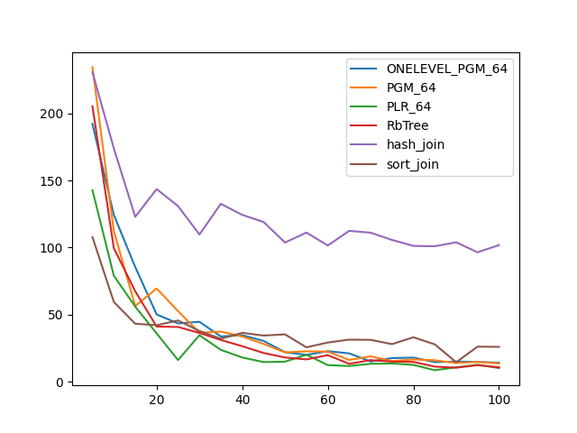
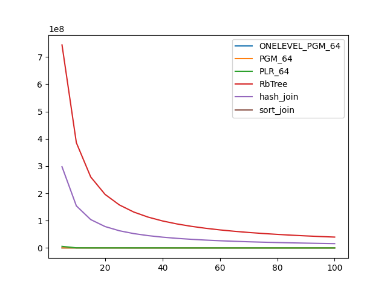

### duration_sec

|   0 |   ONELEVEL_PGM_64 |   PGM_64 |    PLR_64 |   RbTree |   hash_join |   sort_join |
|----:|------------------:|---------:|----------:|---------:|------------:|------------:|
|   5 |          192.137  | 234.494  | 142.745   | 205.296  |    230.631  |    107.71   |
|  10 |          124.312  | 112.269  |  78.8997  |  99.504  |    173.927  |     59.3945 |
|  15 |           85.4297 |  56.3439 |  55.8907  |  67.3705 |    122.887  |     43.1481 |
|  20 |           50.0989 |  69.4338 |  35.9434  |  41.039  |    143.54   |     42.0774 |
|  25 |           43.381  |  52.5987 |  16.0696  |  40.7642 |    130.895  |     45.5851 |
|  30 |           44.6042 |  36.4124 |  34.5789  |  36.27   |    109.686  |     37.7732 |
|  35 |           33.6668 |  37.3171 |  23.7047  |  31.0277 |    132.559  |     31.9422 |
|  40 |           34.6177 |  33.6356 |  18.0089  |  26.4282 |    124.334  |     36.3695 |
|  45 |           30.3421 |  28.078  |  14.5704  |  21.3296 |    119.006  |     34.345  |
|  50 |           21.9286 |  21.8024 |  14.8745  |  18.0072 |    103.685  |     35.2347 |
|  55 |           19.9209 |  22.5993 |  20.0821  |  16.5679 |    111.151  |     25.5687 |
|  60 |           22.6879 |  22.3456 |  12.3014  |  19.7374 |    101.499  |     29.1603 |
|  65 |           21.0609 |  16.1551 |  11.6611  |  13.2684 |    112.415  |     31.3001 |
|  70 |           15.0004 |  18.8396 |  13.2811  |  16.0415 |    111.046  |     31.1491 |
|  75 |           17.5427 |  15.3306 |  13.5077  |  14.888  |    105.645  |     27.963  |
|  80 |           17.9049 |  16.5358 |  12.4886  |  14.6738 |    101.2    |     33.0598 |
|  85 |           14.5562 |  15.9373 |   8.50282 |  11.1897 |    100.919  |     27.7631 |
|  90 |           14.9442 |  13.884  |  10.684   |  10.3762 |    103.888  |     14.4347 |
|  95 |           14.7292 |  14.6613 |  12.5228  |  12.2556 |     96.4007 |     26.0845 |
| 100 |           14.0904 |  13.5718 |  10.1543  |  10.7024 |    101.798  |     25.9049 |

### inner_index_size

|   0 |   ONELEVEL_PGM_64 |      PGM_64 |    PLR_64 |      RbTree |   hash_join |   sort_join |
|----:|------------------:|------------:|----------:|------------:|------------:|------------:|
|   5 |       6.29626e+06 | 4.33117e+06 | 1.511e+07 | 5.44823e+09 |         nan |         nan |
|  10 |       6.29626e+06 | 4.33117e+06 | 1.511e+07 | 5.44823e+09 |         nan |         nan |
|  15 |       6.29626e+06 | 4.33117e+06 | 1.511e+07 | 5.44823e+09 |         nan |         nan |
|  20 |       6.29626e+06 | 4.33117e+06 | 1.511e+07 | 5.44823e+09 |         nan |         nan |
|  25 |       6.29626e+06 | 4.33117e+06 | 1.511e+07 | 5.44823e+09 |         nan |         nan |
|  30 |       6.29626e+06 | 4.33117e+06 | 1.511e+07 | 5.44823e+09 |         nan |         nan |
|  35 |       6.29626e+06 | 4.33117e+06 | 1.511e+07 | 5.44823e+09 |         nan |         nan |
|  40 |       6.29626e+06 | 4.33117e+06 | 1.511e+07 | 5.44823e+09 |         nan |         nan |
|  45 |       6.29626e+06 | 4.33117e+06 | 1.511e+07 | 5.44823e+09 |         nan |         nan |
|  50 |       6.29626e+06 | 4.33117e+06 | 1.511e+07 | 5.44823e+09 |         nan |         nan |
|  55 |       6.29626e+06 | 4.33117e+06 | 1.511e+07 | 5.44823e+09 |         nan |         nan |
|  60 |       6.29626e+06 | 4.33117e+06 | 1.511e+07 | 5.44823e+09 |         nan |         nan |
|  65 |       6.29626e+06 | 4.33117e+06 | 1.511e+07 | 5.44823e+09 |         nan |         nan |
|  70 |       6.29626e+06 | 4.33117e+06 | 1.511e+07 | 5.44823e+09 |         nan |         nan |
|  75 |       6.29626e+06 | 4.33117e+06 | 1.511e+07 | 5.44823e+09 |         nan |         nan |
|  80 |       6.29626e+06 | 4.33117e+06 | 1.511e+07 | 5.44823e+09 |         nan |         nan |
|  85 |       6.29626e+06 | 4.33117e+06 | 1.511e+07 | 5.44823e+09 |         nan |         nan |
|  90 |       6.29626e+06 | 4.33117e+06 | 1.511e+07 | 5.44823e+09 |         nan |         nan |
|  95 |       6.29626e+06 | 4.33117e+06 | 1.511e+07 | 5.44823e+09 |         nan |         nan |
| 100 |       6.29626e+06 | 4.33117e+06 | 1.511e+07 | 5.44823e+09 |         nan |         nan |

### outer_index_size

|   0 |   ONELEVEL_PGM_64 |   PGM_64 |          PLR_64 |      RbTree |   hash_join |   sort_join |
|----:|------------------:|---------:|----------------:|------------:|------------:|------------:|
|   5 |            312552 |   213128 |      5.9015e+06 | 7.44019e+08 | 2.97607e+08 |         nan |
|  10 |            242256 |   166264 | 507360          | 3.85696e+08 | 1.54278e+08 |         nan |
|  15 |            242256 |   166264 | 345184          | 2.60247e+08 | 1.04099e+08 |         nan |
|  20 |            242256 |   166264 | 330336          | 1.96347e+08 | 7.85387e+07 |         nan |
|  25 |            222288 |   152952 | 327456          | 1.5767e+08  | 6.30679e+07 |         nan |
|  30 |            121824 |    83672 | 326720          | 1.31711e+08 | 5.26845e+07 |         nan |
|  35 |            121152 |    83224 | 325856          | 1.13095e+08 | 4.52379e+07 |         nan |
|  40 |            121152 |    83224 | 288160          | 9.90918e+07 | 3.96367e+07 |         nan |
|  45 |            121152 |    83224 | 213536          | 8.81648e+07 | 3.52659e+07 |         nan |
|  50 |            121152 |    83224 | 180032          | 7.9419e+07  | 3.17676e+07 |         nan |
|  55 |            121152 |    83224 | 167648          | 7.22434e+07 | 2.88973e+07 |         nan |
|  60 |            121152 |    83224 | 164288          | 6.62624e+07 | 2.6505e+07  |         nan |
|  65 |            121152 |    83224 | 163072          | 6.11916e+07 | 2.44766e+07 |         nan |
|  70 |            121152 |    83224 | 162752          | 5.68452e+07 | 2.27381e+07 |         nan |
|  75 |            121152 |    83224 | 162144          | 5.30752e+07 | 2.12301e+07 |         nan |
|  80 |            121152 |    83224 | 162432          | 4.97731e+07 | 1.99092e+07 |         nan |
|  85 |            121152 |    83224 | 162272          | 4.6858e+07  | 1.87432e+07 |         nan |
|  90 |            121152 |    83224 | 162048          | 4.42633e+07 | 1.77053e+07 |         nan |
|  95 |            121104 |    83192 | 161952          | 4.19406e+07 | 1.67762e+07 |         nan |
| 100 |            121032 |    83144 | 162112          | 3.98562e+07 | 1.59425e+07 |         nan |

