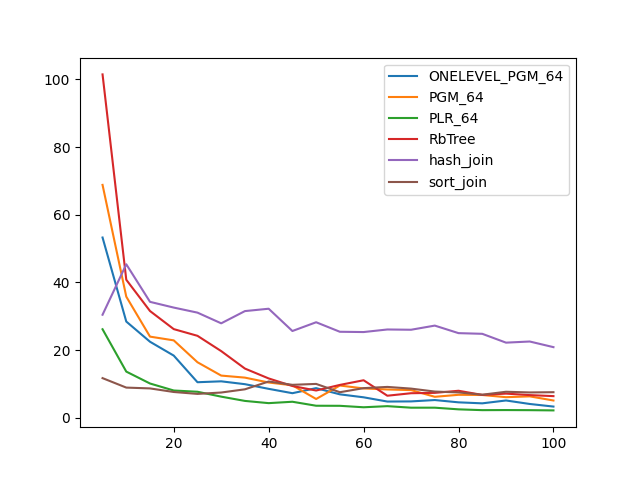
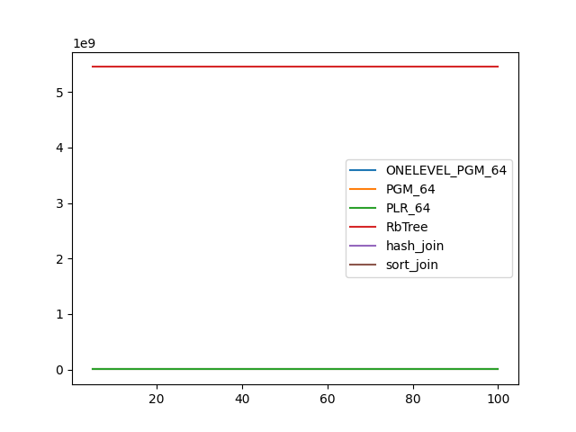
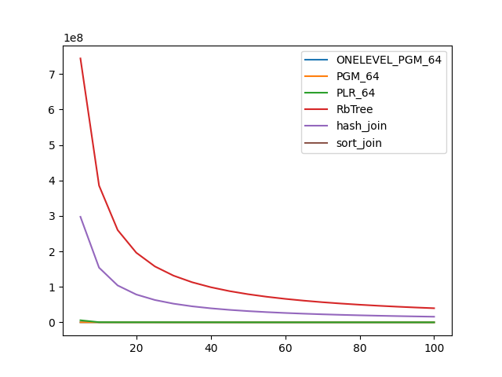

### duration_sec

|   0 |   ONELEVEL_PGM_64 |   PGM_64 |   PLR_64 |    RbTree |   hash_join |   sort_join |
|----:|------------------:|---------:|---------:|----------:|------------:|------------:|
|   5 |          53.2611  | 68.8199  | 26.1467  | 101.48    |     30.4355 |    11.699   |
|  10 |          28.4215  | 35.7813  | 13.6281  |  40.7776  |     45.3543 |     8.89969 |
|  15 |          22.4534  | 23.9664  | 10.1075  |  31.5323  |     34.2455 |     8.65824 |
|  20 |          18.3571  | 22.8599  |  8.03829 |  26.1878  |     32.553  |     7.6006  |
|  25 |          10.4854  | 16.3914  |  7.66964 |  24.2057  |     31.0587 |     7.03528 |
|  30 |          10.7525  | 12.4493  |  6.2225  |  19.6854  |     27.8993 |     7.44184 |
|  35 |           9.90693 | 11.8465  |  4.961   |  14.5214  |     31.5148 |     8.39357 |
|  40 |           8.53008 | 10.3985  |  4.30403 |  11.6061  |     32.2126 |    10.6987  |
|  45 |           7.24336 |  9.5772  |  4.71578 |   9.36768 |     25.6259 |     9.71941 |
|  50 |           8.7419  |  5.53057 |  3.53673 |   8.03704 |     28.2154 |     9.98787 |
|  55 |           6.90418 |  9.51047 |  3.51504 |   9.68986 |     25.4007 |     7.53366 |
|  60 |           6.0291  |  8.65653 |  3.08496 |  11.0694  |     25.317  |     8.73615 |
|  65 |           4.77531 |  8.34672 |  3.41281 |   6.49633 |     26.0773 |     9.10197 |
|  70 |           4.81707 |  8.16409 |  2.96017 |   7.23537 |     25.9995 |     8.60034 |
|  75 |           5.22051 |  6.17792 |  2.9607  |   7.34317 |     27.2249 |     7.72547 |
|  80 |           4.54066 |  6.76961 |  2.46974 |   7.9642  |     24.9973 |     7.47026 |
|  85 |           4.24431 |  6.71057 |  2.23226 |   6.7318  |     24.7965 |     6.79783 |
|  90 |           5.09024 |  6.06415 |  2.25798 |   7.12073 |     22.1874 |     7.66704 |
|  95 |           4.05941 |  6.30628 |  2.22812 |   6.68043 |     22.5218 |     7.46738 |
| 100 |           3.29015 |  5.08584 |  2.15829 |   6.37736 |     20.856  |     7.53921 |

### inner_index_size

|   0 |   ONELEVEL_PGM_64 |      PGM_64 |    PLR_64 |      RbTree |   hash_join |   sort_join |
|----:|------------------:|------------:|----------:|------------:|------------:|------------:|
|   5 |       6.29626e+06 | 4.33117e+06 | 1.511e+07 | 5.44823e+09 |         nan |         nan |
|  10 |       6.29626e+06 | 4.33117e+06 | 1.511e+07 | 5.44823e+09 |         nan |         nan |
|  15 |       6.29626e+06 | 4.33117e+06 | 1.511e+07 | 5.44823e+09 |         nan |         nan |
|  20 |       6.29626e+06 | 4.33117e+06 | 1.511e+07 | 5.44823e+09 |         nan |         nan |
|  25 |       6.29626e+06 | 4.33117e+06 | 1.511e+07 | 5.44823e+09 |         nan |         nan |
|  30 |       6.29626e+06 | 4.33117e+06 | 1.511e+07 | 5.44823e+09 |         nan |         nan |
|  35 |       6.29626e+06 | 4.33117e+06 | 1.511e+07 | 5.44823e+09 |         nan |         nan |
|  40 |       6.29626e+06 | 4.33117e+06 | 1.511e+07 | 5.44823e+09 |         nan |         nan |
|  45 |       6.29626e+06 | 4.33117e+06 | 1.511e+07 | 5.44823e+09 |         nan |         nan |
|  50 |       6.29626e+06 | 4.33117e+06 | 1.511e+07 | 5.44823e+09 |         nan |         nan |
|  55 |       6.29626e+06 | 4.33117e+06 | 1.511e+07 | 5.44823e+09 |         nan |         nan |
|  60 |       6.29626e+06 | 4.33117e+06 | 1.511e+07 | 5.44823e+09 |         nan |         nan |
|  65 |       6.29626e+06 | 4.33117e+06 | 1.511e+07 | 5.44823e+09 |         nan |         nan |
|  70 |       6.29626e+06 | 4.33117e+06 | 1.511e+07 | 5.44823e+09 |         nan |         nan |
|  75 |       6.29626e+06 | 4.33117e+06 | 1.511e+07 | 5.44823e+09 |         nan |         nan |
|  80 |       6.29626e+06 | 4.33117e+06 | 1.511e+07 | 5.44823e+09 |         nan |         nan |
|  85 |       6.29626e+06 | 4.33117e+06 | 1.511e+07 | 5.44823e+09 |         nan |         nan |
|  90 |       6.29626e+06 | 4.33117e+06 | 1.511e+07 | 5.44823e+09 |         nan |         nan |
|  95 |       6.29626e+06 | 4.33117e+06 | 1.511e+07 | 5.44823e+09 |         nan |         nan |
| 100 |       6.29626e+06 | 4.33117e+06 | 1.511e+07 | 5.44823e+09 |         nan |         nan |

### outer_index_size

|   0 |   ONELEVEL_PGM_64 |   PGM_64 |           PLR_64 |      RbTree |   hash_join |   sort_join |
|----:|------------------:|---------:|-----------------:|------------:|------------:|------------:|
|   5 |            311496 |   212424 |      5.90576e+06 | 7.44001e+08 | 2.976e+08   |         nan |
|  10 |            242256 |   166264 | 505152           | 3.85688e+08 | 1.54275e+08 |         nan |
|  15 |            242256 |   166264 | 344960           | 2.60231e+08 | 1.04092e+08 |         nan |
|  20 |            242232 |   166248 | 331200           | 1.96377e+08 | 7.85508e+07 |         nan |
|  25 |            223536 |   153784 | 328032           | 1.57687e+08 | 6.3075e+07  |         nan |
|  30 |            121680 |    83576 | 326656           | 1.31712e+08 | 5.26847e+07 |         nan |
|  35 |            121152 |    83224 | 325984           | 1.13101e+08 | 4.52403e+07 |         nan |
|  40 |            121152 |    83224 | 288704           | 9.90881e+07 | 3.96352e+07 |         nan |
|  45 |            121152 |    83224 | 214304           | 8.81638e+07 | 3.52655e+07 |         nan |
|  50 |            121152 |    83224 | 178848           | 7.94133e+07 | 3.17653e+07 |         nan |
|  55 |            121152 |    83224 | 167488           | 7.22467e+07 | 2.88987e+07 |         nan |
|  60 |            121152 |    83224 | 164480           | 6.62632e+07 | 2.65053e+07 |         nan |
|  65 |            121152 |    83224 | 163040           | 6.11935e+07 | 2.44774e+07 |         nan |
|  70 |            121152 |    83224 | 162496           | 5.68346e+07 | 2.27338e+07 |         nan |
|  75 |            121152 |    83224 | 162656           | 5.30702e+07 | 2.12281e+07 |         nan |
|  80 |            121152 |    83224 | 162304           | 4.97656e+07 | 1.99063e+07 |         nan |
|  85 |            121152 |    83224 | 162144           | 4.68569e+07 | 1.87428e+07 |         nan |
|  90 |            121152 |    83224 | 162240           | 4.42614e+07 | 1.77046e+07 |         nan |
|  95 |            121128 |    83208 | 161792           | 4.1945e+07  | 1.6778e+07  |         nan |
| 100 |            121080 |    83176 | 161824           | 3.98504e+07 | 1.59402e+07 |         nan |

