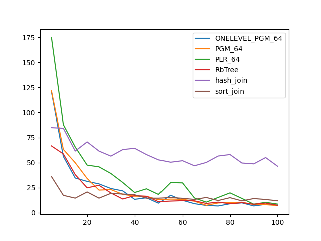
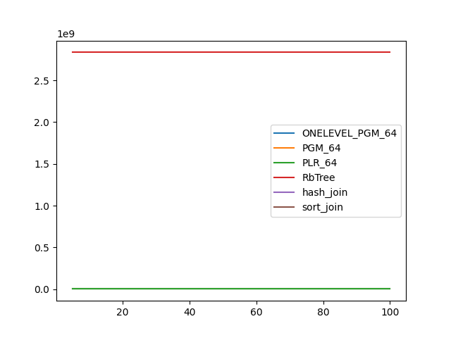
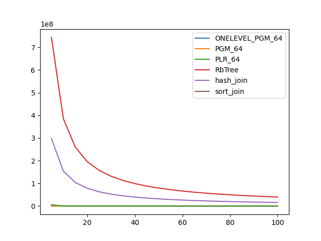

### duration_sec

|   0 |   ONELEVEL_PGM_64 |   PGM_64 |    PLR_64 |   RbTree |   hash_join |   sort_join |
|----:|------------------:|---------:|----------:|---------:|------------:|------------:|
|   5 |          95.1299  | 76.358   | 129.118   | 81.5629  |     67.8846 |     55.1577 |
|  10 |          60.6786  | 64.2604  | 110.564   | 39.4483  |     64.5901 |     25.4255 |
|  15 |          30.7385  | 40.5608  |  73.6923  | 24.1099  |     60.228  |     32.4365 |
|  20 |          31.2089  | 25.2098  |  35.924   | 22.4902  |     67.1975 |     31.8226 |
|  25 |          25.0961  | 24.9326  |  39.652   | 23.1453  |     60.3048 |     21.4668 |
|  30 |          15.1521  | 21.5316  |  49.8097  | 15.9978  |     53.1603 |     29.0006 |
|  35 |          18.7922  | 11.5572  |  33.7646  |  9.63372 |     64.8855 |     24.5199 |
|  40 |          12.0001  | 14.8632  |  26.7322  |  9.48067 |     53.7723 |     24.5849 |
|  45 |          14.3096  | 12.1922  |  16.508   | 11.4029  |     54.7254 |     20.7224 |
|  50 |          13.2534  | 13.7121  |  13.8148  |  8.58476 |     56.7418 |     23.5888 |
|  55 |           7.91253 | 11.9989  |   9.78884 | 10.896   |     44.8414 |     22.5342 |
|  60 |          10.451   | 11.9434  |  12.3723  |  6.58922 |     47.2281 |     25.5081 |
|  65 |           9.79266 | 10.3001  |  22.5136  |  9.23203 |     47.3972 |     27.0561 |
|  70 |           6.42005 | 10.2777  |  23.1531  |  5.76663 |     55.7826 |     23.9908 |
|  75 |           8.35533 |  8.53489 |  23.073   |  8.32923 |     52.3717 |     25.3393 |
|  80 |           7.09817 |  7.70619 |   7.07931 |  5.65166 |     54.676  |     23.9384 |
|  85 |           8.13441 |  4.92203 |   7.67102 |  4.45917 |     51.5083 |     21.6102 |
|  90 |           6.98316 |  4.55246 |  12.7495  |  5.17306 |     49.1137 |     24.0562 |
|  95 |           4.94361 |  6.17054 |   8.19505 |  5.87108 |     45.9588 |     22.7933 |
| 100 |           6.67495 |  5.73942 |   4.07024 |  5.84227 |     49.588  |     22.3417 |

### inner_index_size

|   0 |   ONELEVEL_PGM_64 |      PGM_64 |     PLR_64 |     RbTree |   hash_join |   sort_join |
|----:|------------------:|------------:|-----------:|-----------:|------------:|------------:|
|   5 |       4.35929e+06 | 2.98942e+06 | 8.6689e+06 | 2.8337e+09 |         nan |         nan |
|  10 |       4.35929e+06 | 2.98942e+06 | 8.6689e+06 | 2.8337e+09 |         nan |         nan |
|  15 |       4.35929e+06 | 2.98942e+06 | 8.6689e+06 | 2.8337e+09 |         nan |         nan |
|  20 |       4.35929e+06 | 2.98942e+06 | 8.6689e+06 | 2.8337e+09 |         nan |         nan |
|  25 |       4.35929e+06 | 2.98942e+06 | 8.6689e+06 | 2.8337e+09 |         nan |         nan |
|  30 |       4.35929e+06 | 2.98942e+06 | 8.6689e+06 | 2.8337e+09 |         nan |         nan |
|  35 |       4.35929e+06 | 2.98942e+06 | 8.6689e+06 | 2.8337e+09 |         nan |         nan |
|  40 |       4.35929e+06 | 2.98942e+06 | 8.6689e+06 | 2.8337e+09 |         nan |         nan |
|  45 |       4.35929e+06 | 2.98942e+06 | 8.6689e+06 | 2.8337e+09 |         nan |         nan |
|  50 |       4.35929e+06 | 2.98942e+06 | 8.6689e+06 | 2.8337e+09 |         nan |         nan |
|  55 |       4.35929e+06 | 2.98942e+06 | 8.6689e+06 | 2.8337e+09 |         nan |         nan |
|  60 |       4.35929e+06 | 2.98942e+06 | 8.6689e+06 | 2.8337e+09 |         nan |         nan |
|  65 |       4.35929e+06 | 2.98942e+06 | 8.6689e+06 | 2.8337e+09 |         nan |         nan |
|  70 |       4.35929e+06 | 2.98942e+06 | 8.6689e+06 | 2.8337e+09 |         nan |         nan |
|  75 |       4.35929e+06 | 2.98942e+06 | 8.6689e+06 | 2.8337e+09 |         nan |         nan |
|  80 |       4.35929e+06 | 2.98942e+06 | 8.6689e+06 | 2.8337e+09 |         nan |         nan |
|  85 |       4.35929e+06 | 2.98942e+06 | 8.6689e+06 | 2.8337e+09 |         nan |         nan |
|  90 |       4.35929e+06 | 2.98942e+06 | 8.6689e+06 | 2.8337e+09 |         nan |         nan |
|  95 |       4.35929e+06 | 2.98942e+06 | 8.6689e+06 | 2.8337e+09 |         nan |         nan |
| 100 |       4.35929e+06 | 2.98942e+06 | 8.6689e+06 | 2.8337e+09 |         nan |         nan |

### outer_index_size

|   0 |   ONELEVEL_PGM_64 |   PGM_64 |           PLR_64 |      RbTree |   hash_join |   sort_join |
|----:|------------------:|---------:|-----------------:|------------:|------------:|------------:|
|   5 |            312048 |   212792 |      5.90614e+06 | 7.43996e+08 | 2.97598e+08 |         nan |
|  10 |            242256 |   166264 | 508032           | 3.85721e+08 | 1.54288e+08 |         nan |
|  15 |            242256 |   166264 | 345280           | 2.60285e+08 | 1.04114e+08 |         nan |
|  20 |            242232 |   166248 | 330432           | 1.96416e+08 | 7.85664e+07 |         nan |
|  25 |            224184 |   154216 | 327456           | 1.57721e+08 | 6.30884e+07 |         nan |
|  30 |            121776 |    83640 | 327296           | 1.31755e+08 | 5.27021e+07 |         nan |
|  35 |            121152 |    83224 | 325856           | 1.13144e+08 | 4.52576e+07 |         nan |
|  40 |            121152 |    83224 | 287648           | 9.91332e+07 | 3.96533e+07 |         nan |
|  45 |            121152 |    83224 | 214400           | 8.82032e+07 | 3.52813e+07 |         nan |
|  50 |            121152 |    83224 | 180768           | 7.94535e+07 | 3.17814e+07 |         nan |
|  55 |            121152 |    83224 | 168032           | 7.22828e+07 | 2.89131e+07 |         nan |
|  60 |            121152 |    83224 | 163840           | 6.63007e+07 | 2.65203e+07 |         nan |
|  65 |            121152 |    83224 | 162912           | 6.12366e+07 | 2.44946e+07 |         nan |
|  70 |            121152 |    83224 | 162624           | 5.68826e+07 | 2.27531e+07 |         nan |
|  75 |            121152 |    83224 | 162368           | 5.3107e+07  | 2.12428e+07 |         nan |
|  80 |            121152 |    83224 | 162272           | 4.98121e+07 | 1.99248e+07 |         nan |
|  85 |            121152 |    83224 | 162208           | 4.6897e+07  | 1.87588e+07 |         nan |
|  90 |            121152 |    83224 | 161952           | 4.43034e+07 | 1.77213e+07 |         nan |
|  95 |            121128 |    83208 | 162016           | 4.19811e+07 | 1.67924e+07 |         nan |
| 100 |            121056 |    83160 | 161920           | 3.98941e+07 | 1.59576e+07 |         nan |

