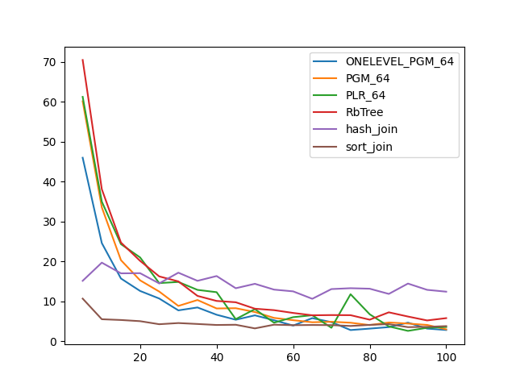
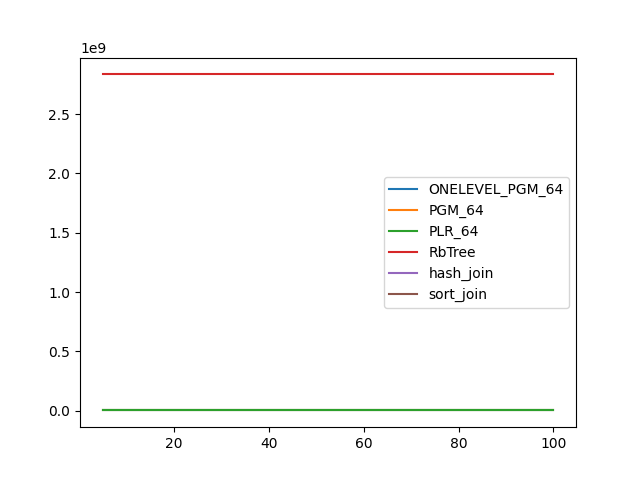
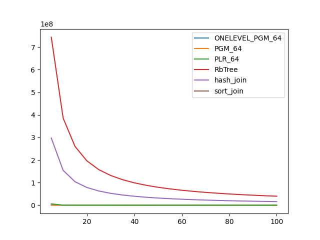

### duration_sec

|   0 |   ONELEVEL_PGM_64 |   PGM_64 |   PLR_64 |   RbTree |   hash_join |   sort_join |
|----:|------------------:|---------:|---------:|---------:|------------:|------------:|
|   5 |          45.9739  | 60.1068  | 61.2154  | 70.4504  |     15.1562 |    10.6974  |
|  10 |          24.599   | 33.5456  | 34.9798  | 38.0884  |     19.7023 |     5.53079 |
|  15 |          15.7324  | 20.3275  | 24.3419  | 24.7403  |     17.024  |     5.34161 |
|  20 |          12.6165  | 15.2775  | 21.0137  | 20.155   |     17.0641 |     5.0472  |
|  25 |          10.7197  | 12.4629  | 14.5805  | 16.2557  |     14.5003 |     4.28354 |
|  30 |           7.75336 |  8.86345 | 14.8702  | 15.0046  |     17.1904 |     4.57655 |
|  35 |           8.47999 | 10.3443  | 12.8831  | 11.3769  |     15.1485 |     4.34351 |
|  40 |           6.65548 |  8.2308  | 12.3041  | 10.1124  |     16.3464 |     4.09338 |
|  45 |           5.40585 |  8.29327 |  5.54894 |  9.78287 |     13.2957 |     4.14982 |
|  50 |           6.50451 |  7.33578 |  8.06615 |  8.16926 |     14.4032 |     3.23758 |
|  55 |           5.27926 |  5.8678  |  4.66325 |  7.807   |     12.9513 |     4.16639 |
|  60 |           3.94724 |  5.29296 |  6.04457 |  7.10605 |     12.5108 |     4.04395 |
|  65 |           5.8115  |  4.77515 |  6.53708 |  6.5205  |     10.6482 |     4.09108 |
|  70 |           4.8057  |  4.90061 |  3.38996 |  6.57569 |     13.0843 |     4.06102 |
|  75 |           2.82181 |  4.66074 | 11.7964  |  6.54772 |     13.301  |     3.84415 |
|  80 |           3.18234 |  4.06845 |  6.77476 |  5.4187  |     13.1755 |     4.11716 |
|  85 |           3.56024 |  4.71957 |  3.73195 |  7.26103 |     11.873  |     4.31036 |
|  90 |           4.67971 |  4.44592 |  2.61386 |  6.20848 |     14.4626 |     3.55157 |
|  95 |           3.1864  |  4.10868 |  3.38893 |  5.22932 |     12.8928 |     3.62364 |
| 100 |           2.83985 |  3.00111 |  3.58022 |  5.80654 |     12.4337 |     3.80844 |

### inner_index_size

|   0 |   ONELEVEL_PGM_64 |      PGM_64 |      PLR_64 |      RbTree |   hash_join |   sort_join |
|----:|------------------:|------------:|------------:|------------:|------------:|------------:|
|   5 |       4.35929e+06 | 2.98942e+06 | 8.70106e+06 | 2.83364e+09 |         nan |         nan |
|  10 |       4.35929e+06 | 2.98942e+06 | 8.70106e+06 | 2.83364e+09 |         nan |         nan |
|  15 |       4.35929e+06 | 2.98942e+06 | 8.70106e+06 | 2.83364e+09 |         nan |         nan |
|  20 |       4.35929e+06 | 2.98942e+06 | 8.70106e+06 | 2.83364e+09 |         nan |         nan |
|  25 |       4.35929e+06 | 2.98942e+06 | 8.70106e+06 | 2.83364e+09 |         nan |         nan |
|  30 |       4.35929e+06 | 2.98942e+06 | 8.70106e+06 | 2.83364e+09 |         nan |         nan |
|  35 |       4.35929e+06 | 2.98942e+06 | 8.70106e+06 | 2.83364e+09 |         nan |         nan |
|  40 |       4.35929e+06 | 2.98942e+06 | 8.70106e+06 | 2.83364e+09 |         nan |         nan |
|  45 |       4.35929e+06 | 2.98942e+06 | 8.70106e+06 | 2.83364e+09 |         nan |         nan |
|  50 |       4.35929e+06 | 2.98942e+06 | 8.70106e+06 | 2.83364e+09 |         nan |         nan |
|  55 |       4.35929e+06 | 2.98942e+06 | 8.70106e+06 | 2.83364e+09 |         nan |         nan |
|  60 |       4.35929e+06 | 2.98942e+06 | 8.70106e+06 | 2.83364e+09 |         nan |         nan |
|  65 |       4.35929e+06 | 2.98942e+06 | 8.70106e+06 | 2.83364e+09 |         nan |         nan |
|  70 |       4.35929e+06 | 2.98942e+06 | 8.70106e+06 | 2.83364e+09 |         nan |         nan |
|  75 |       4.35929e+06 | 2.98942e+06 | 8.70106e+06 | 2.83364e+09 |         nan |         nan |
|  80 |       4.35929e+06 | 2.98942e+06 | 8.70106e+06 | 2.83364e+09 |         nan |         nan |
|  85 |       4.35929e+06 | 2.98942e+06 | 8.70106e+06 | 2.83364e+09 |         nan |         nan |
|  90 |       4.35929e+06 | 2.98942e+06 | 8.70106e+06 | 2.83364e+09 |         nan |         nan |
|  95 |       4.35929e+06 | 2.98942e+06 | 8.70106e+06 | 2.83364e+09 |         nan |         nan |
| 100 |       4.35929e+06 | 2.98942e+06 | 8.70106e+06 | 2.83364e+09 |         nan |         nan |

### outer_index_size

|   0 |   ONELEVEL_PGM_64 |   PGM_64 |           PLR_64 |      RbTree |   hash_join |   sort_join |
|----:|------------------:|---------:|-----------------:|------------:|------------:|------------:|
|   5 |            310944 |   212056 |      5.90275e+06 | 7.44079e+08 | 2.97632e+08 |         nan |
|  10 |            242256 |   166264 | 507136           | 3.85694e+08 | 1.54278e+08 |         nan |
|  15 |            242256 |   166264 | 346368           | 2.60283e+08 | 1.04113e+08 |         nan |
|  20 |            242232 |   166248 | 330624           | 1.96416e+08 | 7.85663e+07 |         nan |
|  25 |            223776 |   153944 | 328832           | 1.57709e+08 | 6.30837e+07 |         nan |
|  30 |            121848 |    83688 | 326624           | 1.31755e+08 | 5.27022e+07 |         nan |
|  35 |            121152 |    83224 | 326016           | 1.13138e+08 | 4.52553e+07 |         nan |
|  40 |            121152 |    83224 | 288576           | 9.91265e+07 | 3.96506e+07 |         nan |
|  45 |            121152 |    83224 | 214272           | 8.8208e+07  | 3.52832e+07 |         nan |
|  50 |            121152 |    83224 | 180864           | 7.94549e+07 | 3.1782e+07  |         nan |
|  55 |            121152 |    83224 | 167456           | 7.22943e+07 | 2.89177e+07 |         nan |
|  60 |            121152 |    83224 | 164128           | 6.62987e+07 | 2.65195e+07 |         nan |
|  65 |            121152 |    83224 | 162880           | 6.12258e+07 | 2.44903e+07 |         nan |
|  70 |            121152 |    83224 | 162752           | 5.688e+07   | 2.2752e+07  |         nan |
|  75 |            121152 |    83224 | 162592           | 5.31175e+07 | 2.1247e+07  |         nan |
|  80 |            121152 |    83224 | 162176           | 4.98075e+07 | 1.9923e+07  |         nan |
|  85 |            121152 |    83224 | 162144           | 4.68956e+07 | 1.87582e+07 |         nan |
|  90 |            121152 |    83224 | 162240           | 4.43104e+07 | 1.77241e+07 |         nan |
|  95 |            121104 |    83192 | 162304           | 4.19851e+07 | 1.6794e+07  |         nan |
| 100 |            121104 |    83192 | 162080           | 3.98954e+07 | 1.59582e+07 |         nan |

