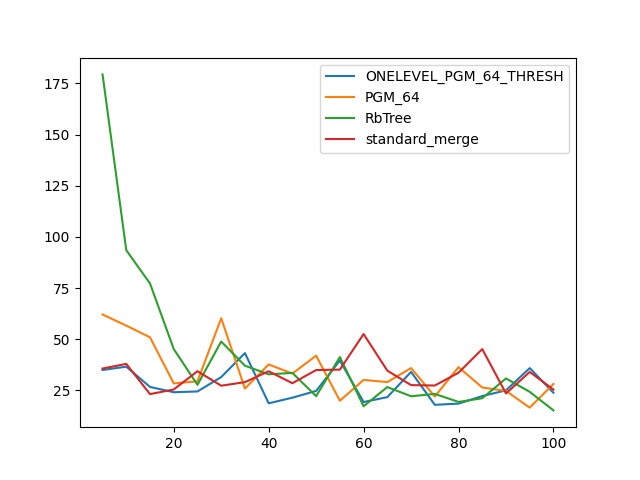

### duration_sec

|   0 |   ONELEVEL_PGM_64_THRESH |   PGM_64 |   RbTree |   standard_merge |
|----:|-------------------------:|---------:|---------:|-----------------:|
|   5 |                  35.0022 |  62.1066 | 179.378  |          35.7061 |
|  10 |                  36.6132 |  56.6797 |  93.5077 |          37.9855 |
|  15 |                  26.7287 |  50.9562 |  77.255  |          23.2226 |
|  20 |                  24.1421 |  28.4509 |  45.2306 |          25.4937 |
|  25 |                  24.5184 |  29.4764 |  27.7527 |          34.4131 |
|  30 |                  31.5447 |  60.2757 |  48.8994 |          27.3288 |
|  35 |                  43.2531 |  25.9217 |  37.0963 |          29.0709 |
|  40 |                  18.7383 |  37.6993 |  32.8956 |          34.3836 |
|  45 |                  21.4714 |  33.2644 |  33.5843 |          28.5451 |
|  50 |                  24.7771 |  41.9802 |  22.214  |          34.9697 |
|  55 |                  39.6235 |  19.9938 |  41.3141 |          35.1948 |
|  60 |                  19.354  |  30.1593 |  17.2894 |          52.5563 |
|  65 |                  21.7484 |  29.0959 |  26.6602 |          34.685  |
|  70 |                  34.0814 |  35.9451 |  22.1778 |          27.6266 |
|  75 |                  17.9907 |  22.0288 |  23.3052 |          27.4148 |
|  80 |                  18.587  |  36.4086 |  19.4154 |          33.672  |
|  85 |                  22.2621 |  26.4489 |  21.2075 |          45.2203 |
|  90 |                  25.068  |  24.8015 |  30.8717 |          23.542  |
|  95 |                  35.9242 |  16.6036 |  24.3249 |          34.0571 |
| 100 |                  23.9073 |  28.1884 |  15.266  |          25.4298 |

