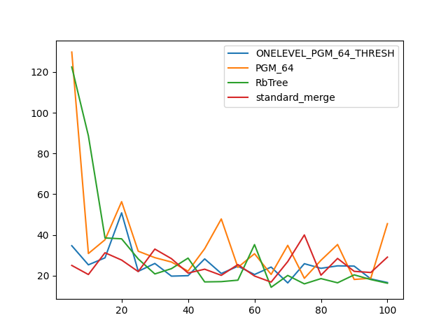

### duration_sec

|   0 |   ONELEVEL_PGM_64_THRESH |   PGM_64 |   RbTree |   standard_merge |
|----:|-------------------------:|---------:|---------:|-----------------:|
|   5 |                  34.7023 | 129.825  | 122.518  |          25.0182 |
|  10 |                  25.3165 |  30.8798 |  88.7124 |          20.5603 |
|  15 |                  28.7671 |  37.6368 |  38.5171 |          31.2545 |
|  20 |                  50.8604 |  56.3459 |  38.0984 |          27.6573 |
|  25 |                  22.135  |  32.0093 |  28.2164 |          22.0001 |
|  30 |                  25.989  |  28.8418 |  20.8443 |          33.0558 |
|  35 |                  19.7605 |  26.6973 |  23.4362 |          28.345  |
|  40 |                  19.9917 |  22.2258 |  28.6203 |          21.2739 |
|  45 |                  28.2368 |  33.2326 |  16.9333 |          23.1776 |
|  50 |                  21.0673 |  47.8608 |  17.0653 |          20.1619 |
|  55 |                  24.624  |  24.0704 |  17.7851 |          25.4559 |
|  60 |                  20.573  |  30.7707 |  35.2582 |          19.8267 |
|  65 |                  24.217  |  20.6004 |  14.2897 |          16.8351 |
|  70 |                  16.4303 |  34.8852 |  20.098  |          26.9183 |
|  75 |                  25.8709 |  18.6996 |  15.9669 |          40.0035 |
|  80 |                  23.6026 |  27.5499 |  18.552  |          20.2212 |
|  85 |                  24.8179 |  35.2908 |  16.4924 |          28.4641 |
|  90 |                  24.6875 |  18.1347 |  20.3992 |          22.1203 |
|  95 |                  18.3995 |  18.7456 |  18.0892 |          21.5542 |
| 100 |                  16.6214 |  45.5304 |  16.2869 |          29.1015 |

