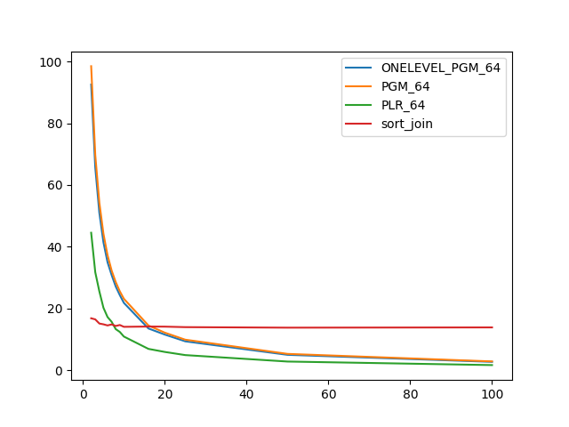
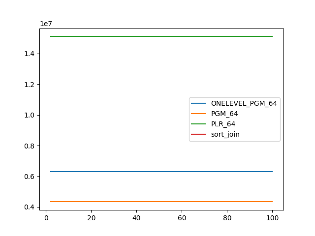
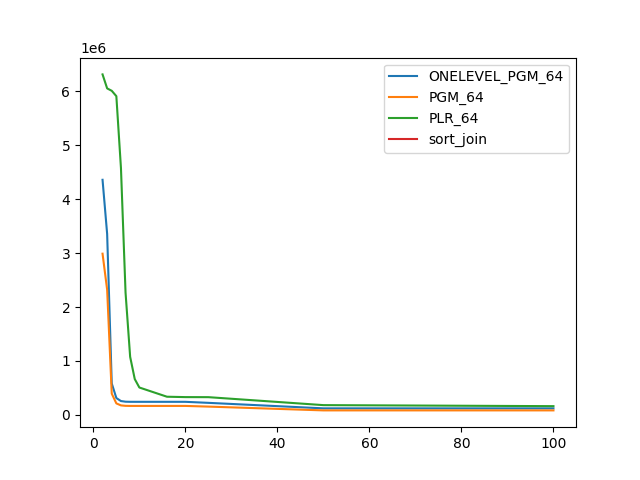

### duration_sec

|   1 |   ONELEVEL_PGM_64 |   PGM_64 |   PLR_64 |   sort_join |
|----:|------------------:|---------:|---------:|------------:|
|   2 |          92.546   | 98.4846  | 44.5413  |     16.834  |
|   3 |          65.6739  | 69.7132  | 31.7536  |     16.4827 |
|   4 |          50.9817  | 54.278   | 25.5509  |     15.1386 |
|   5 |          41.4429  | 44.2195  | 20.2504  |     14.8833 |
|   6 |          35.0016  | 37.3003  | 17.2444  |     14.5202 |
|   7 |          30.8586  | 32.3136  | 15.7064  |     14.8449 |
|   8 |          27.1406  | 28.5846  | 13.3317  |     14.3428 |
|   9 |          24.3471  | 25.581   | 12.4157  |     14.6591 |
|  10 |          21.8142  | 23.1511  | 10.9186  |     14.071  |
|  16 |          13.5339  | 14.5085  |  6.92492 |     14.1615 |
|  20 |          11.5579  | 12.1824  |  5.93758 |     14.1306 |
|  25 |           9.37486 |  9.90503 |  4.91681 |     13.9691 |
|  50 |           4.99958 |  5.31033 |  2.82607 |     13.8006 |
| 100 |           2.72639 |  2.86607 |  1.67871 |     13.8794 |

### inner_index_size

|   1 |   ONELEVEL_PGM_64 |      PGM_64 |    PLR_64 |   sort_join |
|----:|------------------:|------------:|----------:|------------:|
|   2 |       6.29626e+06 | 4.33117e+06 | 1.511e+07 |         nan |
|   3 |       6.29626e+06 | 4.33117e+06 | 1.511e+07 |         nan |
|   4 |       6.29626e+06 | 4.33117e+06 | 1.511e+07 |         nan |
|   5 |       6.29626e+06 | 4.33117e+06 | 1.511e+07 |         nan |
|   6 |       6.29626e+06 | 4.33117e+06 | 1.511e+07 |         nan |
|   7 |       6.29626e+06 | 4.33117e+06 | 1.511e+07 |         nan |
|   8 |       6.29626e+06 | 4.33117e+06 | 1.511e+07 |         nan |
|   9 |       6.29626e+06 | 4.33117e+06 | 1.511e+07 |         nan |
|  10 |       6.29626e+06 | 4.33117e+06 | 1.511e+07 |         nan |
|  16 |       6.29626e+06 | 4.33117e+06 | 1.511e+07 |         nan |
|  20 |       6.29626e+06 | 4.33117e+06 | 1.511e+07 |         nan |
|  25 |       6.29626e+06 | 4.33117e+06 | 1.511e+07 |         nan |
|  50 |       6.29626e+06 | 4.33117e+06 | 1.511e+07 |         nan |
| 100 |       6.29626e+06 | 4.33117e+06 | 1.511e+07 |         nan |

### outer_index_size

|   1 |   ONELEVEL_PGM_64 |           PGM_64 |           PLR_64 |   sort_join |
|----:|------------------:|-----------------:|-----------------:|------------:|
|   2 |       4.35929e+06 |      2.98942e+06 |      6.31386e+06 |         nan |
|   3 |       3.3551e+06  |      2.31997e+06 |      6.05414e+06 |         nan |
|   4 |  582912           | 393912           |      6.00992e+06 |         nan |
|   5 |  312360           | 213000           |      5.91008e+06 |         nan |
|   6 |  256560           | 175800           |      4.57856e+06 |         nan |
|   7 |  244440           | 167720           |      2.26608e+06 |         nan |
|   8 |  242376           | 166344           |      1.07645e+06 |         nan |
|   9 |  242256           | 166264           | 664352           |         nan |
|  10 |  242256           | 166264           | 507648           |         nan |
|  16 |  242256           | 166264           | 336768           |         nan |
|  20 |  242256           | 166264           | 329664           |         nan |
|  25 |  223272           | 153608           | 328640           |         nan |
|  50 |  121152           |  83224           | 180960           |         nan |
| 100 |  121056           |  83160           | 161856           |         nan |

