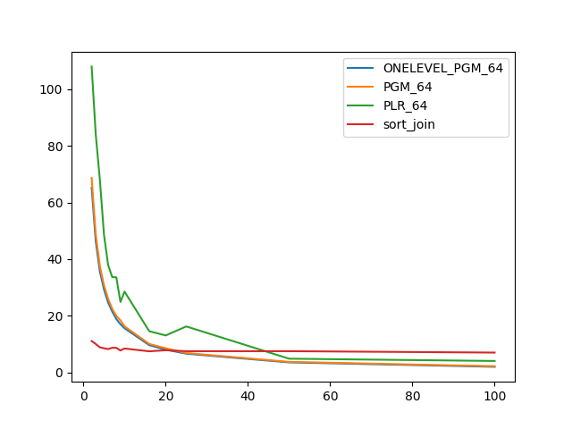
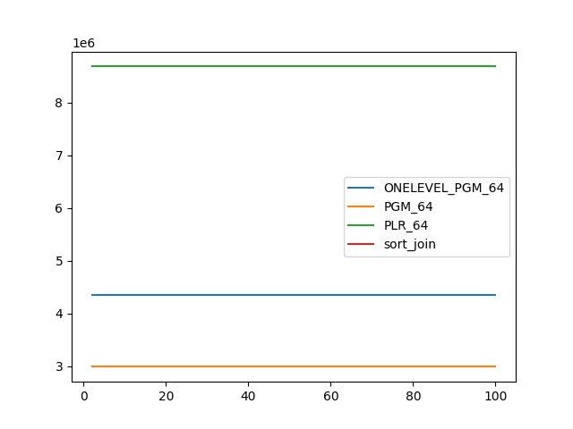
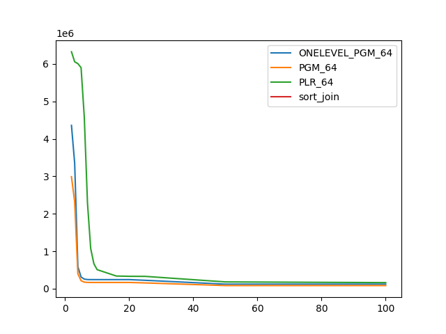

### duration_sec

|   1 |   ONELEVEL_PGM_64 |   PGM_64 |    PLR_64 |   sort_join |
|----:|------------------:|---------:|----------:|------------:|
|   2 |          65.2205  | 68.6804  | 108.062   |    11.0526  |
|   3 |          46.2393  | 48.599   |  83.9782  |     9.99094 |
|   4 |          35.662   | 37.4496  |  68.0214  |     8.81294 |
|   5 |          29.2982  | 30.7756  |  48.6176  |     8.49587 |
|   6 |          24.6553  | 26.0113  |  37.9277  |     8.20112 |
|   7 |          21.4833  | 22.5054  |  33.6684  |     8.65757 |
|   8 |          18.8421  | 19.91    |  33.5405  |     8.63528 |
|   9 |          17.0054  | 18.3988  |  24.8837  |     7.70595 |
|  10 |          15.5722  | 16.2457  |  28.519   |     8.40847 |
|  16 |           9.60518 | 10.0265  |  14.5337  |     7.42257 |
|  20 |           8.00985 |  8.49986 |  13.0183  |     7.79865 |
|  25 |           6.57478 |  6.80895 |  16.2095  |     7.46205 |
|  50 |           3.5059  |  3.68701 |   4.80988 |     7.46681 |
| 100 |           1.94694 |  2.14377 |   4.00512 |     6.96859 |

### inner_index_size

|   1 |   ONELEVEL_PGM_64 |      PGM_64 |      PLR_64 |   sort_join |
|----:|------------------:|------------:|------------:|------------:|
|   2 |       4.35929e+06 | 2.98942e+06 | 8.68746e+06 |         nan |
|   3 |       4.35929e+06 | 2.98942e+06 | 8.68746e+06 |         nan |
|   4 |       4.35929e+06 | 2.98942e+06 | 8.68746e+06 |         nan |
|   5 |       4.35929e+06 | 2.98942e+06 | 8.68746e+06 |         nan |
|   6 |       4.35929e+06 | 2.98942e+06 | 8.68746e+06 |         nan |
|   7 |       4.35929e+06 | 2.98942e+06 | 8.68746e+06 |         nan |
|   8 |       4.35929e+06 | 2.98942e+06 | 8.68746e+06 |         nan |
|   9 |       4.35929e+06 | 2.98942e+06 | 8.68746e+06 |         nan |
|  10 |       4.35929e+06 | 2.98942e+06 | 8.68746e+06 |         nan |
|  16 |       4.35929e+06 | 2.98942e+06 | 8.68746e+06 |         nan |
|  20 |       4.35929e+06 | 2.98942e+06 | 8.68746e+06 |         nan |
|  25 |       4.35929e+06 | 2.98942e+06 | 8.68746e+06 |         nan |
|  50 |       4.35929e+06 | 2.98942e+06 | 8.68746e+06 |         nan |
| 100 |       4.35929e+06 | 2.98942e+06 | 8.68746e+06 |         nan |

### outer_index_size

|   1 |   ONELEVEL_PGM_64 |           PGM_64 |           PLR_64 |   sort_join |
|----:|------------------:|-----------------:|-----------------:|------------:|
|   2 |       4.35929e+06 |      2.98942e+06 |      6.32384e+06 |         nan |
|   3 |       3.3505e+06  |      2.31691e+06 |      6.05632e+06 |         nan |
|   4 |  586704           | 396600           |      6.00704e+06 |         nan |
|   5 |  311688           | 212552           |      5.89962e+06 |         nan |
|   6 |  256032           | 175448           |      4.57885e+06 |         nan |
|   7 |  243984           | 167416           |      2.2808e+06  |         nan |
|   8 |  242520           | 166440           |      1.07034e+06 |         nan |
|   9 |  242304           | 166296           | 664224           |         nan |
|  10 |  242256           | 166264           | 508320           |         nan |
|  16 |  242256           | 166264           | 337696           |         nan |
|  20 |  242232           | 166248           | 330688           |         nan |
|  25 |  223800           | 153960           | 328576           |         nan |
|  50 |  121152           |  83224           | 180992           |         nan |
| 100 |  121008           |  83128           | 161984           |         nan |

