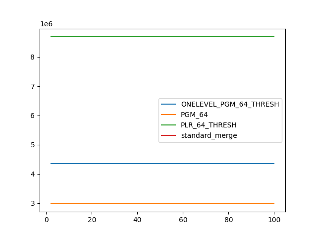

### duration_sec

|   1 |   ONELEVEL_PGM_64_THRESH |   PGM_64 |   PLR_64_THRESH |   standard_merge |
|----:|-------------------------:|---------:|----------------:|-----------------:|
|   2 |                 18.1775  | 79.1783  |        14.3845  |         13.17    |
|   3 |                 14.7874  | 69.2899  |        11.2541  |         11.1549  |
|   4 |                 13.0029  | 56.6164  |         9.55871 |         10.9206  |
|   5 |                 11.9913  | 46.9676  |         8.6235  |         10.2705  |
|   6 |                 11.2607  | 40.6717  |         7.91004 |          9.4014  |
|   7 |                 10.6919  | 35.8602  |         7.50546 |          9.79085 |
|   8 |                 10.3163  | 32.5632  |         7.10206 |          8.91806 |
|   9 |                 10.0395  | 29.7999  |         6.94507 |          8.67352 |
|  10 |                  9.87928 | 27.6323  |         6.70051 |          8.92013 |
|  16 |                  8.6993  | 19.0208  |         5.91942 |          7.97516 |
|  20 |                  8.31988 | 17.3873  |         6.46739 |          8.60249 |
|  25 |                  8.11153 | 16.1382  |         5.76977 |          8.37603 |
|  50 |                  7.34235 | 10.5968  |         5.312   |          8.20806 |
| 100 |                  6.2219  |  7.64334 |         5.45089 |          7.90336 |

### inner_index_size

|   1 |   ONELEVEL_PGM_64_THRESH |      PGM_64 |   PLR_64_THRESH |   standard_merge |
|----:|-------------------------:|------------:|----------------:|-----------------:|
|   2 |              4.35929e+06 | 2.98942e+06 |     8.68685e+06 |              nan |
|   3 |              4.35929e+06 | 2.98942e+06 |     8.68685e+06 |              nan |
|   4 |              4.35929e+06 | 2.98942e+06 |     8.68685e+06 |              nan |
|   5 |              4.35929e+06 | 2.98942e+06 |     8.68685e+06 |              nan |
|   6 |              4.35929e+06 | 2.98942e+06 |     8.68685e+06 |              nan |
|   7 |              4.35929e+06 | 2.98942e+06 |     8.68685e+06 |              nan |
|   8 |              4.35929e+06 | 2.98942e+06 |     8.68685e+06 |              nan |
|   9 |              4.35929e+06 | 2.98942e+06 |     8.68685e+06 |              nan |
|  10 |              4.35929e+06 | 2.98942e+06 |     8.68685e+06 |              nan |
|  16 |              4.35929e+06 | 2.98942e+06 |     8.68685e+06 |              nan |
|  20 |              4.35929e+06 | 2.98942e+06 |     8.68685e+06 |              nan |
|  25 |              4.35929e+06 | 2.98942e+06 |     8.68685e+06 |              nan |
|  50 |              4.35929e+06 | 2.98942e+06 |     8.68685e+06 |              nan |
| 100 |              4.35929e+06 | 2.98942e+06 |     8.68685e+06 |              nan |

