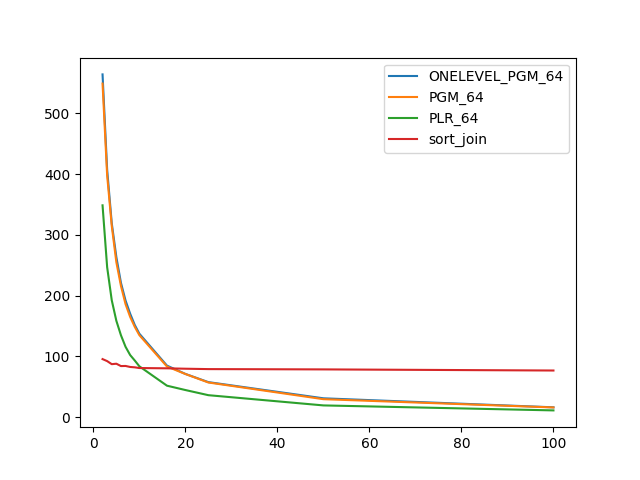
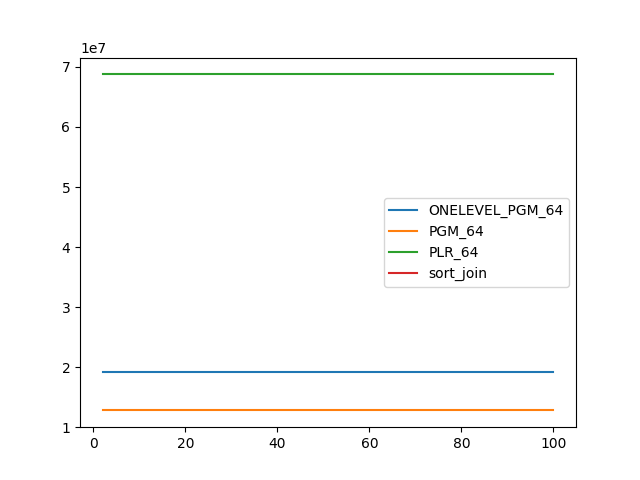
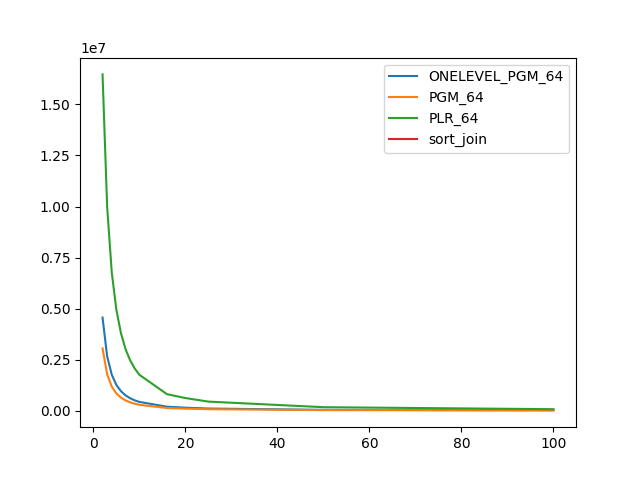

### duration_sec

|   1 |   ONELEVEL_PGM_64 |   PGM_64 |   PLR_64 |   sort_join |
|----:|------------------:|---------:|---------:|------------:|
|   2 |          563.814  | 548.724  | 348.533  |     95.7001 |
|   3 |          407.187  | 397.775  | 246.824  |     92.3891 |
|   4 |          319.225  | 314.894  | 192.491  |     87.3641 |
|   5 |          263.505  | 254.948  | 158.674  |     88.0947 |
|   6 |          221.126  | 216.059  | 134.898  |     84.2438 |
|   7 |          192.002  | 186.009  | 115.909  |     84.4125 |
|   8 |          170.376  | 165.104  | 102.372  |     82.7599 |
|   9 |          151.853  | 148.715  |  93.3859 |     82.1562 |
|  10 |          137.469  | 135.069  |  83.8583 |     81.0119 |
|  16 |           85.0007 |  83.5062 |  51.9754 |     80.5341 |
|  20 |           71.3235 |  71.2002 |  44.8434 |     79.8727 |
|  25 |           57.8348 |  57.2193 |  36.3643 |     79.2432 |
|  50 |           31.2235 |  29.7873 |  19.5466 |     78.7609 |
| 100 |           16.4195 |  16.2018 |  11.3432 |     76.9207 |

### inner_index_size

|   1 |   ONELEVEL_PGM_64 |      PGM_64 |      PLR_64 |   sort_join |
|----:|------------------:|------------:|------------:|------------:|
|   2 |       1.91316e+07 | 1.27978e+07 | 6.87556e+07 |         nan |
|   3 |       1.91316e+07 | 1.27978e+07 | 6.87556e+07 |         nan |
|   4 |       1.91316e+07 | 1.27978e+07 | 6.87556e+07 |         nan |
|   5 |       1.91316e+07 | 1.27978e+07 | 6.87556e+07 |         nan |
|   6 |       1.91316e+07 | 1.27978e+07 | 6.87556e+07 |         nan |
|   7 |       1.91316e+07 | 1.27978e+07 | 6.87556e+07 |         nan |
|   8 |       1.91316e+07 | 1.27978e+07 | 6.87556e+07 |         nan |
|   9 |       1.91316e+07 | 1.27978e+07 | 6.87556e+07 |         nan |
|  10 |       1.91316e+07 | 1.27978e+07 | 6.87556e+07 |         nan |
|  16 |       1.91316e+07 | 1.27978e+07 | 6.87556e+07 |         nan |
|  20 |       1.91316e+07 | 1.27978e+07 | 6.87556e+07 |         nan |
|  25 |       1.91316e+07 | 1.27978e+07 | 6.87556e+07 |         nan |
|  50 |       1.91316e+07 | 1.27978e+07 | 6.87556e+07 |         nan |
| 100 |       1.91316e+07 | 1.27978e+07 | 6.87556e+07 |         nan |

### outer_index_size

|   1 |   ONELEVEL_PGM_64 |           PGM_64 |           PLR_64 |   sort_join |
|----:|------------------:|-----------------:|-----------------:|------------:|
|   2 |       4.55794e+06 |      3.04794e+06 |      1.64714e+07 |         nan |
|   3 |       2.66215e+06 |      1.78033e+06 |      9.9895e+06  |         nan |
|   4 |       1.76364e+06 |      1.17943e+06 |      6.77744e+06 |         nan |
|   5 |       1.25899e+06 | 842008           |      4.94653e+06 |         nan |
|   6 |  953616           | 637768           |      3.79334e+06 |         nan |
|   7 |  748704           | 500824           |      3.00992e+06 |         nan |
|   8 |  607152           | 406376           |      2.46592e+06 |         nan |
|   9 |  502968           | 336536           |      2.0639e+06  |         nan |
|  10 |  428568           | 286824           |      1.7569e+06  |         nan |
|  16 |  193368           | 129568           | 807232           |         nan |
|  20 |  145776           |  97696           | 617184           |         nan |
|  25 |  103032           |  69040           | 442592           |         nan |
|  50 |   39264           |  26400           | 169056           |         nan |
| 100 |   17376           |  11744           |  70432           |         nan |

