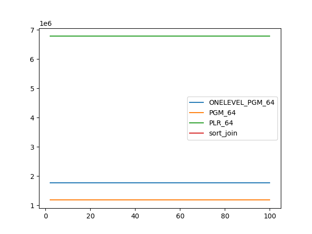
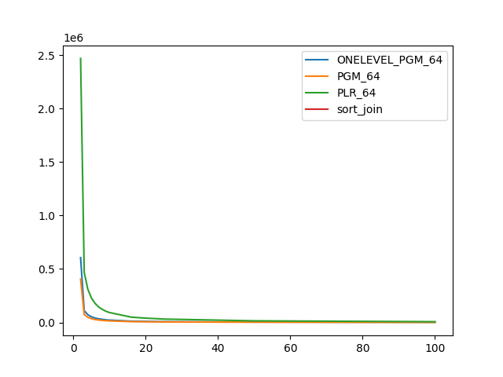

### duration_sec

|   1 |   ONELEVEL_PGM_64 |    PGM_64 |   PLR_64 |   sort_join |
|----:|------------------:|----------:|---------:|------------:|
|   2 |         160.173   | 158.595   | 95.4627  |     22.791  |
|   3 |          56.9026  |  55.3112  | 33.4746  |     18.9483 |
|   4 |          42.241   |  42.311   | 25.4106  |     19.0286 |
|   5 |          33.9738  |  33.6483  | 20.4817  |     18.2285 |
|   6 |          28.5833  |  28.1563  | 17.22    |     18.5137 |
|   7 |          24.5037  |  24.4239  | 14.9115  |     17.8754 |
|   8 |          21.5607  |  21.3617  | 13.0121  |     18.3175 |
|   9 |          19.2726  |  18.9869  | 11.6991  |     18.1091 |
|  10 |          17.352   |  17.2215  | 10.6418  |     17.5877 |
|  16 |          10.6652  |  10.5491  |  6.64398 |     17.2905 |
|  20 |           9.02836 |   8.86871 |  5.55675 |     17.6501 |
|  25 |           7.38033 |   7.25916 |  4.61492 |     17.1896 |
|  50 |           3.94962 |   3.89951 |  2.53398 |     17.6313 |
| 100 |           2.16852 |   2.14038 |  1.44516 |     16.922  |

### inner_index_size

|   1 |   ONELEVEL_PGM_64 |      PGM_64 |      PLR_64 |   sort_join |
|----:|------------------:|------------:|------------:|------------:|
|   2 |       1.76306e+06 | 1.17905e+06 | 6.78208e+06 |         nan |
|   3 |       1.76306e+06 | 1.17905e+06 | 6.78208e+06 |         nan |
|   4 |       1.76306e+06 | 1.17905e+06 | 6.78208e+06 |         nan |
|   5 |       1.76306e+06 | 1.17905e+06 | 6.78208e+06 |         nan |
|   6 |       1.76306e+06 | 1.17905e+06 | 6.78208e+06 |         nan |
|   7 |       1.76306e+06 | 1.17905e+06 | 6.78208e+06 |         nan |
|   8 |       1.76306e+06 | 1.17905e+06 | 6.78208e+06 |         nan |
|   9 |       1.76306e+06 | 1.17905e+06 | 6.78208e+06 |         nan |
|  10 |       1.76306e+06 | 1.17905e+06 | 6.78208e+06 |         nan |
|  16 |       1.76306e+06 | 1.17905e+06 | 6.78208e+06 |         nan |
|  20 |       1.76306e+06 | 1.17905e+06 | 6.78208e+06 |         nan |
|  25 |       1.76306e+06 | 1.17905e+06 | 6.78208e+06 |         nan |
|  50 |       1.76306e+06 | 1.17905e+06 | 6.78208e+06 |         nan |
| 100 |       1.76306e+06 | 1.17905e+06 | 6.78208e+06 |         nan |

### outer_index_size

|   1 |   ONELEVEL_PGM_64 |   PGM_64 |           PLR_64 |   sort_join |
|----:|------------------:|---------:|-----------------:|------------:|
|   2 |            606648 |   405944 |      2.46838e+06 |         nan |
|   3 |            110712 |    74192 | 468512           |         nan |
|   4 |             72816 |    48864 | 310720           |         nan |
|   5 |             53256 |    35776 | 228576           |         nan |
|   6 |             41496 |    27920 | 178880           |         nan |
|   7 |             34032 |    22912 | 144736           |         nan |
|   8 |             29664 |    19968 | 122592           |         nan |
|   9 |             24912 |    16800 | 104768           |         nan |
|  10 |             22392 |    15120 |  92896           |         nan |
|  16 |             12216 |     8288 |  50176           |         nan |
|  20 |             10320 |     7024 |  40576           |         nan |
|  25 |              7848 |     5376 |  32032           |         nan |
|  50 |              4152 |     2896 |  15456           |         nan |
| 100 |              2040 |     1472 |   7424           |         nan |

