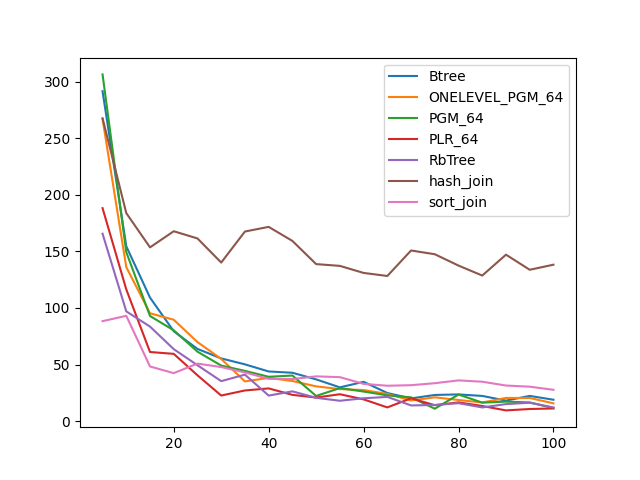
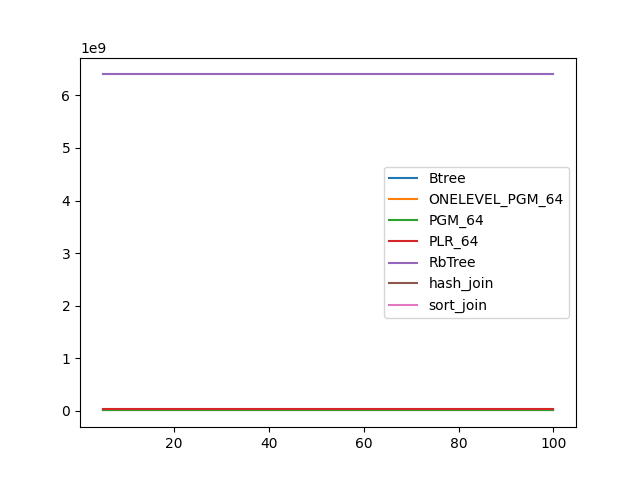
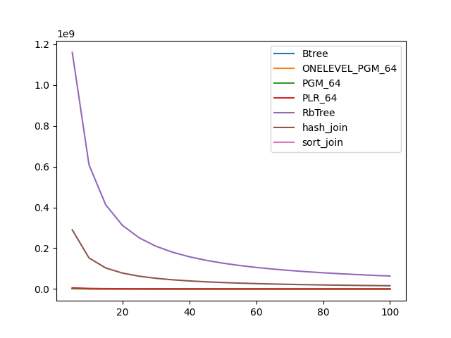

### duration_sec

|   0 |    Btree |   ONELEVEL_PGM_64 |   PGM_64 |   PLR_64 |   RbTree |   hash_join |   sort_join |
|----:|---------:|------------------:|---------:|---------:|---------:|------------:|------------:|
|   5 | 87.9471  |          81.2349  | 81.8631  | 48.2632  | 50.4301  |     99.8563 |     18.0256 |
|  10 | 46.9164  |          43.2116  | 43.8375  | 25.8342  | 28.1713  |     94.3552 |     14.6075 |
|  15 | 32.5542  |          29.654   | 29.9303  | 18.0736  | 19.9459  |     79.9976 |     13.2222 |
|  20 | 24.9106  |          22.6723  | 22.9718  | 13.9673  | 15.3951  |     89.989  |     12.5535 |
|  25 | 20.5049  |          30.15    | 18.6341  | 11.4128  | 12.8199  |     82.0755 |     12.0422 |
|  30 | 17.3096  |          15.6327  | 15.8387  |  9.73385 | 11.1902  |     75.6377 |     11.866  |
|  35 | 15.1443  |          13.5779  | 13.6951  |  8.54969 |  9.76777 |     90.3787 |     11.6022 |
|  40 | 13.4631  |          12.0477  | 12.1768  |  7.63732 |  8.7464  |    117.445  |     11.4096 |
|  45 | 12.1213  |          10.8233  | 10.8848  |  6.92594 |  8.17775 |     79.0854 |     11.3465 |
|  50 | 10.5328  |           9.93372 |  9.92591 |  6.32851 |  7.45134 |     75.9147 |     11.2481 |
|  55 | 10.2555  |           9.06594 |  9.14095 |  5.88492 |  6.85094 |     72.9766 |     11.1473 |
|  60 |  9.45663 |           8.40244 |  8.50493 |  5.45935 |  6.32509 |     69.2876 |     11.0422 |
|  65 |  8.79283 |           7.87404 |  7.88892 |  5.11275 |  6.0897  |     65.9162 |     10.9669 |
|  70 |  8.38238 |           7.38477 |  7.48061 |  4.8548  |  5.66974 |     83.1752 |     10.9612 |
|  75 |  7.63012 |           6.97978 |  6.99166 |  4.6017  |  5.43263 |     79.5156 |     10.9404 |
|  80 |  7.30338 |           6.56266 |  6.68162 |  4.37729 |  5.26295 |     79.4741 |     10.8918 |
|  85 |  7.085   |           6.23566 |  6.31444 |  4.18134 |  4.95631 |     74.6436 |     10.8221 |
|  90 |  6.84608 |           6.00139 |  6.00914 |  4.02525 |  4.84494 |     74.5553 |     10.8601 |
|  95 |  6.49071 |           5.71704 |  5.76489 |  3.86979 |  4.54847 |     70.1893 |     10.8395 |
| 100 |  6.29687 |           5.46576 |  5.54776 |  3.71481 |  4.40063 |     68.2748 |     10.7887 |

### inner_index_size

|   0 |      Btree |   ONELEVEL_PGM_64 |      PGM_64 |      PLR_64 |   RbTree |   hash_join |   sort_join |
|----:|-----------:|------------------:|------------:|------------:|---------:|------------:|------------:|
|   5 | 1.1943e+07 |       1.25522e+07 | 8.51182e+06 | 3.21133e+07 |  6.4e+09 |         nan |         nan |
|  10 | 1.1943e+07 |       1.25522e+07 | 8.51182e+06 | 3.21133e+07 |  6.4e+09 |         nan |         nan |
|  15 | 1.1943e+07 |       1.25522e+07 | 8.51182e+06 | 3.21133e+07 |  6.4e+09 |         nan |         nan |
|  20 | 1.1943e+07 |       1.25522e+07 | 8.51182e+06 | 3.21133e+07 |  6.4e+09 |         nan |         nan |
|  25 | 1.1943e+07 |       1.25522e+07 | 8.51182e+06 | 3.21133e+07 |  6.4e+09 |         nan |         nan |
|  30 | 1.1943e+07 |       1.25522e+07 | 8.51182e+06 | 3.21133e+07 |  6.4e+09 |         nan |         nan |
|  35 | 1.1943e+07 |       1.25522e+07 | 8.51182e+06 | 3.21133e+07 |  6.4e+09 |         nan |         nan |
|  40 | 1.1943e+07 |       1.25522e+07 | 8.51182e+06 | 3.21133e+07 |  6.4e+09 |         nan |         nan |
|  45 | 1.1943e+07 |       1.25522e+07 | 8.51182e+06 | 3.21133e+07 |  6.4e+09 |         nan |         nan |
|  50 | 1.1943e+07 |       1.25522e+07 | 8.51182e+06 | 3.21133e+07 |  6.4e+09 |         nan |         nan |
|  55 | 1.1943e+07 |       1.25522e+07 | 8.51182e+06 | 3.21133e+07 |  6.4e+09 |         nan |         nan |
|  60 | 1.1943e+07 |       1.25522e+07 | 8.51182e+06 | 3.21133e+07 |  6.4e+09 |         nan |         nan |
|  65 | 1.1943e+07 |       1.25522e+07 | 8.51182e+06 | 3.21133e+07 |  6.4e+09 |         nan |         nan |
|  70 | 1.1943e+07 |       1.25522e+07 | 8.51182e+06 | 3.21133e+07 |  6.4e+09 |         nan |         nan |
|  75 | 1.1943e+07 |       1.25522e+07 | 8.51182e+06 | 3.21133e+07 |  6.4e+09 |         nan |         nan |
|  80 | 1.1943e+07 |       1.25522e+07 | 8.51182e+06 | 3.21133e+07 |  6.4e+09 |         nan |         nan |
|  85 | 1.1943e+07 |       1.25522e+07 | 8.51182e+06 | 3.21133e+07 |  6.4e+09 |         nan |         nan |
|  90 | 1.1943e+07 |       1.25522e+07 | 8.51182e+06 | 3.21133e+07 |  6.4e+09 |         nan |         nan |
|  95 | 1.1943e+07 |       1.25522e+07 | 8.51182e+06 | 3.21133e+07 |  6.4e+09 |         nan |         nan |
| 100 | 1.1943e+07 |       1.25522e+07 | 8.51182e+06 | 3.21133e+07 |  6.4e+09 |         nan |         nan |

### outer_index_size

|   0 |            Btree |   ONELEVEL_PGM_64 |           PGM_64 |           PLR_64 |      RbTree |   hash_join |   sort_join |
|----:|-----------------:|------------------:|-----------------:|-----------------:|------------:|------------:|------------:|
|   5 |      2.16872e+06 |       1.96298e+06 |      1.31526e+06 |      5.5033e+06  | 1.16004e+09 | 2.90011e+08 |         nan |
|  10 |      1.1425e+06  |  838080           | 561016           |      2.58592e+06 | 6.0907e+08  | 1.52268e+08 |         nan |
|  15 | 769920           |  473928           | 317104           |      1.5545e+06  | 4.12742e+08 | 1.03186e+08 |         nan |
|  20 | 584640           |  306288           | 204848           |      1.05114e+06 | 3.12128e+08 | 7.80319e+07 |         nan |
|  25 | 470384           |  216192           | 144624           | 763200           | 2.50954e+08 | 6.27385e+07 |         nan |
|  30 | 396272           |  160392           | 107312           | 581696           | 2.09799e+08 | 5.24498e+07 |         nan |
|  35 | 340688           |  123648           |  82736           | 459584           | 1.80286e+08 | 4.50714e+07 |         nan |
|  40 | 297456           |   98424           |  66008           | 371264           | 1.58018e+08 | 3.95046e+07 |         nan |
|  45 | 266576           |   80256           |  53744           | 309152           | 1.40658e+08 | 3.51646e+07 |         nan |
|  50 | 241872           |   67368           |  45168           | 259264           | 1.26729e+08 | 3.16822e+07 |         nan |
|  55 | 220256           |   57360           |  38448           | 222880           | 1.1531e+08  | 2.88274e+07 |         nan |
|  60 | 201728           |   49320           |  33072           | 191328           | 1.05779e+08 | 2.64449e+07 |         nan |
|  65 | 186288           |   42696           |  28656           | 168000           | 9.77034e+07 | 2.44259e+07 |         nan |
|  70 | 173936           |   37728           |  25328           | 149760           | 9.0786e+07  | 2.26965e+07 |         nan |
|  75 | 161584           |   33288           |  22352           | 131936           | 8.47681e+07 | 2.1192e+07  |         nan |
|  80 | 152320           |   29664           |  19920           | 118784           | 7.94941e+07 | 1.98735e+07 |         nan |
|  85 | 143056           |   26568           |  17888           | 108128           | 7.48476e+07 | 1.87119e+07 |         nan |
|  90 | 136880           |   24504           |  16464           |  98272           | 7.07134e+07 | 1.76783e+07 |         nan |
|  95 | 130704           |   22104           |  14880           |  88672           | 6.70184e+07 | 1.67546e+07 |         nan |
| 100 | 124528           |   19848           |  13360           |  81312           | 6.36754e+07 | 1.59189e+07 |         nan |

