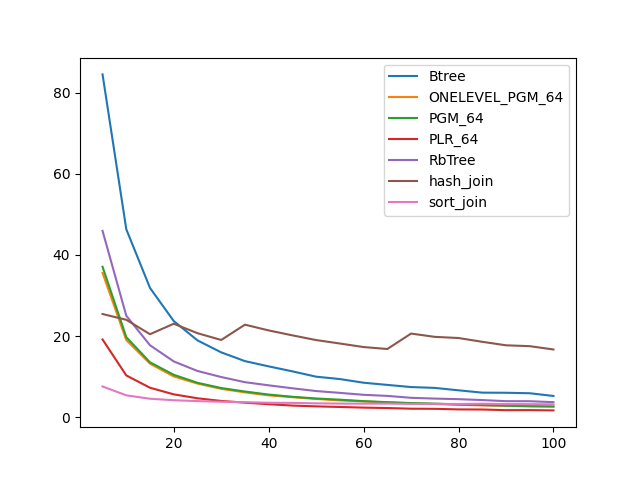
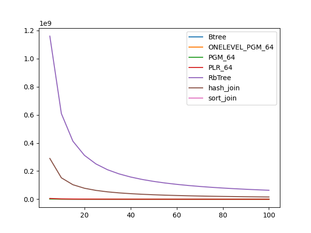

### duration_sec

|   0 |    Btree |   ONELEVEL_PGM_64 |   PGM_64 |    PLR_64 |   RbTree |   hash_join |   sort_join |
|----:|---------:|------------------:|---------:|----------:|---------:|------------:|------------:|
|   5 | 286.058  |          245.439  | 258.978  | 130.066   | 170.689  |     195.533 |     67.6763 |
|  10 | 140.919  |          136.858  | 143.301  |  81.7419  |  74.4491 |     189.895 |     53.5084 |
|  15 |  85.0162 |           95.5821 |  95.4428 |  60.976   |  49.7709 |     162.045 |     46.4294 |
|  20 |  75.4571 |           64.7868 |  65.518  |  36.0008  |  43.563  |     166.433 |     36.0226 |
|  25 |  58.427  |           50.9271 |  57.1476 |  35.6957  |  36.916  |     150.793 |     29.771  |
|  30 |  50.6121 |           45.1373 |  46.1347 |  21.7953  |  29.5373 |     145.229 |     36.4224 |
|  35 |  51.3495 |           34.3247 |  41.0479 |  24.5195  |  24.4722 |     176.885 |     32.0497 |
|  40 |  39.0321 |           40.5533 |  37.2516 |  22.4909  |  24.497  |     142.354 |     32.1336 |
|  45 |  36.5362 |           28.6798 |  30.713  |  19.1613  |  20.6436 |     149.318 |     27.565  |
|  50 |  32.7962 |           27.9104 |  23.1012 |  17.4608  |  21.8308 |     146.263 |     26.6033 |
|  55 |  24.656  |           25.0472 |  25.4327 |  15.5393  |  18.9067 |     138.754 |     30.6131 |
|  60 |  26.5017 |           24.6618 |  24.9261 |  12.259   |  18.7716 |     129.642 |     30.6968 |
|  65 |  25.4807 |           23.2301 |  20.7166 |  15.6587  |  15.2839 |     130.692 |     27.1352 |
|  70 |  24.639  |           16.569  |  21.2057 |  12.452   |  15.3623 |     144.426 |     28.8627 |
|  75 |  22.8589 |           18.2284 |  17.4836 |  13.3514  |  14.2581 |     135.344 |     29.9523 |
|  80 |  20.4419 |           14.0813 |  17.404  |  11.6228  |  13.3872 |     144.692 |     27.5575 |
|  85 |  20.9621 |           15.9529 |  15.9205 |   9.46268 |  11.8297 |     134.061 |     28.584  |
|  90 |  17.3694 |           16.1657 |  13.4922 |   6.4535  |  11.9459 |     143.882 |     29.648  |
|  95 |  19.3691 |           17.8256 |  14.9213 |  10.698   |  13.0496 |     131.489 |     29.7396 |
| 100 |  16.021  |           14.9451 |  13.2957 |   9.14132 |  10.4514 |     117.03  |     32.1734 |

### inner_index_size

|   0 |      Btree |   ONELEVEL_PGM_64 |      PGM_64 |      PLR_64 |   RbTree |   hash_join |   sort_join |
|----:|-----------:|------------------:|------------:|------------:|---------:|------------:|------------:|
|   5 | 1.1943e+07 |       1.25522e+07 | 8.51182e+06 | 3.21133e+07 |  6.4e+09 |         nan |         nan |
|  10 | 1.1943e+07 |       1.25522e+07 | 8.51182e+06 | 3.21133e+07 |  6.4e+09 |         nan |         nan |
|  15 | 1.1943e+07 |       1.25522e+07 | 8.51182e+06 | 3.21133e+07 |  6.4e+09 |         nan |         nan |
|  20 | 1.1943e+07 |       1.25522e+07 | 8.51182e+06 | 3.21133e+07 |  6.4e+09 |         nan |         nan |
|  25 | 1.1943e+07 |       1.25522e+07 | 8.51182e+06 | 3.21133e+07 |  6.4e+09 |         nan |         nan |
|  30 | 1.1943e+07 |       1.25522e+07 | 8.51182e+06 | 3.21133e+07 |  6.4e+09 |         nan |         nan |
|  35 | 1.1943e+07 |       1.25522e+07 | 8.51182e+06 | 3.21133e+07 |  6.4e+09 |         nan |         nan |
|  40 | 1.1943e+07 |       1.25522e+07 | 8.51182e+06 | 3.21133e+07 |  6.4e+09 |         nan |         nan |
|  45 | 1.1943e+07 |       1.25522e+07 | 8.51182e+06 | 3.21133e+07 |  6.4e+09 |         nan |         nan |
|  50 | 1.1943e+07 |       1.25522e+07 | 8.51182e+06 | 3.21133e+07 |  6.4e+09 |         nan |         nan |
|  55 | 1.1943e+07 |       1.25522e+07 | 8.51182e+06 | 3.21133e+07 |  6.4e+09 |         nan |         nan |
|  60 | 1.1943e+07 |       1.25522e+07 | 8.51182e+06 | 3.21133e+07 |  6.4e+09 |         nan |         nan |
|  65 | 1.1943e+07 |       1.25522e+07 | 8.51182e+06 | 3.21133e+07 |  6.4e+09 |         nan |         nan |
|  70 | 1.1943e+07 |       1.25522e+07 | 8.51182e+06 | 3.21133e+07 |  6.4e+09 |         nan |         nan |
|  75 | 1.1943e+07 |       1.25522e+07 | 8.51182e+06 | 3.21133e+07 |  6.4e+09 |         nan |         nan |
|  80 | 1.1943e+07 |       1.25522e+07 | 8.51182e+06 | 3.21133e+07 |  6.4e+09 |         nan |         nan |
|  85 | 1.1943e+07 |       1.25522e+07 | 8.51182e+06 | 3.21133e+07 |  6.4e+09 |         nan |         nan |
|  90 | 1.1943e+07 |       1.25522e+07 | 8.51182e+06 | 3.21133e+07 |  6.4e+09 |         nan |         nan |
|  95 | 1.1943e+07 |       1.25522e+07 | 8.51182e+06 | 3.21133e+07 |  6.4e+09 |         nan |         nan |
| 100 | 1.1943e+07 |       1.25522e+07 | 8.51182e+06 | 3.21133e+07 |  6.4e+09 |         nan |         nan |

### outer_index_size

|   0 |            Btree |   ONELEVEL_PGM_64 |           PGM_64 |           PLR_64 |      RbTree |   hash_join |   sort_join |
|----:|-----------------:|------------------:|-----------------:|-----------------:|------------:|------------:|------------:|
|   5 |      2.16872e+06 |       1.96267e+06 |      1.31519e+06 |      5.50298e+06 | 1.16019e+09 | 2.90047e+08 |         nan |
|  10 |      1.1425e+06  |  836616           | 559832           |      2.58467e+06 | 6.09072e+08 | 1.52268e+08 |         nan |
|  15 | 769920           |  474744           | 317688           |      1.55414e+06 | 4.1276e+08  | 1.0319e+08  |         nan |
|  20 | 584640           |  306720           | 205136           |      1.05149e+06 | 3.121e+08   | 7.8025e+07  |         nan |
|  25 | 470384           |  216096           | 144592           | 761248           | 2.50956e+08 | 6.2739e+07  |         nan |
|  30 | 396272           |  160824           | 107688           | 581312           | 2.09815e+08 | 5.24538e+07 |         nan |
|  35 | 340688           |  123984           |  83024           | 457216           | 1.80277e+08 | 4.50694e+07 |         nan |
|  40 | 297456           |   98568           |  66000           | 371552           | 1.58021e+08 | 3.95053e+07 |         nan |
|  45 | 266576           |   80904           |  54312           | 306624           | 1.40653e+08 | 3.51632e+07 |         nan |
|  50 | 241872           |   67824           |  45544           | 260576           | 1.26725e+08 | 3.16812e+07 |         nan |
|  55 | 220256           |   57072           |  38224           | 222560           | 1.15319e+08 | 2.88296e+07 |         nan |
|  60 | 201728           |   49680           |  33360           | 192384           | 1.05781e+08 | 2.64453e+07 |         nan |
|  65 | 186288           |   42720           |  28656           | 169312           | 9.77019e+07 | 2.44255e+07 |         nan |
|  70 | 173936           |   37752           |  25344           | 148864           | 9.07758e+07 | 2.2694e+07  |         nan |
|  75 | 161584           |   33240           |  22336           | 131296           | 8.47627e+07 | 2.11907e+07 |         nan |
|  80 | 152320           |   29952           |  20128           | 118048           | 7.95104e+07 | 1.98776e+07 |         nan |
|  85 | 143056           |   26976           |  18128           | 107232           | 7.48554e+07 | 1.87138e+07 |         nan |
|  90 | 136880           |   24072           |  16160           |  97408           | 7.07178e+07 | 1.76794e+07 |         nan |
|  95 | 130704           |   21936           |  14736           |  89216           | 6.70151e+07 | 1.67538e+07 |         nan |
| 100 | 124528           |   20496           |  13776           |  81600           | 6.36852e+07 | 1.59213e+07 |         nan |

