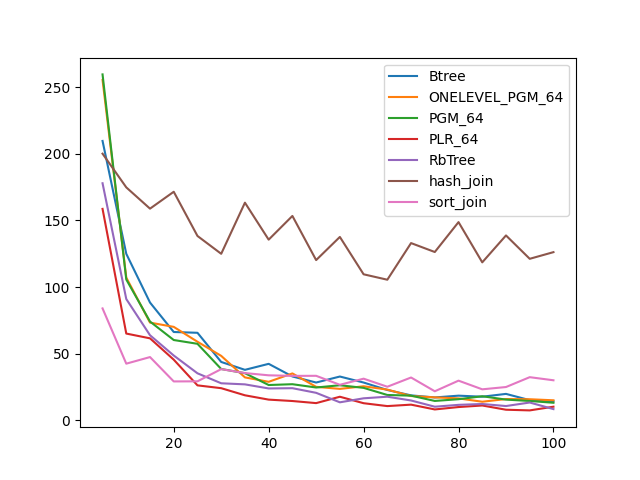
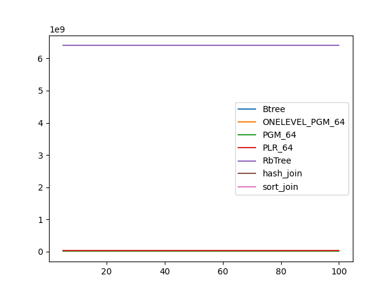
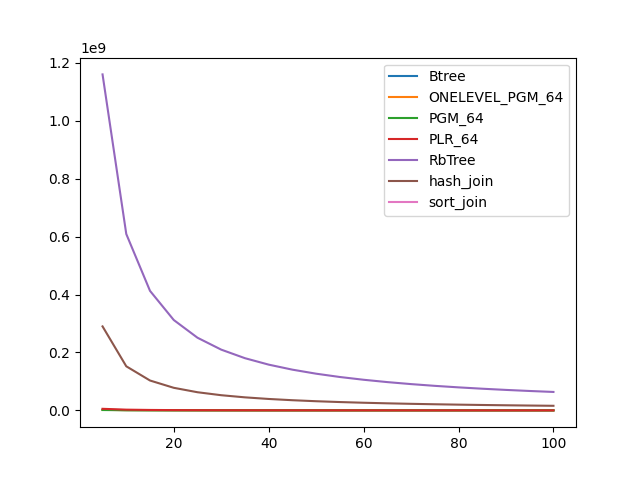

### duration_sec

|   0 |    Btree |   ONELEVEL_PGM_64 |   PGM_64 |   PLR_64 |   RbTree |   hash_join |   sort_join |
|----:|---------:|------------------:|---------:|---------:|---------:|------------:|------------:|
|   5 | 88.2508  |          81.0563  | 82.0318  | 48.4201  | 50.4299  |     98.6781 |     18.0809 |
|  10 | 47.1768  |          43.2218  | 43.7533  | 26.1007  | 28.3423  |     94.3528 |     14.3036 |
|  15 | 32.3666  |          29.5836  | 29.9749  | 17.8743  | 19.8273  |     80.2655 |     13.1996 |
|  20 | 24.9     |          22.6719  | 22.9451  | 13.8857  | 15.5941  |     89.5439 |     12.5301 |
|  25 | 20.4677  |          18.4465  | 18.6338  | 11.4108  | 13.1593  |     81.1281 |     12.106  |
|  30 | 17.2507  |          15.5973  | 15.7749  |  9.76499 | 11.0609  |     75.5817 |     11.8083 |
|  35 | 15.074   |          13.52    | 13.736   |  8.53286 |  9.88934 |     90.511  |     11.5979 |
|  40 | 13.1885  |          12.0383  | 12.1584  |  7.60552 |  8.79827 |     84.6876 |     11.4257 |
|  45 | 12.0564  |          10.8728  | 10.9282  |  6.88298 |  8.12021 |     80.8656 |     11.321  |
|  50 | 11.097   |           9.8766  |  9.87988 |  6.35879 |  7.37957 |     76.1569 |     11.2198 |
|  55 | 10.1485  |           9.02978 |  9.16046 |  5.86826 |  6.87856 |     71.3134 |     11.1091 |
|  60 |  8.92148 |           8.41003 |  8.5011  |  5.46805 |  6.43464 |     69.6344 |     11.1177 |
|  65 |  8.35518 |           7.867   |  7.88253 |  5.15271 |  6.04904 |     67.8562 |     10.9946 |
|  70 |  7.86293 |           7.41507 |  7.42666 |  4.87437 |  5.69867 |     85.3653 |     10.958  |
|  75 |  7.90647 |           6.95385 |  7.03675 |  4.61116 |  5.42792 |     79.5864 |     10.8814 |
|  80 |  7.36178 |           6.62857 |  6.64487 |  4.37312 |  5.2039  |     77.2511 |     10.8849 |
|  85 |  7.01006 |           6.24189 |  6.2873  |  4.16968 |  4.94639 |     74.7479 |     10.8275 |
|  90 |  6.7632  |           5.96165 |  6.03569 |  4.03845 |  4.68757 |     70.7961 |     10.8246 |
|  95 |  6.43278 |           5.69844 |  5.744   |  3.85582 |  4.52878 |     69.0105 |     10.7909 |
| 100 |  6.19224 |           5.48136 |  5.53707 |  3.72472 |  4.36656 |     67.2311 |     10.7436 |

### inner_index_size

|   0 |      Btree |   ONELEVEL_PGM_64 |      PGM_64 |      PLR_64 |   RbTree |   hash_join |   sort_join |
|----:|-----------:|------------------:|------------:|------------:|---------:|------------:|------------:|
|   5 | 1.1943e+07 |       1.25522e+07 | 8.51182e+06 | 3.21133e+07 |  6.4e+09 |         nan |         nan |
|  10 | 1.1943e+07 |       1.25522e+07 | 8.51182e+06 | 3.21133e+07 |  6.4e+09 |         nan |         nan |
|  15 | 1.1943e+07 |       1.25522e+07 | 8.51182e+06 | 3.21133e+07 |  6.4e+09 |         nan |         nan |
|  20 | 1.1943e+07 |       1.25522e+07 | 8.51182e+06 | 3.21133e+07 |  6.4e+09 |         nan |         nan |
|  25 | 1.1943e+07 |       1.25522e+07 | 8.51182e+06 | 3.21133e+07 |  6.4e+09 |         nan |         nan |
|  30 | 1.1943e+07 |       1.25522e+07 | 8.51182e+06 | 3.21133e+07 |  6.4e+09 |         nan |         nan |
|  35 | 1.1943e+07 |       1.25522e+07 | 8.51182e+06 | 3.21133e+07 |  6.4e+09 |         nan |         nan |
|  40 | 1.1943e+07 |       1.25522e+07 | 8.51182e+06 | 3.21133e+07 |  6.4e+09 |         nan |         nan |
|  45 | 1.1943e+07 |       1.25522e+07 | 8.51182e+06 | 3.21133e+07 |  6.4e+09 |         nan |         nan |
|  50 | 1.1943e+07 |       1.25522e+07 | 8.51182e+06 | 3.21133e+07 |  6.4e+09 |         nan |         nan |
|  55 | 1.1943e+07 |       1.25522e+07 | 8.51182e+06 | 3.21133e+07 |  6.4e+09 |         nan |         nan |
|  60 | 1.1943e+07 |       1.25522e+07 | 8.51182e+06 | 3.21133e+07 |  6.4e+09 |         nan |         nan |
|  65 | 1.1943e+07 |       1.25522e+07 | 8.51182e+06 | 3.21133e+07 |  6.4e+09 |         nan |         nan |
|  70 | 1.1943e+07 |       1.25522e+07 | 8.51182e+06 | 3.21133e+07 |  6.4e+09 |         nan |         nan |
|  75 | 1.1943e+07 |       1.25522e+07 | 8.51182e+06 | 3.21133e+07 |  6.4e+09 |         nan |         nan |
|  80 | 1.1943e+07 |       1.25522e+07 | 8.51182e+06 | 3.21133e+07 |  6.4e+09 |         nan |         nan |
|  85 | 1.1943e+07 |       1.25522e+07 | 8.51182e+06 | 3.21133e+07 |  6.4e+09 |         nan |         nan |
|  90 | 1.1943e+07 |       1.25522e+07 | 8.51182e+06 | 3.21133e+07 |  6.4e+09 |         nan |         nan |
|  95 | 1.1943e+07 |       1.25522e+07 | 8.51182e+06 | 3.21133e+07 |  6.4e+09 |         nan |         nan |
| 100 | 1.1943e+07 |       1.25522e+07 | 8.51182e+06 | 3.21133e+07 |  6.4e+09 |         nan |         nan |

### outer_index_size

|   0 |            Btree |   ONELEVEL_PGM_64 |           PGM_64 |           PLR_64 |      RbTree |   hash_join |   sort_join |
|----:|-----------------:|------------------:|-----------------:|-----------------:|------------:|------------:|------------:|
|   5 |      2.16872e+06 |        1.9639e+06 |      1.31602e+06 |      5.49853e+06 | 1.16015e+09 | 2.90038e+08 |         nan |
|  10 |      1.1425e+06  |   838344          | 561080           |      2.59034e+06 | 6.09064e+08 | 1.52266e+08 |         nan |
|  15 | 769920           |   474360          | 317280           |      1.55654e+06 | 4.12772e+08 | 1.03193e+08 |         nan |
|  20 | 584640           |   306816          | 205232           |      1.05376e+06 | 3.1215e+08  | 7.80376e+07 |         nan |
|  25 | 470384           |   215592          | 144240           | 764032           | 2.50975e+08 | 6.27437e+07 |         nan |
|  30 | 396272           |   160320          | 107400           | 580256           | 2.09843e+08 | 5.24607e+07 |         nan |
|  35 | 340688           |   123432          |  82624           | 459456           | 1.80293e+08 | 4.50733e+07 |         nan |
|  40 | 297456           |    98976          |  66288           | 372352           | 1.58035e+08 | 3.95086e+07 |         nan |
|  45 | 266576           |    80904          |  54280           | 308736           | 1.40688e+08 | 3.5172e+07  |         nan |
|  50 | 241872           |    67344          |  45104           | 260320           | 1.26762e+08 | 3.16906e+07 |         nan |
|  55 | 220256           |    57288          |  38384           | 222432           | 1.15351e+08 | 2.88378e+07 |         nan |
|  60 | 201728           |    48816          |  32720           | 191552           | 1.05811e+08 | 2.64528e+07 |         nan |
|  65 | 186288           |    42624          |  28624           | 168192           | 9.77519e+07 | 2.4438e+07  |         nan |
|  70 | 173936           |    37680          |  25296           | 148736           | 9.08105e+07 | 2.27026e+07 |         nan |
|  75 | 161584           |    33264          |  22352           | 132224           | 8.48062e+07 | 2.12016e+07 |         nan |
|  80 | 152320           |    29640          |  19920           | 117920           | 7.95353e+07 | 1.98838e+07 |         nan |
|  85 | 143056           |    27000          |  18176           | 107648           | 7.48838e+07 | 1.8721e+07  |         nan |
|  90 | 136880           |    24144          |  16240           |  97120           | 7.07449e+07 | 1.76862e+07 |         nan |
|  95 | 130704           |    22344          |  15024           |  89376           | 6.7044e+07  | 1.6761e+07  |         nan |
| 100 | 124528           |    20256          |  13616           |  81760           | 6.37175e+07 | 1.59294e+07 |         nan |

