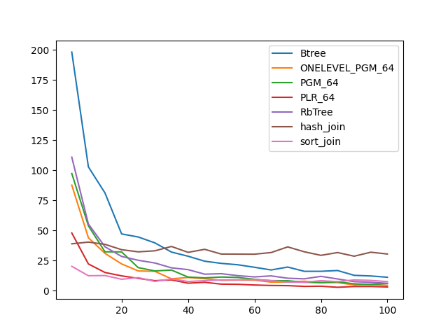
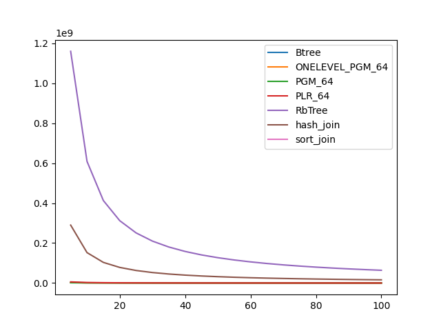

### duration_sec

|   0 |    Btree |   ONELEVEL_PGM_64 |   PGM_64 |   PLR_64 |    RbTree |   hash_join |   sort_join |
|----:|---------:|------------------:|---------:|---------:|----------:|------------:|------------:|
|   5 | 198.063  |          87.6863  | 97.3446  | 47.9694  | 110.875   |     38.9787 |    20.3005  |
|  10 | 102.794  |          44.0092  | 53.9153  | 22.2629  |  55.3986  |     40.3962 |    12.4904  |
|  15 |  81.1296 |          31.0381  | 32.2885  | 15.1716  |  36.4863  |     38.5319 |    12.6415  |
|  20 |  47.1799 |          22.294   | 32.2775  | 12.3784  |  28.4964  |     34.0963 |     9.55505 |
|  25 |  44.629  |          16.4552  | 19.2179  | 10.2861  |  25.3128  |     32.306  |    10.9311  |
|  30 |  39.7631 |          16.1432  | 16.4668  |  8.36746 |  23.0682  |     33.1762 |     7.74424 |
|  35 |  32.127  |           9.9436  | 17.2116  |  9.05401 |  19.0437  |     36.7861 |     9.85591 |
|  40 |  28.6768 |          11.0302  | 11.3779  |  6.30964 |  17.5543  |     31.8841 |     7.70464 |
|  45 |  24.5417 |          10.0338  | 10.7045  |  7.03353 |  13.7596  |     34.4015 |     8.37234 |
|  50 |  22.7432 |           8.67504 | 11.412   |  5.51387 |  14.1877  |     30.466  |     9.03461 |
|  55 |  21.5812 |           8.92407 | 11.0465  |  5.37152 |  12.5438  |     30.4145 |     9.10676 |
|  60 |  19.4939 |           8.80298 |  9.54018 |  4.79706 |  11.5188  |     30.3561 |     9.25849 |
|  65 |  17.2838 |           7.18027 |  8.40708 |  4.38682 |  12.3569  |     31.7255 |     8.3987  |
|  70 |  19.6823 |           7.25158 |  8.3118  |  4.26528 |  10.4096  |     36.4162 |     7.20266 |
|  75 |  16.1474 |           7.9348  |  7.08791 |  3.63852 |   9.92056 |     32.3446 |     7.09702 |
|  80 |  16.1639 |           6.84699 |  6.73637 |  3.79451 |  11.9661  |     29.4026 |     8.38103 |
|  85 |  16.8137 |           6.76876 |  7.48432 |  2.905   |   9.80643 |     31.7233 |     7.57199 |
|  90 |  12.8168 |           4.9238  |  5.74367 |  3.53152 |   7.55026 |     28.6938 |     9.01758 |
|  95 |  12.3029 |           5.20347 |  5.25333 |  3.57441 |   7.02899 |     32.0064 |     8.60538 |
| 100 |  11.2182 |           4.45005 |  6.00395 |  3.15731 |   6.22503 |     30.5008 |     7.61184 |

### inner_index_size

|   0 |      Btree |   ONELEVEL_PGM_64 |      PGM_64 |      PLR_64 |   RbTree |   hash_join |   sort_join |
|----:|-----------:|------------------:|------------:|------------:|---------:|------------:|------------:|
|   5 | 1.1943e+07 |       1.25522e+07 | 8.51182e+06 | 3.21133e+07 |  6.4e+09 |         nan |         nan |
|  10 | 1.1943e+07 |       1.25522e+07 | 8.51182e+06 | 3.21133e+07 |  6.4e+09 |         nan |         nan |
|  15 | 1.1943e+07 |       1.25522e+07 | 8.51182e+06 | 3.21133e+07 |  6.4e+09 |         nan |         nan |
|  20 | 1.1943e+07 |       1.25522e+07 | 8.51182e+06 | 3.21133e+07 |  6.4e+09 |         nan |         nan |
|  25 | 1.1943e+07 |       1.25522e+07 | 8.51182e+06 | 3.21133e+07 |  6.4e+09 |         nan |         nan |
|  30 | 1.1943e+07 |       1.25522e+07 | 8.51182e+06 | 3.21133e+07 |  6.4e+09 |         nan |         nan |
|  35 | 1.1943e+07 |       1.25522e+07 | 8.51182e+06 | 3.21133e+07 |  6.4e+09 |         nan |         nan |
|  40 | 1.1943e+07 |       1.25522e+07 | 8.51182e+06 | 3.21133e+07 |  6.4e+09 |         nan |         nan |
|  45 | 1.1943e+07 |       1.25522e+07 | 8.51182e+06 | 3.21133e+07 |  6.4e+09 |         nan |         nan |
|  50 | 1.1943e+07 |       1.25522e+07 | 8.51182e+06 | 3.21133e+07 |  6.4e+09 |         nan |         nan |
|  55 | 1.1943e+07 |       1.25522e+07 | 8.51182e+06 | 3.21133e+07 |  6.4e+09 |         nan |         nan |
|  60 | 1.1943e+07 |       1.25522e+07 | 8.51182e+06 | 3.21133e+07 |  6.4e+09 |         nan |         nan |
|  65 | 1.1943e+07 |       1.25522e+07 | 8.51182e+06 | 3.21133e+07 |  6.4e+09 |         nan |         nan |
|  70 | 1.1943e+07 |       1.25522e+07 | 8.51182e+06 | 3.21133e+07 |  6.4e+09 |         nan |         nan |
|  75 | 1.1943e+07 |       1.25522e+07 | 8.51182e+06 | 3.21133e+07 |  6.4e+09 |         nan |         nan |
|  80 | 1.1943e+07 |       1.25522e+07 | 8.51182e+06 | 3.21133e+07 |  6.4e+09 |         nan |         nan |
|  85 | 1.1943e+07 |       1.25522e+07 | 8.51182e+06 | 3.21133e+07 |  6.4e+09 |         nan |         nan |
|  90 | 1.1943e+07 |       1.25522e+07 | 8.51182e+06 | 3.21133e+07 |  6.4e+09 |         nan |         nan |
|  95 | 1.1943e+07 |       1.25522e+07 | 8.51182e+06 | 3.21133e+07 |  6.4e+09 |         nan |         nan |
| 100 | 1.1943e+07 |       1.25522e+07 | 8.51182e+06 | 3.21133e+07 |  6.4e+09 |         nan |         nan |

### outer_index_size

|   0 |            Btree |   ONELEVEL_PGM_64 |           PGM_64 |           PLR_64 |      RbTree |   hash_join |   sort_join |
|----:|-----------------:|------------------:|-----------------:|-----------------:|------------:|------------:|------------:|
|   5 |      2.16872e+06 |       1.96469e+06 |      1.31655e+06 |      5.50282e+06 | 1.16011e+09 | 2.90028e+08 |         nan |
|  10 |      1.1425e+06  |  836160           | 559536           |      2.58733e+06 | 6.09024e+08 | 1.52256e+08 |         nan |
|  15 | 769920           |  473568           | 316872           |      1.55571e+06 | 4.12806e+08 | 1.03201e+08 |         nan |
|  20 | 584640           |  306936           | 205344           |      1.04941e+06 | 3.12192e+08 | 7.80479e+07 |         nan |
|  25 | 470384           |  215640           | 144360           | 764128           | 2.50962e+08 | 6.27406e+07 |         nan |
|  30 | 396272           |  160176           | 107272           | 583264           | 2.09863e+08 | 5.24658e+07 |         nan |
|  35 | 340688           |  123840           |  82880           | 457984           | 1.80304e+08 | 4.5076e+07  |         nan |
|  40 | 297456           |   98688           |  66112           | 370624           | 1.58061e+08 | 3.95153e+07 |         nan |
|  45 | 266576           |   81600           |  54640           | 308832           | 1.40684e+08 | 3.5171e+07  |         nan |
|  50 | 241872           |   67344           |  45240           | 260608           | 1.26764e+08 | 3.1691e+07  |         nan |
|  55 | 220256           |   57672           |  38640           | 223456           | 1.15338e+08 | 2.88344e+07 |         nan |
|  60 | 201728           |   49656           |  33312           | 191552           | 1.05815e+08 | 2.64538e+07 |         nan |
|  65 | 186288           |   42576           |  28544           | 168160           | 9.77362e+07 | 2.4434e+07  |         nan |
|  70 | 173936           |   37920           |  25488           | 148416           | 9.08116e+07 | 2.27029e+07 |         nan |
|  75 | 161584           |   33408           |  22432           | 132128           | 8.47944e+07 | 2.11986e+07 |         nan |
|  80 | 152320           |   30024           |  20144           | 119008           | 7.95328e+07 | 1.98832e+07 |         nan |
|  85 | 143056           |   26928           |  18112           | 107648           | 7.48812e+07 | 1.87203e+07 |         nan |
|  90 | 136880           |   24096           |  16208           |  96800           | 7.0752e+07  | 1.7688e+07  |         nan |
|  95 | 130704           |   22296           |  14992           |  89536           | 6.70444e+07 | 1.67611e+07 |         nan |
| 100 | 124528           |   20520           |  13808           |  81856           | 6.37186e+07 | 1.59296e+07 |         nan |

