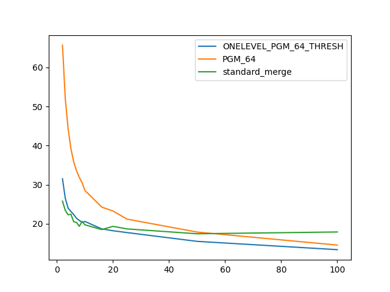

### duration_sec

|   1 |   ONELEVEL_PGM_64_THRESH |   PGM_64 |   standard_merge |
|----:|-------------------------:|---------:|-----------------:|
|   2 |                  31.4879 |  65.6715 |          25.7946 |
|   3 |                  26.492  |  51.93   |          23.3921 |
|   4 |                  24.0045 |  44.3416 |          22.2781 |
|   5 |                  23.1223 |  39.2265 |          22.4251 |
|   6 |                  22.3496 |  35.821  |          20.4953 |
|   7 |                  21.3934 |  33.5652 |          20.3298 |
|   8 |                  20.8349 |  31.8559 |          19.3461 |
|   9 |                  20.3464 |  30.4679 |          20.5908 |
|  10 |                  20.5795 |  28.5176 |          19.7216 |
|  16 |                  18.6704 |  24.2509 |          18.4953 |
|  20 |                  18.2026 |  23.2515 |          19.3267 |
|  25 |                  17.7336 |  21.1778 |          18.6702 |
|  50 |                  15.4838 |  17.8624 |          17.4256 |
| 100 |                  13.358  |  14.5301 |          17.8851 |

### inner_index_size

|   1 |   ONELEVEL_PGM_64_THRESH |      PGM_64 |   standard_merge |
|----:|-------------------------:|------------:|-----------------:|
|   2 |              1.25522e+07 | 8.51182e+06 |              nan |
|   3 |              1.25522e+07 | 8.51182e+06 |              nan |
|   4 |              1.25522e+07 | 8.51182e+06 |              nan |
|   5 |              1.25522e+07 | 8.51182e+06 |              nan |
|   6 |              1.25522e+07 | 8.51182e+06 |              nan |
|   7 |              1.25522e+07 | 8.51182e+06 |              nan |
|   8 |              1.25522e+07 | 8.51182e+06 |              nan |
|   9 |              1.25522e+07 | 8.51182e+06 |              nan |
|  10 |              1.25522e+07 | 8.51182e+06 |              nan |
|  16 |              1.25522e+07 | 8.51182e+06 |              nan |
|  20 |              1.25522e+07 | 8.51182e+06 |              nan |
|  25 |              1.25522e+07 | 8.51182e+06 |              nan |
|  50 |              1.25522e+07 | 8.51182e+06 |              nan |
| 100 |              1.25522e+07 | 8.51182e+06 |              nan |

