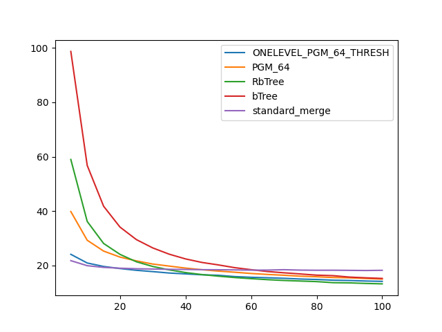

### duration_sec

|   0 |   ONELEVEL_PGM_64_THRESH |   PGM_64 |   RbTree |   bTree |   standard_merge |
|----:|-------------------------:|---------:|---------:|--------:|-----------------:|
|   5 |                  24.1047 |  39.8296 |  58.9804 | 98.6999 |          21.7821 |
|  10 |                  20.9163 |  29.2813 |  36.1951 | 56.7914 |          19.9235 |
|  15 |                  19.6421 |  25.2994 |  28.0996 | 41.7908 |          19.3045 |
|  20 |                  18.874  |  23.0856 |  24.0874 | 34.1206 |          18.9993 |
|  25 |                  18.2282 |  21.6925 |  21.3647 | 29.5164 |          18.7971 |
|  30 |                  17.7499 |  20.5307 |  19.6352 | 26.4557 |          18.6917 |
|  35 |                  17.2287 |  19.7768 |  18.3873 | 24.1615 |          18.5921 |
|  40 |                  16.9083 |  19.0418 |  17.3971 | 22.4129 |          18.5422 |
|  45 |                  16.5754 |  18.4422 |  16.6578 | 21.1172 |          18.4561 |
|  50 |                  16.4005 |  17.9382 |  16.0669 | 20.212  |          18.4293 |
|  55 |                  15.9204 |  17.5153 |  15.5667 | 19.1997 |          18.3794 |
|  60 |                  15.6579 |  17.0628 |  15.1561 | 18.4557 |          18.2882 |
|  65 |                  15.4933 |  16.7021 |  14.7838 | 17.7811 |          18.3067 |
|  70 |                  15.2863 |  16.4126 |  14.4911 | 17.3134 |          18.4497 |
|  75 |                  15.0167 |  16.0708 |  14.2791 | 16.8879 |          18.2955 |
|  80 |                  14.8545 |  15.8585 |  14.0717 | 16.4444 |          18.2458 |
|  85 |                  14.5927 |  15.5667 |  13.6777 | 16.2616 |          18.2589 |
|  90 |                  14.4742 |  15.4621 |  13.6054 | 15.7331 |          18.211  |
|  95 |                  14.2834 |  15.2216 |  13.3949 | 15.4592 |          18.1556 |
| 100 |                  14.1553 |  14.9949 |  13.2422 | 15.236  |          18.2255 |

