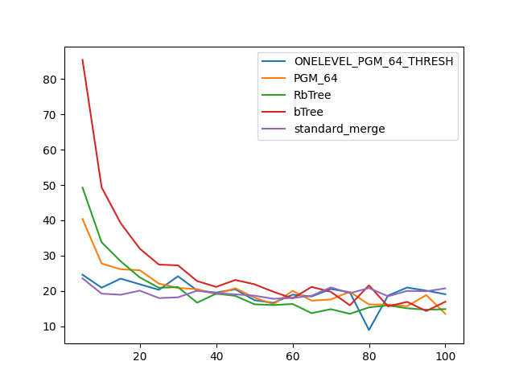

### duration_sec

|   0 |   ONELEVEL_PGM_64_THRESH |   PGM_64 |   RbTree |    bTree |   standard_merge |
|----:|-------------------------:|---------:|---------:|---------:|-----------------:|
|   5 |                  7.61254 | 10.5565  | 15.7027  | 25.1901  |          5.9308  |
|  10 |                  6.47529 |  7.92165 |  9.85602 | 14.8337  |          5.45775 |
|  15 |                  5.82283 |  7.07199 |  7.73779 | 10.9469  |          5.3037  |
|  20 |                  5.61453 |  6.35579 |  6.67184 |  9.3164  |          5.25505 |
|  25 |                  5.57287 |  6.23343 |  6.04132 |  8.01071 |          5.22644 |
|  30 |                  5.45879 |  5.74562 |  5.58063 |  7.32662 |          5.17328 |
|  35 |                  5.35294 |  5.56199 |  5.27173 |  6.64506 |          5.12409 |
|  40 |                  5.31648 |  5.3721  |  5.02786 |  6.23416 |          5.07272 |
|  45 |                  5.28263 |  5.22529 |  4.81918 |  5.93101 |          5.11599 |
|  50 |                  5.46888 |  5.05997 |  4.68066 |  5.6171  |          5.10104 |
|  55 |                  5.26195 |  4.95732 |  4.53504 |  5.37403 |          5.08672 |
|  60 |                  5.49418 |  4.86375 |  4.40992 |  5.22885 |          5.06846 |
|  65 |                  5.23255 |  4.7999  |  4.38073 |  5.0693  |          5.04397 |
|  70 |                  5.21994 |  4.69666 |  4.23189 |  4.96245 |          5.06194 |
|  75 |                  5.22466 |  4.64195 |  4.21951 |  5.03422 |          5.06387 |
|  80 |                  5.22267 |  4.61749 |  4.09493 |  4.761   |          5.11658 |
|  85 |                  5.21774 |  4.63818 |  4.07033 |  4.63971 |          5.12238 |
|  90 |                  5.18275 |  4.43556 |  4.00738 |  4.553   |          5.09788 |
|  95 |                  5.18757 |  4.64028 |  3.96366 |  4.58372 |          5.03227 |
| 100 |                  5.19549 |  4.36902 |  3.92396 |  4.60445 |          5.12065 |

