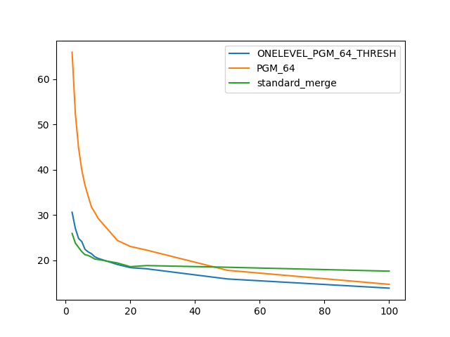

### duration_sec

|   1 |   ONELEVEL_PGM_64_THRESH |   PGM_64 |   standard_merge |
|----:|-------------------------:|---------:|-----------------:|
|   2 |                  30.6403 |  65.982  |          25.9721 |
|   3 |                  27.0818 |  52.4412 |          23.8542 |
|   4 |                  24.8738 |  44.848  |          22.8739 |
|   5 |                  24.1618 |  39.9035 |          21.9506 |
|   6 |                  22.443  |  36.5905 |          21.266  |
|   7 |                  21.8789 |  34.1174 |          21.0944 |
|   8 |                  21.4902 |  31.7808 |          20.7368 |
|   9 |                  20.8208 |  30.631  |          20.3138 |
|  10 |                  20.4783 |  29.3368 |          20.2169 |
|  16 |                  19.1113 |  24.4164 |          19.4506 |
|  20 |                  18.4192 |  23.0977 |          18.6276 |
|  25 |                  18.1658 |  22.2946 |          18.8729 |
|  50 |                  15.9183 |  17.8312 |          18.5021 |
| 100 |                  13.8909 |  14.731  |          17.6438 |

