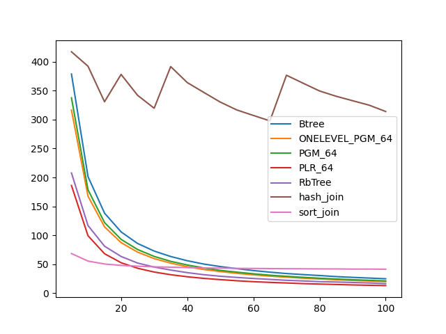
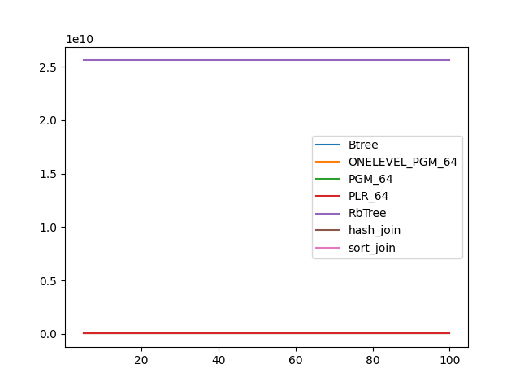
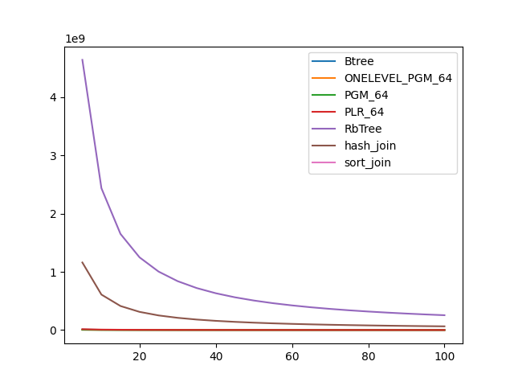

### duration_sec

|   0 |    Btree |   ONELEVEL_PGM_64 |   PGM_64 |   PLR_64 |   RbTree |   hash_join |   sort_join |
|----:|---------:|------------------:|---------:|---------:|---------:|------------:|------------:|
|   5 | 378.847  |          316.615  | 337.703  | 186.092  | 207.767  |     417.32  |     68.4798 |
|  10 | 201.448  |          167.698  | 178.682  |  99.2559 | 116.896  |     392.359 |     55.4429 |
|  15 | 138.297  |          114.625  | 122.045  |  68.1461 |  81.1617 |     330.893 |     50.3736 |
|  20 | 105.904  |           87.3291 |  93.0128 |  52.5972 |  63.3902 |     378.193 |     47.9853 |
|  25 |  85.8255 |           70.8797 |  75.3933 |  43.0184 |  52.0279 |     342.004 |     46.5773 |
|  30 |  72.7545 |           59.7163 |  63.5053 |  36.4802 |  45.0839 |     319.706 |     45.5029 |
|  35 |  63.3318 |           51.8682 |  54.9841 |  31.8672 |  39.924  |     391.702 |     44.8595 |
|  40 |  56.0517 |           45.7742 |  48.6926 |  28.3197 |  35.4449 |     364.14  |     44.12   |
|  45 |  50.2791 |           40.8564 |  43.5862 |  25.5215 |  31.8762 |     347.089 |     43.4328 |
|  50 |  45.9104 |           37.317  |  39.2745 |  23.3494 |  29.2163 |     330.296 |     43.2437 |
|  55 |  42.3599 |           34.2313 |  36.3198 |  21.4145 |  27.1281 |     316.701 |     42.809  |
|  60 |  39.0346 |           31.6286 |  33.45   |  19.766  |  25.3336 |     307.211 |     42.6901 |
|  65 |  36.2863 |           29.3803 |  30.9984 |  18.6192 |  23.7794 |     297.846 |     42.4541 |
|  70 |  33.8661 |           27.6004 |  29.0726 |  17.572  |  22.1754 |     376.728 |     42.2457 |
|  75 |  32.0678 |           25.8197 |  27.3541 |  16.4445 |  21.0747 |     363.068 |     42.0784 |
|  80 |  30.4346 |           24.4525 |  25.8073 |  15.7108 |  19.8297 |     349.548 |     41.8958 |
|  85 |  28.5934 |           23.1303 |  24.4176 |  14.9162 |  19.2024 |     340.45  |     41.8432 |
|  90 |  27.277  |           21.9925 |  23.2597 |  14.1932 |  18.436  |     332.678 |     41.5413 |
|  95 |  26.0706 |           21.0089 |  22.1311 |  13.6005 |  17.5664 |     325.012 |     41.5789 |
| 100 |  24.875  |           20.0362 |  21.1492 |  13.0746 |  16.4415 |     314.049 |     41.3703 |

### inner_index_size

|   0 |       Btree |   ONELEVEL_PGM_64 |      PGM_64 |      PLR_64 |   RbTree |   hash_join |   sort_join |
|----:|------------:|------------------:|------------:|------------:|---------:|------------:|------------:|
|   5 | 4.77443e+07 |       3.30032e+07 | 2.26294e+07 | 8.64974e+07 | 2.56e+10 |         nan |         nan |
|  10 | 4.77443e+07 |       3.30032e+07 | 2.26294e+07 | 8.64974e+07 | 2.56e+10 |         nan |         nan |
|  15 | 4.77443e+07 |       3.30032e+07 | 2.26294e+07 | 8.64974e+07 | 2.56e+10 |         nan |         nan |
|  20 | 4.77443e+07 |       3.30032e+07 | 2.26294e+07 | 8.64974e+07 | 2.56e+10 |         nan |         nan |
|  25 | 4.77443e+07 |       3.30032e+07 | 2.26294e+07 | 8.64974e+07 | 2.56e+10 |         nan |         nan |
|  30 | 4.77443e+07 |       3.30032e+07 | 2.26294e+07 | 8.64974e+07 | 2.56e+10 |         nan |         nan |
|  35 | 4.77443e+07 |       3.30032e+07 | 2.26294e+07 | 8.64974e+07 | 2.56e+10 |         nan |         nan |
|  40 | 4.77443e+07 |       3.30032e+07 | 2.26294e+07 | 8.64974e+07 | 2.56e+10 |         nan |         nan |
|  45 | 4.77443e+07 |       3.30032e+07 | 2.26294e+07 | 8.64974e+07 | 2.56e+10 |         nan |         nan |
|  50 | 4.77443e+07 |       3.30032e+07 | 2.26294e+07 | 8.64974e+07 | 2.56e+10 |         nan |         nan |
|  55 | 4.77443e+07 |       3.30032e+07 | 2.26294e+07 | 8.64974e+07 | 2.56e+10 |         nan |         nan |
|  60 | 4.77443e+07 |       3.30032e+07 | 2.26294e+07 | 8.64974e+07 | 2.56e+10 |         nan |         nan |
|  65 | 4.77443e+07 |       3.30032e+07 | 2.26294e+07 | 8.64974e+07 | 2.56e+10 |         nan |         nan |
|  70 | 4.77443e+07 |       3.30032e+07 | 2.26294e+07 | 8.64974e+07 | 2.56e+10 |         nan |         nan |
|  75 | 4.77443e+07 |       3.30032e+07 | 2.26294e+07 | 8.64974e+07 | 2.56e+10 |         nan |         nan |
|  80 | 4.77443e+07 |       3.30032e+07 | 2.26294e+07 | 8.64974e+07 | 2.56e+10 |         nan |         nan |
|  85 | 4.77443e+07 |       3.30032e+07 | 2.26294e+07 | 8.64974e+07 | 2.56e+10 |         nan |         nan |
|  90 | 4.77443e+07 |       3.30032e+07 | 2.26294e+07 | 8.64974e+07 | 2.56e+10 |         nan |         nan |
|  95 | 4.77443e+07 |       3.30032e+07 | 2.26294e+07 | 8.64974e+07 | 2.56e+10 |         nan |         nan |
| 100 | 4.77443e+07 |       3.30032e+07 | 2.26294e+07 | 8.64974e+07 | 2.56e+10 |         nan |         nan |

### outer_index_size

|   0 |            Btree |   ONELEVEL_PGM_64 |           PGM_64 |           PLR_64 |      RbTree |   hash_join |   sort_join |
|----:|-----------------:|------------------:|-----------------:|-----------------:|------------:|------------:|------------:|
|   5 |      8.6585e+06  |       5.75954e+06 |      3.95669e+06 |      1.47722e+07 | 4.6405e+09  | 1.16013e+09 |         nan |
|  10 |      4.5495e+06  |       3.01462e+06 |      2.07298e+06 |      7.71574e+06 | 2.43611e+09 | 6.09026e+08 |         nan |
|  15 |      3.08378e+06 |       2.04547e+06 |      1.40786e+06 |      5.21782e+06 | 1.65106e+09 | 4.12765e+08 |         nan |
|  20 |      2.33547e+06 |       1.54994e+06 |      1.06704e+06 |      3.94845e+06 | 1.24855e+09 | 3.12137e+08 |         nan |
|  25 |      1.88154e+06 |       1.25011e+06 | 860736           |      3.17206e+06 | 1.0038e+09  | 2.50951e+08 |         nan |
|  30 |      1.57173e+06 |       1.04892e+06 | 722160           |      2.65578e+06 | 8.39297e+08 | 2.09824e+08 |         nan |
|  35 |      1.35248e+06 |  904656           | 623408           |      2.28502e+06 | 7.21083e+08 | 1.80271e+08 |         nan |
|  40 |      1.18573e+06 |  795648           | 548240           |      2.00717e+06 | 6.32103e+08 | 1.58026e+08 |         nan |
|  45 |      1.05603e+06 |  708816           | 488592           |      1.79069e+06 | 5.62615e+08 | 1.40654e+08 |         nan |
|  50 | 954128           |  640704           | 441664           |      1.61894e+06 | 5.06926e+08 | 1.26732e+08 |         nan |
|  55 | 870752           |  584328           | 402632           |      1.4713e+06  | 4.61219e+08 | 1.15305e+08 |         nan |
|  60 | 791536           |  536712           | 370024           |      1.3529e+06  | 4.23109e+08 | 1.05777e+08 |         nan |
|  65 | 729776           |  496536           | 342400           |      1.25277e+06 | 3.90811e+08 | 9.77028e+07 |         nan |
|  70 | 680368           |  463032           | 319256           |      1.16627e+06 | 3.63112e+08 | 9.07779e+07 |         nan |
|  75 | 634048           |  432456           | 298168           |      1.09018e+06 | 3.39062e+08 | 8.47654e+07 |         nan |
|  80 | 596992           |  406488           | 280232           |      1.02358e+06 | 3.18005e+08 | 7.95011e+07 |         nan |
|  85 | 559936           |  383520           | 264408           | 966048           | 2.99415e+08 | 7.48538e+07 |         nan |
|  90 | 529056           |  363384           | 250552           | 912832           | 2.82877e+08 | 7.07191e+07 |         nan |
|  95 | 504352           |  344784           | 237784           | 863584           | 2.68059e+08 | 6.70148e+07 |         nan |
| 100 | 479648           |  327504           | 225816           | 823040           | 2.54727e+08 | 6.36817e+07 |         nan |

