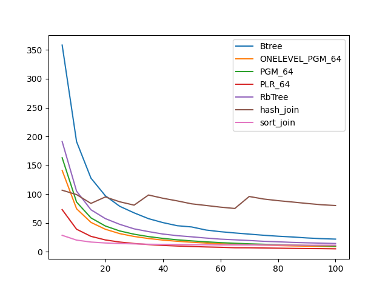
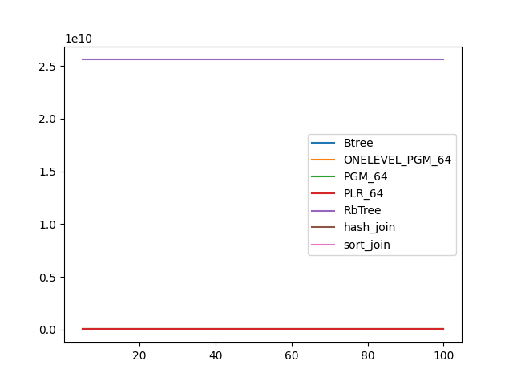
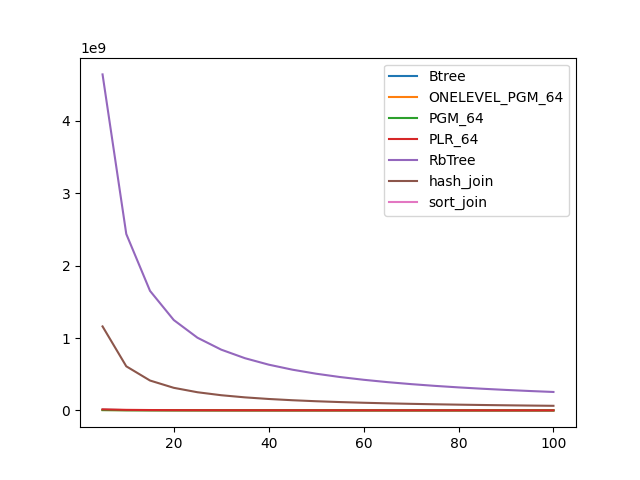

### duration_sec

|   0 |    Btree |   ONELEVEL_PGM_64 |    PGM_64 |   PLR_64 |   RbTree |   hash_join |   sort_join |
|----:|---------:|------------------:|----------:|---------:|---------:|------------:|------------:|
|   5 | 358.427  |         141.063   | 162.997   | 73.0815  | 191.124  |    106.75   |     28.5419 |
|  10 | 191.065  |          74.6755  |  86.2625  | 39.154   | 105.114  |     99.2241 |     20.2357 |
|  15 | 127.749  |          50.9757  |  58.7928  | 26.7562  |  72.8841 |     83.8888 |     16.8766 |
|  20 |  97.1704 |          39.0664  |  44.7289  | 20.5367  |  57.5461 |     95.0795 |     15.2723 |
|  25 |  78.89   |          31.4997  |  36.1374  | 16.8794  |  47.5928 |     86.7124 |     14.3071 |
|  30 |  67.4929 |          26.5384  |  30.4577  | 14.2893  |  39.7564 |     80.8804 |     13.6812 |
|  35 |  57.457  |          22.9822  |  26.3173  | 12.5572  |  34.9951 |     98.4682 |     13.073  |
|  40 |  50.6136 |          20.2843  |  23.2191  | 11.0833  |  30.7798 |     92.8467 |     12.8403 |
|  45 |  45.2007 |          18.1962  |  20.7288  |  9.98042 |  27.9471 |     88.2528 |     12.5768 |
|  50 |  43.0482 |          16.5305  |  18.8941  |  9.18039 |  25.9396 |     83.1422 |     12.3073 |
|  55 |  37.7152 |          15.1184  |  17.2692  |  8.39011 |  23.7894 |     80.3104 |     12.1101 |
|  60 |  34.8333 |          13.9503  |  15.8941  |  7.80386 |  21.9271 |     77.4196 |     11.8116 |
|  65 |  32.6353 |          13.0052  |  14.7557  |  6.99409 |  20.7457 |     75.097  |     11.8224 |
|  70 |  30.6225 |          12.1643  |  13.8053  |  6.92357 |  19.5815 |     95.8768 |     11.7543 |
|  75 |  28.6553 |          11.484   |  13.0179  |  6.55167 |  18.1743 |     91.5004 |     11.6724 |
|  80 |  26.9935 |          10.8205  |  12.2133  |  6.24236 |  17.3049 |     88.6802 |     11.5823 |
|  85 |  25.6598 |          10.2072  |  11.604   |  5.88658 |  16.2952 |     86.3222 |     11.5638 |
|  90 |  24.0099 |           9.76776 |  10.9614  |  5.6294  |  15.549  |     83.8325 |     11.3764 |
|  95 |  22.7576 |           9.29814 |  10.4704  |  5.48781 |  14.969  |     81.6053 |     11.3935 |
| 100 |  21.9653 |           8.85119 |   9.93434 |  5.15331 |  14.344  |     80.2189 |     11.3042 |

### inner_index_size

|   0 |       Btree |   ONELEVEL_PGM_64 |      PGM_64 |      PLR_64 |   RbTree |   hash_join |   sort_join |
|----:|------------:|------------------:|------------:|------------:|---------:|------------:|------------:|
|   5 | 4.77443e+07 |       3.30032e+07 | 2.26294e+07 | 8.64974e+07 | 2.56e+10 |         nan |         nan |
|  10 | 4.77443e+07 |       3.30032e+07 | 2.26294e+07 | 8.64974e+07 | 2.56e+10 |         nan |         nan |
|  15 | 4.77443e+07 |       3.30032e+07 | 2.26294e+07 | 8.64974e+07 | 2.56e+10 |         nan |         nan |
|  20 | 4.77443e+07 |       3.30032e+07 | 2.26294e+07 | 8.64974e+07 | 2.56e+10 |         nan |         nan |
|  25 | 4.77443e+07 |       3.30032e+07 | 2.26294e+07 | 8.64974e+07 | 2.56e+10 |         nan |         nan |
|  30 | 4.77443e+07 |       3.30032e+07 | 2.26294e+07 | 8.64974e+07 | 2.56e+10 |         nan |         nan |
|  35 | 4.77443e+07 |       3.30032e+07 | 2.26294e+07 | 8.64974e+07 | 2.56e+10 |         nan |         nan |
|  40 | 4.77443e+07 |       3.30032e+07 | 2.26294e+07 | 8.64974e+07 | 2.56e+10 |         nan |         nan |
|  45 | 4.77443e+07 |       3.30032e+07 | 2.26294e+07 | 8.64974e+07 | 2.56e+10 |         nan |         nan |
|  50 | 4.77443e+07 |       3.30032e+07 | 2.26294e+07 | 8.64974e+07 | 2.56e+10 |         nan |         nan |
|  55 | 4.77443e+07 |       3.30032e+07 | 2.26294e+07 | 8.64974e+07 | 2.56e+10 |         nan |         nan |
|  60 | 4.77443e+07 |       3.30032e+07 | 2.26294e+07 | 8.64974e+07 | 2.56e+10 |         nan |         nan |
|  65 | 4.77443e+07 |       3.30032e+07 | 2.26294e+07 | 8.64974e+07 | 2.56e+10 |         nan |         nan |
|  70 | 4.77443e+07 |       3.30032e+07 | 2.26294e+07 | 8.64974e+07 | 2.56e+10 |         nan |         nan |
|  75 | 4.77443e+07 |       3.30032e+07 | 2.26294e+07 | 8.64974e+07 | 2.56e+10 |         nan |         nan |
|  80 | 4.77443e+07 |       3.30032e+07 | 2.26294e+07 | 8.64974e+07 | 2.56e+10 |         nan |         nan |
|  85 | 4.77443e+07 |       3.30032e+07 | 2.26294e+07 | 8.64974e+07 | 2.56e+10 |         nan |         nan |
|  90 | 4.77443e+07 |       3.30032e+07 | 2.26294e+07 | 8.64974e+07 | 2.56e+10 |         nan |         nan |
|  95 | 4.77443e+07 |       3.30032e+07 | 2.26294e+07 | 8.64974e+07 | 2.56e+10 |         nan |         nan |
| 100 | 4.77443e+07 |       3.30032e+07 | 2.26294e+07 | 8.64974e+07 | 2.56e+10 |         nan |         nan |

### outer_index_size

|   0 |            Btree |   ONELEVEL_PGM_64 |           PGM_64 |           PLR_64 |      RbTree |   hash_join |   sort_join |
|----:|-----------------:|------------------:|-----------------:|-----------------:|------------:|------------:|------------:|
|   5 |      8.6585e+06  |       5.75669e+06 |      3.95454e+06 |      1.47734e+07 | 4.6405e+09  | 1.16013e+09 |         nan |
|  10 |      4.5495e+06  |       3.01918e+06 |      2.07619e+06 |      7.70893e+06 | 2.4363e+09  | 6.09076e+08 |         nan |
|  15 |      3.08378e+06 |       2.04583e+06 |      1.40808e+06 |      5.21354e+06 | 1.65108e+09 | 4.1277e+08  |         nan |
|  20 |      2.33547e+06 |       1.55002e+06 |      1.06698e+06 |      3.94832e+06 | 1.24853e+09 | 3.12134e+08 |         nan |
|  25 |      1.88154e+06 |       1.24824e+06 | 859312           |      3.17398e+06 | 1.0038e+09  | 2.50951e+08 |         nan |
|  30 |      1.57173e+06 |       1.04978e+06 | 723008           |      2.65824e+06 | 8.39279e+08 | 2.0982e+08  |         nan |
|  35 |      1.35248e+06 |  904824           | 623552           |      2.28854e+06 | 7.21091e+08 | 1.80273e+08 |         nan |
|  40 |      1.18573e+06 |  794184           | 547136           |      2.00774e+06 | 6.32047e+08 | 1.58012e+08 |         nan |
|  45 |      1.05603e+06 |  709032           | 488528           |      1.7871e+06  | 5.62601e+08 | 1.4065e+08  |         nan |
|  50 | 954128           |  639720           | 440808           |      1.6113e+06  | 5.06885e+08 | 1.26721e+08 |         nan |
|  55 | 870752           |  584256           | 402664           |      1.47456e+06 | 4.61259e+08 | 1.15315e+08 |         nan |
|  60 | 791536           |  536352           | 369680           |      1.35194e+06 | 4.23125e+08 | 1.05781e+08 |         nan |
|  65 | 729776           |  496296           | 342168           |      1.2527e+06  | 3.90834e+08 | 9.77085e+07 |         nan |
|  70 | 680368           |  461808           | 318360           |      1.16496e+06 | 3.63125e+08 | 9.07813e+07 |         nan |
|  75 | 634048           |  432768           | 298280           |      1.08851e+06 | 3.39067e+08 | 8.47667e+07 |         nan |
|  80 | 596992           |  406176           | 279992           |      1.02298e+06 | 3.18017e+08 | 7.95042e+07 |         nan |
|  85 | 559936           |  383856           | 264632           | 964224           | 2.99397e+08 | 7.48492e+07 |         nan |
|  90 | 529056           |  361464           | 249208           | 911264           | 2.82884e+08 | 7.07209e+07 |         nan |
|  95 | 504352           |  343872           | 237080           | 864192           | 2.68058e+08 | 6.70146e+07 |         nan |
| 100 | 479648           |  327192           | 225672           | 823456           | 2.54727e+08 | 6.36817e+07 |         nan |

