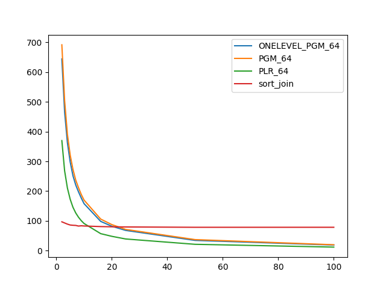
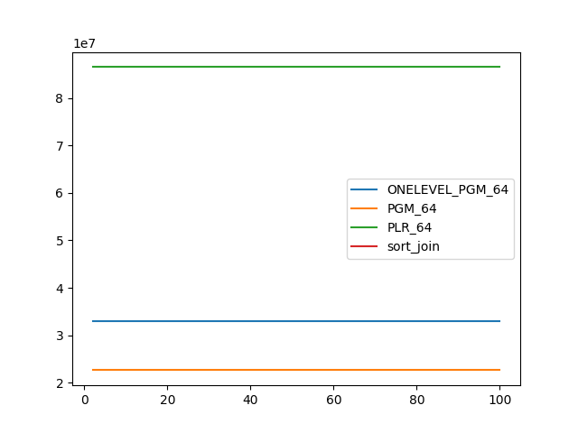
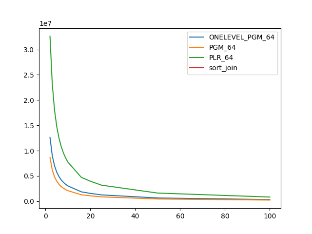

### duration_sec

|   1 |   ONELEVEL_PGM_64 |   PGM_64 |   PLR_64 |   sort_join |
|----:|------------------:|---------:|---------:|------------:|
|   2 |          644.496  | 691.97   | 369.928  |     96.8951 |
|   3 |          465.949  | 504.256  | 268.139  |     93.053  |
|   4 |          363.22   | 391.506  | 210.684  |     89.2203 |
|   5 |          298.419  | 321.724  | 172.878  |     86.1862 |
|   6 |          251.952  | 273.455  | 145.89   |     85.2922 |
|   7 |          220.738  | 237.211  | 126.762  |     84.8157 |
|   8 |          197.644  | 211.754  | 112.336  |     82.628  |
|   9 |          176.872  | 188.796  | 100.719  |     83.5844 |
|  10 |          158.019  | 169.933  |  91.3171 |     82.9037 |
|  16 |           98.3648 | 106.118  |  57.1389 |     80.8916 |
|  20 |           82.0457 |  87.6514 |  48.1942 |     80.1757 |
|  25 |           68.0454 |  71.3263 |  39.2601 |     79.6709 |
|  50 |           34.4573 |  37.1379 |  21.3113 |     78.5156 |
| 100 |           18.7823 |  19.8339 |  11.9474 |     78.5583 |

### inner_index_size

|   1 |   ONELEVEL_PGM_64 |      PGM_64 |      PLR_64 |   sort_join |
|----:|------------------:|------------:|------------:|------------:|
|   2 |       3.30032e+07 | 2.26294e+07 | 8.64974e+07 |         nan |
|   3 |       3.30032e+07 | 2.26294e+07 | 8.64974e+07 |         nan |
|   4 |       3.30032e+07 | 2.26294e+07 | 8.64974e+07 |         nan |
|   5 |       3.30032e+07 | 2.26294e+07 | 8.64974e+07 |         nan |
|   6 |       3.30032e+07 | 2.26294e+07 | 8.64974e+07 |         nan |
|   7 |       3.30032e+07 | 2.26294e+07 | 8.64974e+07 |         nan |
|   8 |       3.30032e+07 | 2.26294e+07 | 8.64974e+07 |         nan |
|   9 |       3.30032e+07 | 2.26294e+07 | 8.64974e+07 |         nan |
|  10 |       3.30032e+07 | 2.26294e+07 | 8.64974e+07 |         nan |
|  16 |       3.30032e+07 | 2.26294e+07 | 8.64974e+07 |         nan |
|  20 |       3.30032e+07 | 2.26294e+07 | 8.64974e+07 |         nan |
|  25 |       3.30032e+07 | 2.26294e+07 | 8.64974e+07 |         nan |
|  50 |       3.30032e+07 | 2.26294e+07 | 8.64974e+07 |         nan |
| 100 |       3.30032e+07 | 2.26294e+07 | 8.64974e+07 |         nan |

### outer_index_size

|   1 |   ONELEVEL_PGM_64 |           PGM_64 |           PLR_64 |   sort_join |
|----:|------------------:|-----------------:|-----------------:|------------:|
|   2 |       1.2623e+07  |      8.66402e+06 |      3.26155e+07 |         nan |
|   3 |       9.04066e+06 |      6.20742e+06 |      2.32935e+07 |         nan |
|   4 |       7.03663e+06 |      4.83261e+06 |      1.80899e+07 |         nan |
|   5 |       5.75798e+06 |      3.9555e+06  |      1.47785e+07 |         nan |
|   6 |       4.87111e+06 |      3.3471e+06  |      1.24858e+07 |         nan |
|   7 |       4.21685e+06 |      2.8981e+06  |      1.08101e+07 |         nan |
|   8 |       3.72485e+06 |      2.56064e+06 |      9.52973e+06 |         nan |
|   9 |       3.33127e+06 |      2.2907e+06  |      8.52493e+06 |         nan |
|  10 |       3.02105e+06 |      2.07741e+06 |      7.71741e+06 |         nan |
|  16 |       1.84877e+06 |      1.2727e+06  |      4.70826e+06 |         nan |
|  20 |       1.54829e+06 |      1.06602e+06 |      3.94893e+06 |         nan |
|  25 |       1.2497e+06  | 860448           |      3.17126e+06 |         nan |
|  50 |  640200           | 441440           |      1.61328e+06 |         nan |
| 100 |  327456           | 225880           | 823552           |         nan |

