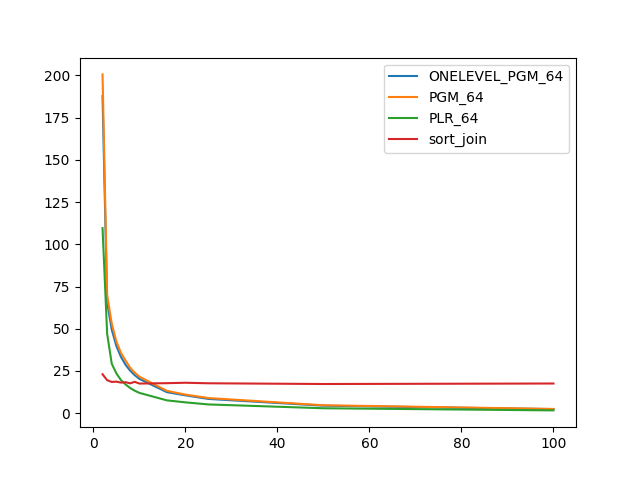
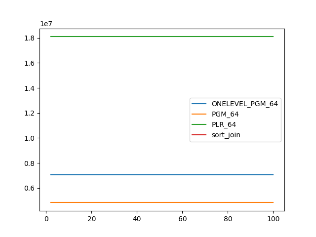
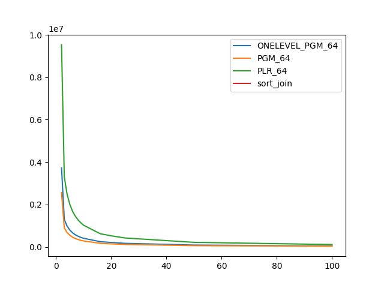

### duration_sec

|   1 |   ONELEVEL_PGM_64 |    PGM_64 |    PLR_64 |   sort_join |
|----:|------------------:|----------:|----------:|------------:|
|   2 |         187.75    | 200.597   | 109.57    |     23.0458 |
|   3 |          65.6229  |  69.8848  |  47.0188  |     19.5366 |
|   4 |          49.4648  |  53.0459  |  29.3065  |     18.4915 |
|   5 |          39.8234  |  42.513   |  23.6165  |     18.7004 |
|   6 |          33.3517  |  35.6948  |  19.6081  |     18.1133 |
|   7 |          28.6702  |  31.2354  |  17.0319  |     18.3409 |
|   8 |          25.1963  |  26.8929  |  14.9221  |     17.685  |
|   9 |          22.498   |  24.0199  |  13.3204  |     18.567  |
|  10 |          20.3281  |  21.6336  |  12.0294  |     17.541  |
|  16 |          12.4505  |  13.229   |   7.59973 |     17.7797 |
|  20 |          10.581   |  11.017   |   6.42023 |     18.0271 |
|  25 |           8.46009 |   8.98156 |   5.1922  |     17.7186 |
|  50 |           4.45097 |   4.70392 |   2.93572 |     17.2858 |
| 100 |           2.41707 |   2.52089 |   1.65873 |     17.5832 |

### inner_index_size

|   1 |   ONELEVEL_PGM_64 |      PGM_64 |      PLR_64 |   sort_join |
|----:|------------------:|------------:|------------:|------------:|
|   2 |       7.03927e+06 | 4.83411e+06 | 1.80877e+07 |         nan |
|   3 |       7.03927e+06 | 4.83411e+06 | 1.80877e+07 |         nan |
|   4 |       7.03927e+06 | 4.83411e+06 | 1.80877e+07 |         nan |
|   5 |       7.03927e+06 | 4.83411e+06 | 1.80877e+07 |         nan |
|   6 |       7.03927e+06 | 4.83411e+06 | 1.80877e+07 |         nan |
|   7 |       7.03927e+06 | 4.83411e+06 | 1.80877e+07 |         nan |
|   8 |       7.03927e+06 | 4.83411e+06 | 1.80877e+07 |         nan |
|   9 |       7.03927e+06 | 4.83411e+06 | 1.80877e+07 |         nan |
|  10 |       7.03927e+06 | 4.83411e+06 | 1.80877e+07 |         nan |
|  16 |       7.03927e+06 | 4.83411e+06 | 1.80877e+07 |         nan |
|  20 |       7.03927e+06 | 4.83411e+06 | 1.80877e+07 |         nan |
|  25 |       7.03927e+06 | 4.83411e+06 | 1.80877e+07 |         nan |
|  50 |       7.03927e+06 | 4.83411e+06 | 1.80877e+07 |         nan |
| 100 |       7.03927e+06 | 4.83411e+06 | 1.80877e+07 |         nan |

### outer_index_size

|   1 |   ONELEVEL_PGM_64 |           PGM_64 |           PLR_64 |   sort_join |
|----:|------------------:|-----------------:|-----------------:|------------:|
|   2 |       3.72502e+06 |      2.56094e+06 |      9.53795e+06 |         nan |
|   3 |       1.30133e+06 | 895968           |      3.30259e+06 |         nan |
|   4 |  985128           | 678576           |      2.49424e+06 |         nan |
|   5 |  795696           | 548256           |      2.00666e+06 |         nan |
|   6 |  664848           | 458288           |      1.6753e+06  |         nan |
|   7 |  572232           | 394296           |      1.44694e+06 |         nan |
|   8 |  503208           | 346944           |      1.27334e+06 |         nan |
|   9 |  449592           | 309944           |      1.1335e+06  |         nan |
|  10 |  406056           | 280008           |      1.02256e+06 |         nan |
|  16 |  247704           | 170792           | 621920           |         nan |
|  20 |  208176           | 143640           | 522400           |         nan |
|  25 |  168624           | 116488           | 420608           |         nan |
|  50 |   86832           |  60008           | 214912           |         nan |
| 100 |   45168           |  31320           | 111072           |         nan |

