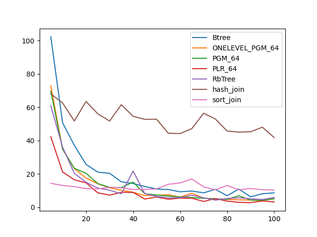
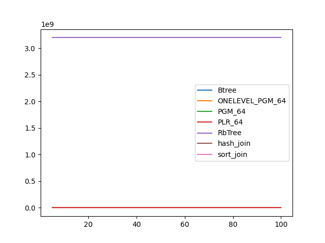
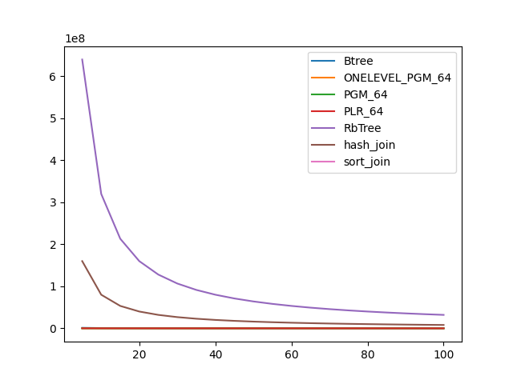

### duration_sec

|   0 |     Btree |   ONELEVEL_PGM_64 |   PGM_64 |   PLR_64 |   RbTree |   hash_join |   sort_join |
|----:|----------:|------------------:|---------:|---------:|---------:|------------:|------------:|
|   5 | 102.268   |          72.9108  | 69.614   | 42.2352  | 60.869   |     67.9864 |     14.3173 |
|  10 |  50.6702  |          34.906   | 34.8849  | 21.1558  | 36.0645  |     62.5625 |     13.0062 |
|  15 |  37.0964  |          23.169   | 23.2882  | 16.445   | 20.3342  |     51.7112 |     12.3147 |
|  20 |  25.6675  |          17.4882  | 20.3452  | 14.6008  | 14.9126  |     63.4242 |     11.1648 |
|  25 |  21.035   |          14.0259  | 14.1504  |  8.60002 | 11.444   |     56.003  |     10.9371 |
|  30 |  20.3333  |          11.5984  | 11.8601  |  7.22585 | 10.1488  |     51.6988 |     11.9629 |
|  35 |  15.2193  |          10.1201  | 11.757   |  8.92061 |  8.00712 |     61.4913 |     11.5454 |
|  40 |  14.2124  |           8.95402 | 15.0382  |  8.86628 | 21.6527  |     54.5613 |     10.6351 |
|  45 |  12.4337  |           6.90936 |  8.05177 |  4.90353 |  8.13273 |     52.6773 |     10.6265 |
|  50 |  10.8757  |           7.26841 |  7.28603 |  6.07956 |  6.44509 |     52.7576 |     10.9341 |
|  55 |  10.5767  |           7.39451 |  6.66505 |  4.74982 |  5.5661  |     44.3554 |     13.7124 |
|  60 |   9.20665 |           6.09107 |  6.14563 |  5.41528 |  5.71559 |     44.1585 |     14.559  |
|  65 |   9.6733  |           8.35389 |  5.70662 |  5.36308 |  7.17053 |     47.1522 |     16.9069 |
|  70 |   8.59152 |           5.42424 |  5.32571 |  3.43568 |  5.64486 |     56.3472 |     12.2229 |
|  75 |  10.7032  |           4.97466 |  4.9904  |  5.14457 |  4.18772 |     52.9247 |     10.3965 |
|  80 |   6.86878 |           4.66778 |  4.70272 |  3.63171 |  5.20923 |     45.6807 |     13.029  |
|  85 |  10.8704  |           4.41498 |  6.84585 |  2.89902 |  5.61776 |     45.0425 |     10.4085 |
|  90 |   6.2141  |           4.21493 |  4.26296 |  2.71789 |  5.01653 |     45.2501 |     11.2291 |
|  95 |   8.05929 |           3.98446 |  4.04907 |  3.7091  |  4.6168  |     47.9573 |     10.4565 |
| 100 |   8.57717 |           5.81008 |  4.97685 |  3.152   |  5.77508 |     41.7933 |     10.3229 |

### inner_index_size

|   0 |       Btree |   ONELEVEL_PGM_64 |   PGM_64 |   PLR_64 |   RbTree |   hash_join |   sort_join |
|----:|------------:|------------------:|---------:|---------:|---------:|------------:|------------:|
|   5 | 5.97509e+06 |            163896 |   109664 |   693632 |  3.2e+09 |         nan |         nan |
|  10 | 5.97509e+06 |            163896 |   109664 |   693632 |  3.2e+09 |         nan |         nan |
|  15 | 5.97509e+06 |            163896 |   109664 |   693632 |  3.2e+09 |         nan |         nan |
|  20 | 5.97509e+06 |            163896 |   109664 |   693632 |  3.2e+09 |         nan |         nan |
|  25 | 5.97509e+06 |            163896 |   109664 |   693632 |  3.2e+09 |         nan |         nan |
|  30 | 5.97509e+06 |            163896 |   109664 |   693632 |  3.2e+09 |         nan |         nan |
|  35 | 5.97509e+06 |            163896 |   109664 |   693632 |  3.2e+09 |         nan |         nan |
|  40 | 5.97509e+06 |            163896 |   109664 |   693632 |  3.2e+09 |         nan |         nan |
|  45 | 5.97509e+06 |            163896 |   109664 |   693632 |  3.2e+09 |         nan |         nan |
|  50 | 5.97509e+06 |            163896 |   109664 |   693632 |  3.2e+09 |         nan |         nan |
|  55 | 5.97509e+06 |            163896 |   109664 |   693632 |  3.2e+09 |         nan |         nan |
|  60 | 5.97509e+06 |            163896 |   109664 |   693632 |  3.2e+09 |         nan |         nan |
|  65 | 5.97509e+06 |            163896 |   109664 |   693632 |  3.2e+09 |         nan |         nan |
|  70 | 5.97509e+06 |            163896 |   109664 |   693632 |  3.2e+09 |         nan |         nan |
|  75 | 5.97509e+06 |            163896 |   109664 |   693632 |  3.2e+09 |         nan |         nan |
|  80 | 5.97509e+06 |            163896 |   109664 |   693632 |  3.2e+09 |         nan |         nan |
|  85 | 5.97509e+06 |            163896 |   109664 |   693632 |  3.2e+09 |         nan |         nan |
|  90 | 5.97509e+06 |            163896 |   109664 |   693632 |  3.2e+09 |         nan |         nan |
|  95 | 5.97509e+06 |            163896 |   109664 |   693632 |  3.2e+09 |         nan |         nan |
| 100 | 5.97509e+06 |            163896 |   109664 |   693632 |  3.2e+09 |         nan |         nan |

### outer_index_size

|   0 |            Btree |   ONELEVEL_PGM_64 |   PGM_64 |   PLR_64 |      RbTree |   hash_join |   sort_join |
|----:|-----------------:|------------------:|---------:|---------:|------------:|------------:|------------:|
|   5 |      1.20117e+06 |             32544 |    21840 |   138400 | 6.4e+08     | 1.6e+08     |         nan |
|  10 | 600080           |             16296 |    10976 |    69184 | 3.2e+08     | 8e+07       |         nan |
|  15 | 402448           |             10704 |     7248 |    46784 | 2.13333e+08 | 5.33333e+07 |         nan |
|  20 | 303632           |              8256 |     5560 |    34784 | 1.6e+08     | 4e+07       |         nan |
|  25 | 241872           |              6360 |     4296 |    27520 | 1.28e+08    | 3.2e+07     |         nan |
|  30 | 204816           |              5424 |     3672 |    22240 | 1.06667e+08 | 2.66667e+07 |         nan |
|  35 | 173936           |              4416 |     3000 |    19776 | 9.14286e+07 | 2.28571e+07 |         nan |
|  40 | 155408           |              4224 |     2872 |    17856 | 8e+07       | 2e+07       |         nan |
|  45 | 136880           |              3504 |     2448 |    15520 | 7.11111e+07 | 1.77778e+07 |         nan |
|  50 | 124528           |              3192 |     2184 |    13184 | 6.4e+07     | 1.6e+07     |         nan |
|  55 | 112176           |              3168 |     2168 |    12736 | 5.81818e+07 | 1.45455e+07 |         nan |
|  60 | 106000           |              2808 |     1928 |    12256 | 5.33333e+07 | 1.33333e+07 |         nan |
|  65 |  96736           |              2496 |     1720 |    10816 | 4.92308e+07 | 1.23077e+07 |         nan |
|  70 |  90560           |              2400 |     1656 |    10272 | 4.57143e+07 | 1.14286e+07 |         nan |
|  75 |  84384           |              2184 |     1512 |     9248 | 4.26667e+07 | 1.06667e+07 |         nan |
|  80 |  81296           |              1968 |     1368 |     8544 | 4e+07       | 1e+07       |         nan |
|  85 |  75120           |              1944 |     1352 |     8032 | 3.76471e+07 | 9.41177e+06 |         nan |
|  90 |  72032           |              2016 |     1400 |     8000 | 3.55556e+07 | 8.8889e+06  |         nan |
|  95 |  68944           |              1800 |     1256 |     7584 | 3.36842e+07 | 8.42106e+06 |         nan |
| 100 |  65856           |              1728 |     1208 |     7328 | 3.2e+07     | 8e+06       |         nan |

