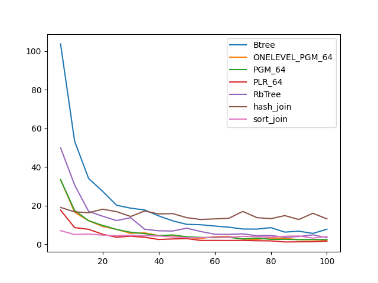
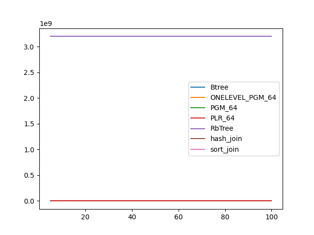
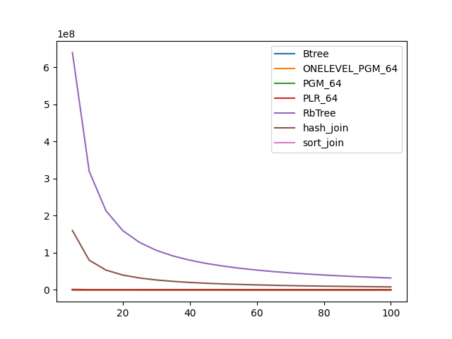

### duration_sec

|   0 |    Btree |   ONELEVEL_PGM_64 |   PGM_64 |   PLR_64 |   RbTree |   hash_join |   sort_join |
|----:|---------:|------------------:|---------:|---------:|---------:|------------:|------------:|
|   5 | 46.2272  |          15.5634  | 14.9195  | 8.7572   | 23.9854  |    11.7958  |     3.84788 |
|  10 | 23.6246  |           8.09686 |  7.21868 | 4.16742  | 12.6917  |    11.4877  |     2.85802 |
|  15 | 15.8389  |           5.60943 |  5.37776 | 3.36358  |  8.94806 |     9.40484 |     2.48776 |
|  20 | 12.338   |           4.38817 |  4.18008 | 2.55449  |  6.94579 |    10.9515  |     2.29145 |
|  25 |  9.72174 |           3.66285 |  3.49198 | 2.04711  |  5.83455 |     9.75769 |     2.24089 |
|  30 |  8.47032 |           3.15331 |  3.01002 | 2.00906  |  5.03595 |     8.85552 |     2.12736 |
|  35 |  7.50469 |           2.72864 |  2.66044 | 1.78052  |  4.44282 |    10.4283  |     2.1464  |
|  40 |  6.33352 |           2.53724 |  2.40062 | 1.64062  |  3.98418 |     9.85092 |     2.09618 |
|  45 |  5.91665 |           2.17782 |  2.25886 | 1.49023  |  3.65303 |     9.40229 |     2.00957 |
|  50 |  5.42716 |           2.15164 |  1.99916 | 1.40725  |  3.37303 |     8.60774 |     2.00552 |
|  55 |  4.99821 |           2.06438 |  1.83804 | 1.30109  |  3.17886 |     8.04842 |     1.97    |
|  60 |  4.43489 |           1.77722 |  1.76168 | 1.20116  |  2.96718 |     7.78636 |     1.98027 |
|  65 |  4.35491 |           1.7087  |  1.6948  | 1.12063  |  2.82375 |     7.38797 |     1.96308 |
|  70 |  4.061   |           1.66387 |  1.66585 | 1.04825  |  2.61839 |     9.42779 |     1.94919 |
|  75 |  3.86947 |           1.60026 |  1.55548 | 0.983915 |  2.50876 |     8.41002 |     1.95757 |
|  80 |  3.67452 |           1.52113 |  1.50968 | 0.932068 |  2.41361 |     8.96572 |     1.93854 |
|  85 |  3.56452 |           1.48216 |  1.34931 | 0.829735 |  2.29613 |     7.99872 |     1.93746 |
|  90 |  3.35985 |           1.43544 |  1.37254 | 0.743374 |  2.19329 |     7.64295 |     1.91513 |
|  95 |  3.21187 |           1.25841 |  1.30955 | 0.800754 |  2.14062 |     7.32415 |     1.93293 |
| 100 |  2.83511 |           1.30092 |  1.24834 | 0.766782 |  2.05512 |     7.55442 |     1.91444 |

### inner_index_size

|   0 |       Btree |   ONELEVEL_PGM_64 |   PGM_64 |   PLR_64 |   RbTree |   hash_join |   sort_join |
|----:|------------:|------------------:|---------:|---------:|---------:|------------:|------------:|
|   5 | 5.97509e+06 |            162960 |   109008 |   696864 |  3.2e+09 |         nan |         nan |
|  10 | 5.97509e+06 |            162960 |   109008 |   696864 |  3.2e+09 |         nan |         nan |
|  15 | 5.97509e+06 |            162960 |   109008 |   696864 |  3.2e+09 |         nan |         nan |
|  20 | 5.97509e+06 |            162960 |   109008 |   696864 |  3.2e+09 |         nan |         nan |
|  25 | 5.97509e+06 |            162960 |   109008 |   696864 |  3.2e+09 |         nan |         nan |
|  30 | 5.97509e+06 |            162960 |   109008 |   696864 |  3.2e+09 |         nan |         nan |
|  35 | 5.97509e+06 |            162960 |   109008 |   696864 |  3.2e+09 |         nan |         nan |
|  40 | 5.97509e+06 |            162960 |   109008 |   696864 |  3.2e+09 |         nan |         nan |
|  45 | 5.97509e+06 |            162960 |   109008 |   696864 |  3.2e+09 |         nan |         nan |
|  50 | 5.97509e+06 |            162960 |   109008 |   696864 |  3.2e+09 |         nan |         nan |
|  55 | 5.97509e+06 |            162960 |   109008 |   696864 |  3.2e+09 |         nan |         nan |
|  60 | 5.97509e+06 |            162960 |   109008 |   696864 |  3.2e+09 |         nan |         nan |
|  65 | 5.97509e+06 |            162960 |   109008 |   696864 |  3.2e+09 |         nan |         nan |
|  70 | 5.97509e+06 |            162960 |   109008 |   696864 |  3.2e+09 |         nan |         nan |
|  75 | 5.97509e+06 |            162960 |   109008 |   696864 |  3.2e+09 |         nan |         nan |
|  80 | 5.97509e+06 |            162960 |   109008 |   696864 |  3.2e+09 |         nan |         nan |
|  85 | 5.97509e+06 |            162960 |   109008 |   696864 |  3.2e+09 |         nan |         nan |
|  90 | 5.97509e+06 |            162960 |   109008 |   696864 |  3.2e+09 |         nan |         nan |
|  95 | 5.97509e+06 |            162960 |   109008 |   696864 |  3.2e+09 |         nan |         nan |
| 100 | 5.97509e+06 |            162960 |   109008 |   696864 |  3.2e+09 |         nan |         nan |

### outer_index_size

|   0 |            Btree |   ONELEVEL_PGM_64 |   PGM_64 |   PLR_64 |      RbTree |   hash_join |   sort_join |
|----:|-----------------:|------------------:|---------:|---------:|------------:|------------:|------------:|
|   5 |      1.20117e+06 |             32880 |    22080 |   140256 | 6.4e+08     | 1.6e+08     |         nan |
|  10 | 600080           |             16104 |    10848 |    70016 | 3.2e+08     | 8e+07       |         nan |
|  15 | 402448           |             10872 |     7360 |    46080 | 2.13333e+08 | 5.33333e+07 |         nan |
|  20 | 303632           |              8376 |     5696 |    34688 | 1.6e+08     | 4e+07       |         nan |
|  25 | 241872           |              6576 |     4440 |    27168 | 1.28e+08    | 3.2e+07     |         nan |
|  30 | 204816           |              5304 |     3592 |    23168 | 1.06667e+08 | 2.66667e+07 |         nan |
|  35 | 173936           |              4680 |     3176 |    20000 | 9.14286e+07 | 2.28571e+07 |         nan |
|  40 | 155408           |              4104 |     2792 |    16960 | 8e+07       | 2e+07       |         nan |
|  45 | 136880           |              3720 |     2536 |    15616 | 7.11111e+07 | 1.77778e+07 |         nan |
|  50 | 124528           |              3336 |     2280 |    13952 | 6.4e+07     | 1.6e+07     |         nan |
|  55 | 112176           |              2952 |     2024 |    12832 | 5.81818e+07 | 1.45455e+07 |         nan |
|  60 | 106000           |              2736 |     1880 |    11968 | 5.33333e+07 | 1.33333e+07 |         nan |
|  65 |  96736           |              2664 |     1832 |    11168 | 4.92308e+07 | 1.23077e+07 |         nan |
|  70 |  90560           |              2328 |     1608 |     9920 | 4.57143e+07 | 1.14286e+07 |         nan |
|  75 |  84384           |              2232 |     1544 |     9344 | 4.26667e+07 | 1.06667e+07 |         nan |
|  80 |  81296           |              2040 |     1416 |     8672 | 4e+07       | 1e+07       |         nan |
|  85 |  75120           |              1944 |     1352 |     8288 | 3.76471e+07 | 9.41177e+06 |         nan |
|  90 |  72032           |              1968 |     1368 |     7904 | 3.55556e+07 | 8.8889e+06  |         nan |
|  95 |  68944           |              1656 |     1160 |     6752 | 3.36842e+07 | 8.42106e+06 |         nan |
| 100 |  65856           |              1704 |     1192 |     7008 | 3.2e+07     | 8e+06       |         nan |

