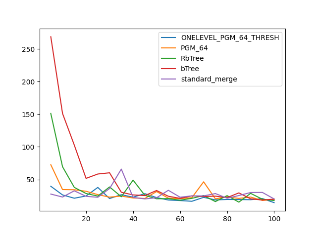

### duration_sec

|   0 |   ONELEVEL_PGM_64_THRESH |   PGM_64 |   RbTree |    bTree |   standard_merge |
|----:|-------------------------:|---------:|---------:|---------:|-----------------:|
|   5 |                 13.135   | 18.4582  | 30.6776  | 53.4315  |         15.7144  |
|  10 |                 11.3581  | 13.9517  | 18.4065  | 29.6673  |         10.3457  |
|  15 |                 10.6943  | 12.4092  | 14.4393  | 27.9196  |         10.1466  |
|  20 |                 10.2787  | 11.4492  | 12.2508  | 17.5092  |          9.79152 |
|  25 |                  9.89942 | 10.9203  | 10.9201  | 15.3237  |          9.79387 |
|  30 |                  9.47001 | 10.5055  | 10.1256  | 13.5896  |          9.69281 |
|  35 |                  9.30714 | 10.1728  |  9.47511 | 15.263   |          9.54736 |
|  40 |                  9.17247 |  9.69833 |  9.12639 | 15.7168  |          9.6471  |
|  45 |                  8.92531 |  9.54347 |  8.63412 | 10.8962  |          9.67179 |
|  50 |                  8.73382 |  9.26907 | 11.7772  | 10.4879  |          9.5422  |
|  55 |                  8.57281 |  9.01117 |  8.02935 |  9.97096 |          9.47386 |
|  60 |                  8.40994 |  8.85775 |  7.86848 |  9.5946  |          9.52101 |
|  65 |                  8.22997 |  8.65421 |  7.72162 |  9.4543  |         14.0296  |
|  70 |                 12.6817  |  8.47204 |  7.49401 |  8.95956 |          9.612   |
|  75 |                  8.04445 |  8.42681 |  7.34794 |  8.85588 |          9.46965 |
|  80 |                  8.05778 |  8.27489 |  7.30364 |  8.61005 |          9.57334 |
|  85 |                 12.153   |  8.04731 |  7.15477 |  8.47843 |          9.46023 |
|  90 |                  7.82466 |  7.89838 |  7.14049 |  8.21168 |          9.39368 |
|  95 |                  7.65339 |  7.94673 |  6.9621  |  8.26519 |          9.50069 |
| 100 |                  7.55396 |  7.78226 |  9.25934 |  7.77092 |          9.42327 |

