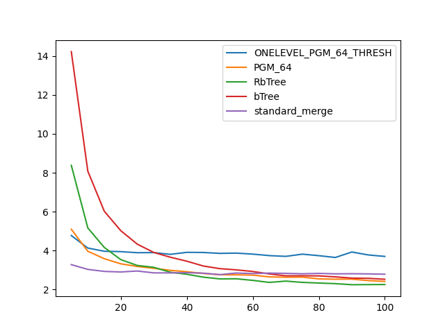

### duration_sec

|   0 |   ONELEVEL_PGM_64_THRESH |   PGM_64 |   RbTree |    bTree |   standard_merge |
|----:|-------------------------:|---------:|---------:|---------:|-----------------:|
|   5 |                 12.3369  | 17.3729  | 24.9859  | 43.9009  |          9.66991 |
|  10 |                 11.3567  | 12.1026  | 15.5227  | 23.9722  |          9.40564 |
|  15 |                  9.90983 | 10.722   | 12.2441  | 18.2902  |          9.69236 |
|  20 |                 10.3856  | 10.0356  | 12.1934  | 16.5459  |          9.3716  |
|  25 |                 11.1844  | 10.7489  | 10.2625  | 14.2821  |         10.2649  |
|  30 |                 10.5645  |  9.73045 | 10.0282  | 12.3409  |          8.84677 |
|  35 |                 10.6664  |  9.45579 |  7.95444 | 10.3506  |          9.51044 |
|  40 |                 11.38    |  9.18026 |  7.43918 | 11.2103  |          9.22879 |
|  45 |                 10.3515  |  8.23912 |  7.89468 |  9.87835 |          8.97325 |
|  50 |                 10.1902  |  9.07375 |  8.95041 | 10.441   |          9.57816 |
|  55 |                  8.85985 |  4.19259 |  7.94315 |  8.77331 |          8.90911 |
|  60 |                 10.0069  |  7.99396 |  6.90743 |  8.3537  |          8.27452 |
|  65 |                 11.1308  |  9.39042 |  7.63853 |  8.17971 |          9.0637  |
|  70 |                 11.5234  |  7.9925  |  6.20471 |  8.87076 |          8.27639 |
|  75 |                 10.4969  |  9.77448 |  6.78679 |  8.94056 |          9.21572 |
|  80 |                  9.98761 |  7.49105 |  6.71519 |  8.40816 |         10.2697  |
|  85 |                  9.80242 |  7.84113 |  6.86165 |  7.98093 |          8.16103 |
|  90 |                 10.1106  |  7.38806 |  7.49953 |  8.08531 |          8.76513 |
|  95 |                 10.3552  |  9.4168  |  6.90085 |  8.02328 |          9.12378 |
| 100 |                  9.27869 |  6.68939 |  6.90426 |  8.13271 |          8.80448 |

