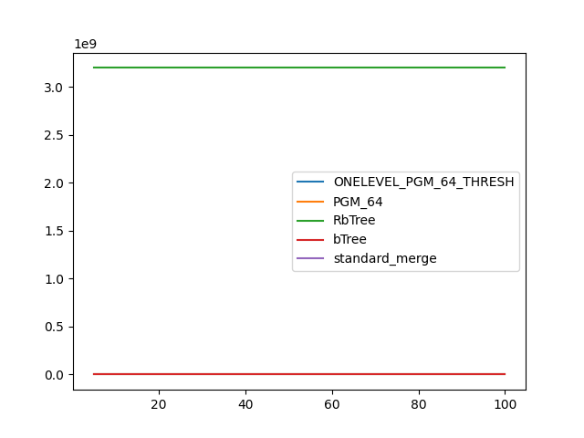
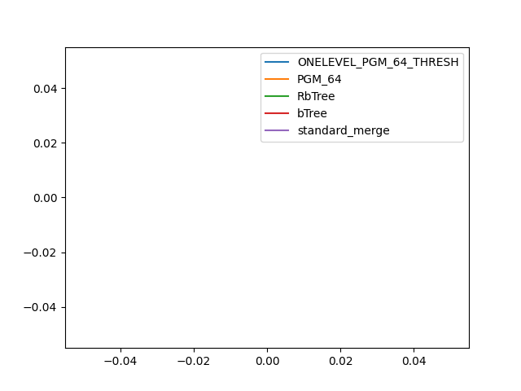

### duration_sec

|   0 |   ONELEVEL_PGM_64_THRESH |   PGM_64 |   RbTree |    bTree |   standard_merge |
|----:|-------------------------:|---------:|---------:|---------:|-----------------:|
|   5 |                  4.77211 |  5.09516 |  8.38397 | 14.2307  |          3.27418 |
|  10 |                  4.12722 |  3.96316 |  5.16189 |  8.08542 |          3.03018 |
|  15 |                  3.96213 |  3.57912 |  4.15847 |  6.01953 |          2.92594 |
|  20 |                  3.94261 |  3.31618 |  3.53237 |  5.0201  |          2.89776 |
|  25 |                  3.88822 |  3.18034 |  3.23205 |  4.32704 |          2.94654 |
|  30 |                  3.89323 |  3.08652 |  3.13542 |  3.9001  |          2.85043 |
|  35 |                  3.80327 |  2.98066 |  2.88317 |  3.65648 |          2.84956 |
|  40 |                  3.90734 |  2.90988 |  2.77891 |  3.45159 |          2.8591  |
|  45 |                  3.89976 |  2.82039 |  2.63142 |  3.20398 |          2.83546 |
|  50 |                  3.85351 |  2.7548  |  2.5405  |  3.06857 |          2.76142 |
|  55 |                  3.86673 |  2.75029 |  2.54647 |  3.00565 |          2.84241 |
|  60 |                  3.81522 |  2.73426 |  2.46438 |  2.92227 |          2.81622 |
|  65 |                  3.7387  |  2.64466 |  2.3606  |  2.79685 |          2.8387  |
|  70 |                  3.69956 |  2.6267  |  2.42769 |  2.69895 |          2.82453 |
|  75 |                  3.81333 |  2.63232 |  2.362   |  2.70184 |          2.80406 |
|  80 |                  3.73525 |  2.54117 |  2.32768 |  2.69553 |          2.82388 |
|  85 |                  3.643   |  2.52412 |  2.29739 |  2.6455  |          2.80087 |
|  90 |                  3.92362 |  2.52799 |  2.24159 |  2.58149 |          2.80724 |
|  95 |                  3.77302 |  2.45517 |  2.24739 |  2.57018 |          2.79857 |
| 100 |                  3.69683 |  2.41002 |  2.25203 |  2.52115 |          2.78201 |

### inner_index_size

|   0 |   ONELEVEL_PGM_64_THRESH |   PGM_64 |   RbTree |       bTree |   standard_merge |
|----:|-------------------------:|---------:|---------:|------------:|-----------------:|
|   5 |                   162120 |   108448 |  3.2e+09 | 5.97509e+06 |              nan |
|  10 |                   162120 |   108448 |  3.2e+09 | 5.97509e+06 |              nan |
|  15 |                   162120 |   108448 |  3.2e+09 | 5.97509e+06 |              nan |
|  20 |                   162120 |   108448 |  3.2e+09 | 5.97509e+06 |              nan |
|  25 |                   162120 |   108448 |  3.2e+09 | 5.97509e+06 |              nan |
|  30 |                   162120 |   108448 |  3.2e+09 | 5.97509e+06 |              nan |
|  35 |                   162120 |   108448 |  3.2e+09 | 5.97509e+06 |              nan |
|  40 |                   162120 |   108448 |  3.2e+09 | 5.97509e+06 |              nan |
|  45 |                   162120 |   108448 |  3.2e+09 | 5.97509e+06 |              nan |
|  50 |                   162120 |   108448 |  3.2e+09 | 5.97509e+06 |              nan |
|  55 |                   162120 |   108448 |  3.2e+09 | 5.97509e+06 |              nan |
|  60 |                   162120 |   108448 |  3.2e+09 | 5.97509e+06 |              nan |
|  65 |                   162120 |   108448 |  3.2e+09 | 5.97509e+06 |              nan |
|  70 |                   162120 |   108448 |  3.2e+09 | 5.97509e+06 |              nan |
|  75 |                   162120 |   108448 |  3.2e+09 | 5.97509e+06 |              nan |
|  80 |                   162120 |   108448 |  3.2e+09 | 5.97509e+06 |              nan |
|  85 |                   162120 |   108448 |  3.2e+09 | 5.97509e+06 |              nan |
|  90 |                   162120 |   108448 |  3.2e+09 | 5.97509e+06 |              nan |
|  95 |                   162120 |   108448 |  3.2e+09 | 5.97509e+06 |              nan |
| 100 |                   162120 |   108448 |  3.2e+09 | 5.97509e+06 |              nan |

### outer_index_size

|   0 |   ONELEVEL_PGM_64_THRESH |   PGM_64 |   RbTree |   bTree |   standard_merge |
|----:|-------------------------:|---------:|---------:|--------:|-----------------:|
|   5 |                      nan |      nan |      nan |     nan |              nan |
|  10 |                      nan |      nan |      nan |     nan |              nan |
|  15 |                      nan |      nan |      nan |     nan |              nan |
|  20 |                      nan |      nan |      nan |     nan |              nan |
|  25 |                      nan |      nan |      nan |     nan |              nan |
|  30 |                      nan |      nan |      nan |     nan |              nan |
|  35 |                      nan |      nan |      nan |     nan |              nan |
|  40 |                      nan |      nan |      nan |     nan |              nan |
|  45 |                      nan |      nan |      nan |     nan |              nan |
|  50 |                      nan |      nan |      nan |     nan |              nan |
|  55 |                      nan |      nan |      nan |     nan |              nan |
|  60 |                      nan |      nan |      nan |     nan |              nan |
|  65 |                      nan |      nan |      nan |     nan |              nan |
|  70 |                      nan |      nan |      nan |     nan |              nan |
|  75 |                      nan |      nan |      nan |     nan |              nan |
|  80 |                      nan |      nan |      nan |     nan |              nan |
|  85 |                      nan |      nan |      nan |     nan |              nan |
|  90 |                      nan |      nan |      nan |     nan |              nan |
|  95 |                      nan |      nan |      nan |     nan |              nan |
| 100 |                      nan |      nan |      nan |     nan |              nan |

