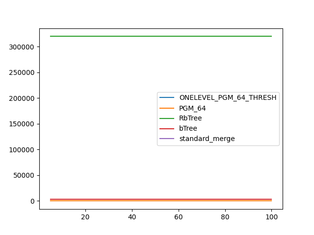

### duration_sec

|   0 |   ONELEVEL_PGM_64_THRESH |     PGM_64 |     RbTree |      bTree |   standard_merge |
|----:|-------------------------:|-----------:|-----------:|-----------:|-----------------:|
|   5 |               0.00177594 | 0.00179868 | 0.00258355 | 0.0033557  |       0.00174178 |
|  10 |               0.00163036 | 0.00159515 | 0.0017704  | 0.00226543 |       0.00142661 |
|  15 |               0.00147551 | 0.00151225 | 0.00152729 | 0.0017751  |       0.00157128 |
|  20 |               0.00145676 | 0.0014651  | 0.00133611 | 0.00161049 |       0.00143736 |
|  25 |               0.00154952 | 0.00145188 | 0.00133697 | 0.00156979 |       0.00153345 |
|  30 |               0.0015291  | 0.00142143 | 0.0012764  | 0.00144114 |       0.00156085 |
|  35 |               0.00157745 | 0.00137544 | 0.0012364  | 0.0014961  |       0.00149309 |
|  40 |               0.00149936 | 0.00137287 | 0.00121281 | 0.00142123 |       0.00145377 |
|  45 |               0.00139247 | 0.00134493 | 0.00113858 | 0.00129543 |       0.00146933 |
|  50 |               0.00137812 | 0.00146161 | 0.0012591  | 0.00132759 |       0.00171784 |
|  55 |               0.0015034  | 0.00136457 | 0.00115113 | 0.00129909 |       0.0014076  |
|  60 |               0.00138651 | 0.00130381 | 0.00109424 | 0.00130759 |       0.00138849 |
|  65 |               0.00150912 | 0.00128275 | 0.00109782 | 0.00125745 |       0.00147716 |
|  70 |               0.00143003 | 0.0013388  | 0.00117523 | 0.0012922  |       0.00139733 |
|  75 |               0.00154428 | 0.00132507 | 0.00117725 | 0.0013259  |       0.00154098 |
|  80 |               0.00151526 | 0.00126883 | 0.00108914 | 0.00121699 |       0.00144139 |
|  85 |               0.00154505 | 0.00136041 | 0.00108246 | 0.0012182  |       0.00158267 |
|  90 |               0.0015502  | 0.00128446 | 0.00113507 | 0.00124635 |       0.00144652 |
|  95 |               0.0013785  | 0.00119258 | 0.0010726  | 0.00118713 |       0.00147255 |
| 100 |               0.00137911 | 0.00117978 | 0.00104762 | 0.00121453 |       0.00134294 |

### inner_index_size

|   0 |   ONELEVEL_PGM_64_THRESH |   PGM_64 |   RbTree |   bTree |   standard_merge |
|----:|-------------------------:|---------:|---------:|--------:|-----------------:|
|   5 |                       48 |       48 |   320000 |    3088 |              nan |
|  10 |                       48 |       48 |   320000 |    3088 |              nan |
|  15 |                       48 |       48 |   320000 |    3088 |              nan |
|  20 |                       48 |       48 |   320000 |    3088 |              nan |
|  25 |                       48 |       48 |   320000 |    3088 |              nan |
|  30 |                       48 |       48 |   320000 |    3088 |              nan |
|  35 |                       48 |       48 |   320000 |    3088 |              nan |
|  40 |                       48 |       48 |   320000 |    3088 |              nan |
|  45 |                       48 |       48 |   320000 |    3088 |              nan |
|  50 |                       48 |       48 |   320000 |    3088 |              nan |
|  55 |                       48 |       48 |   320000 |    3088 |              nan |
|  60 |                       48 |       48 |   320000 |    3088 |              nan |
|  65 |                       48 |       48 |   320000 |    3088 |              nan |
|  70 |                       48 |       48 |   320000 |    3088 |              nan |
|  75 |                       48 |       48 |   320000 |    3088 |              nan |
|  80 |                       48 |       48 |   320000 |    3088 |              nan |
|  85 |                       48 |       48 |   320000 |    3088 |              nan |
|  90 |                       48 |       48 |   320000 |    3088 |              nan |
|  95 |                       48 |       48 |   320000 |    3088 |              nan |
| 100 |                       48 |       48 |   320000 |    3088 |              nan |

### outer_index_size

|   0 |   ONELEVEL_PGM_64_THRESH |   PGM_64 |   RbTree |   bTree |   standard_merge |
|----:|-------------------------:|---------:|---------:|--------:|-----------------:|
|   5 |                      nan |      nan |      nan |     nan |              nan |
|  10 |                      nan |      nan |      nan |     nan |              nan |
|  15 |                      nan |      nan |      nan |     nan |              nan |
|  20 |                      nan |      nan |      nan |     nan |              nan |
|  25 |                      nan |      nan |      nan |     nan |              nan |
|  30 |                      nan |      nan |      nan |     nan |              nan |
|  35 |                      nan |      nan |      nan |     nan |              nan |
|  40 |                      nan |      nan |      nan |     nan |              nan |
|  45 |                      nan |      nan |      nan |     nan |              nan |
|  50 |                      nan |      nan |      nan |     nan |              nan |
|  55 |                      nan |      nan |      nan |     nan |              nan |
|  60 |                      nan |      nan |      nan |     nan |              nan |
|  65 |                      nan |      nan |      nan |     nan |              nan |
|  70 |                      nan |      nan |      nan |     nan |              nan |
|  75 |                      nan |      nan |      nan |     nan |              nan |
|  80 |                      nan |      nan |      nan |     nan |              nan |
|  85 |                      nan |      nan |      nan |     nan |              nan |
|  90 |                      nan |      nan |      nan |     nan |              nan |
|  95 |                      nan |      nan |      nan |     nan |              nan |
| 100 |                      nan |      nan |      nan |     nan |              nan |

