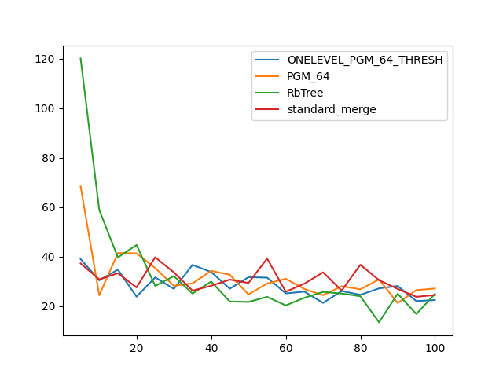
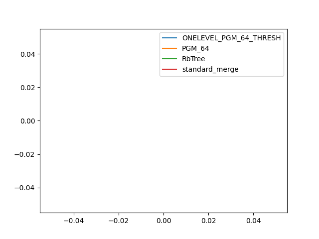

### duration_sec

|   0 |   ONELEVEL_PGM_64_THRESH |   PGM_64 |   RbTree |   standard_merge |
|----:|-------------------------:|---------:|---------:|-----------------:|
|   5 |                  38.9769 |  68.4155 | 120.183  |          37.2246 |
|  10 |                  30.3904 |  24.3315 |  58.8617 |          30.7539 |
|  15 |                  34.7135 |  41.4321 |  39.6437 |          33.254  |
|  20 |                  23.7589 |  41.2909 |  44.6801 |          27.4998 |
|  25 |                  31.5603 |  35.3435 |  28.1001 |          39.7095 |
|  30 |                  26.911  |  28.1718 |  32.0817 |          33.6148 |
|  35 |                  36.6189 |  29.1355 |  25.0356 |          26.2019 |
|  40 |                  33.7472 |  34.21   |  29.8928 |          28.1752 |
|  45 |                  26.9986 |  32.6488 |  21.824  |          30.6694 |
|  50 |                  31.6539 |  24.6557 |  21.6457 |          29.3015 |
|  55 |                  31.4659 |  29.0881 |  23.6888 |          39.1898 |
|  60 |                  25.0922 |  31.0078 |  20.2312 |          25.7726 |
|  65 |                  25.8029 |  26.8627 |  23.3245 |          29.0371 |
|  70 |                  21.2434 |  24.3431 |  25.6962 |          33.6156 |
|  75 |                  26.0512 |  27.9942 |  25.0309 |          26.2439 |
|  80 |                  24.5178 |  26.7552 |  23.9409 |          36.6858 |
|  85 |                  27.1124 |  30.7468 |  13.3756 |          30.4429 |
|  90 |                  28.1002 |  21.1905 |  24.9544 |          26.9037 |
|  95 |                  21.9878 |  26.4213 |  16.7664 |          23.7025 |
| 100 |                  22.4093 |  27.0612 |  24.8508 |          24.4409 |

### comparison_count

|   0 |   ONELEVEL_PGM_64_THRESH |   PGM_64 |   RbTree |   standard_merge |
|----:|-------------------------:|---------:|---------:|-----------------:|
|   5 |                      nan |      nan |      nan |              nan |
|  10 |                      nan |      nan |      nan |              nan |
|  15 |                      nan |      nan |      nan |              nan |
|  20 |                      nan |      nan |      nan |              nan |
|  25 |                      nan |      nan |      nan |              nan |
|  30 |                      nan |      nan |      nan |              nan |
|  35 |                      nan |      nan |      nan |              nan |
|  40 |                      nan |      nan |      nan |              nan |
|  45 |                      nan |      nan |      nan |              nan |
|  50 |                      nan |      nan |      nan |              nan |
|  55 |                      nan |      nan |      nan |              nan |
|  60 |                      nan |      nan |      nan |              nan |
|  65 |                      nan |      nan |      nan |              nan |
|  70 |                      nan |      nan |      nan |              nan |
|  75 |                      nan |      nan |      nan |              nan |
|  80 |                      nan |      nan |      nan |              nan |
|  85 |                      nan |      nan |      nan |              nan |
|  90 |                      nan |      nan |      nan |              nan |
|  95 |                      nan |      nan |      nan |              nan |
| 100 |                      nan |      nan |      nan |              nan |

