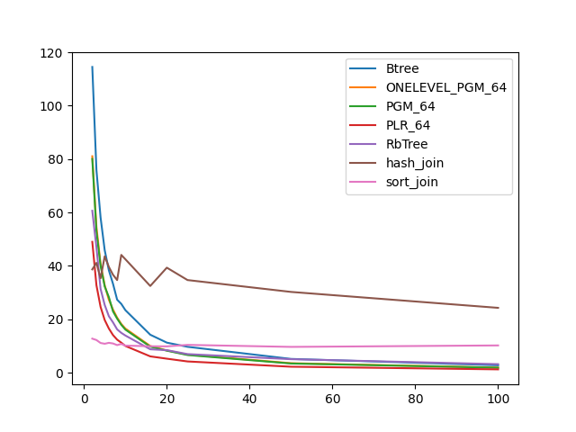
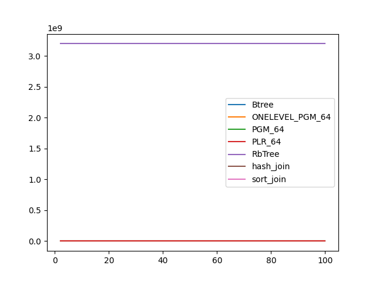
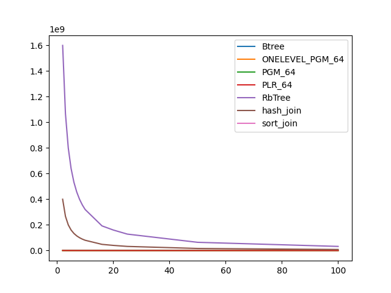

### duration_sec

|   1 |     Btree |   ONELEVEL_PGM_64 |   PGM_64 |   PLR_64 |   RbTree |   hash_join |   sort_join |
|----:|----------:|------------------:|---------:|---------:|---------:|------------:|------------:|
|   2 | 114.48    |          81.0472  | 80.0526  | 48.9984  | 60.6355  |     38.6796 |    12.7407  |
|   3 |  75.8944  |          54.6218  | 52.9645  | 32.7523  | 46.9738  |     41.1116 |    12.2235  |
|   4 |  58.1307  |          40.6659  | 40.0678  | 24.6303  | 31.3768  |     35.3517 |    11.1172  |
|   5 |  45.8356  |          32.7165  | 32.2832  | 19.7123  | 25.3559  |     43.584  |    10.8266  |
|   6 |  38.3372  |          27.2986  | 28.3101  | 16.5364  | 21.1451  |     39.6167 |    11.1738  |
|   7 |  33.2859  |          23.6352  | 22.9587  | 14.0844  | 18.8346  |     36.6698 |    10.9336  |
|   8 |  27.3357  |          20.615   | 20.2433  | 12.3633  | 16.2168  |     34.6689 |    10.321   |
|   9 |  25.7596  |          18.2335  | 17.9259  | 11.2373  | 14.9079  |     44.0986 |    10.7611  |
|  10 |  23.3839  |          16.5063  | 16.1139  | 10.0014  | 13.902   |     42.4558 |    10.134   |
|  16 |  14.211   |           9.99088 |  9.72732 |  6.10193 |  8.75987 |     32.4627 |     9.88777 |
|  20 |  11.2508  |           8.33497 |  8.23147 |  5.23818 |  8.43361 |     39.3199 |     9.85331 |
|  25 |   9.68636 |           6.76057 |  6.61228 |  4.20188 |  6.95631 |     34.6821 |    10.4034  |
|  50 |   5.15149 |           3.55048 |  3.42836 |  2.22958 |  5.04088 |     30.2375 |     9.65349 |
| 100 |   2.7765  |           1.90717 |  1.85339 |  1.23951 |  3.18942 |     24.2762 |    10.2015  |

### inner_index_size

|   1 |   Btree |   ONELEVEL_PGM_64 |   PGM_64 |   PLR_64 |      RbTree |   hash_join |   sort_join |
|----:|--------:|------------------:|---------:|---------:|------------:|------------:|------------:|
|   2 |       0 |            162744 |   108864 |   696320 | 3.20003e+09 |         nan |         nan |
|   3 |       0 |            162744 |   108864 |   696320 | 3.20003e+09 |         nan |         nan |
|   4 |       0 |            162744 |   108864 |   696320 | 3.20003e+09 |         nan |         nan |
|   5 |       0 |            162744 |   108864 |   696320 | 3.20003e+09 |         nan |         nan |
|   6 |       0 |            162744 |   108864 |   696320 | 3.20003e+09 |         nan |         nan |
|   7 |       0 |            162744 |   108864 |   696320 | 3.20003e+09 |         nan |         nan |
|   8 |       0 |            162744 |   108864 |   696320 | 3.20003e+09 |         nan |         nan |
|   9 |       0 |            162744 |   108864 |   696320 | 3.20003e+09 |         nan |         nan |
|  10 |       0 |            162744 |   108864 |   696320 | 3.20003e+09 |         nan |         nan |
|  16 |       0 |            162744 |   108864 |   696320 | 3.20003e+09 |         nan |         nan |
|  20 |       0 |            162744 |   108864 |   696320 | 3.20003e+09 |         nan |         nan |
|  25 |       0 |            162744 |   108864 |   696320 | 3.20003e+09 |         nan |         nan |
|  50 |       0 |            162744 |   108864 |   696320 | 3.20003e+09 |         nan |         nan |
| 100 |       0 |            162744 |   108864 |   696320 | 3.20003e+09 |         nan |         nan |

### outer_index_size

|   1 |   Btree |   ONELEVEL_PGM_64 |   PGM_64 |   PLR_64 |      RbTree |   hash_join |   sort_join |
|----:|--------:|------------------:|---------:|---------:|------------:|------------:|------------:|
|   2 |       0 |             80544 |    53920 |   347040 | 1.60003e+09 | 4.00008e+08 |         nan |
|   3 |       0 |             54024 |    36176 |   232128 | 1.0667e+09  | 2.66675e+08 |         nan |
|   4 |       0 |             40848 |    27376 |   173344 | 8.00032e+08 | 2.00008e+08 |         nan |
|   5 |       0 |             31632 |    21248 |   138560 | 6.40032e+08 | 1.60008e+08 |         nan |
|   6 |       0 |             27696 |    18592 |   116672 | 5.33365e+08 | 1.33341e+08 |         nan |
|   7 |       0 |             23496 |    15792 |    99008 | 4.57175e+08 | 1.14294e+08 |         nan |
|   8 |       0 |             20520 |    13824 |    86656 | 4.00032e+08 | 1.00008e+08 |         nan |
|   9 |       0 |             17952 |    12096 |    77728 | 3.55588e+08 | 8.88969e+07 |         nan |
|  10 |       0 |             15768 |    10624 |    69248 | 3.20032e+08 | 8.0008e+07  |         nan |
|  16 |       0 |              9888 |     6648 |    41504 | 1.92032e+08 | 4.8008e+07  |         nan |
|  20 |       0 |              8136 |     5536 |    34464 | 1.60032e+08 | 4.0008e+07  |         nan |
|  25 |       0 |              6648 |     4544 |    27808 | 1.28032e+08 | 3.2008e+07  |         nan |
|  50 |       0 |              3120 |     2136 |    13600 | 6.4032e+07  | 1.6008e+07  |         nan |
| 100 |       0 |              1656 |     1160 |     7040 | 3.2032e+07  | 8.008e+06   |         nan |

