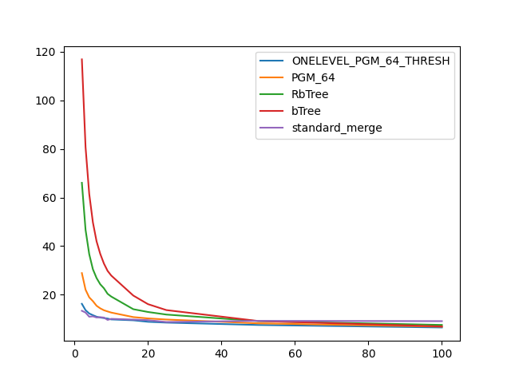
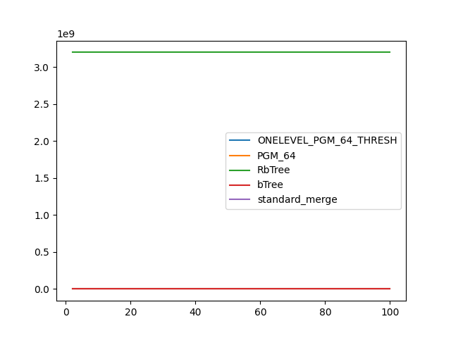

### duration_sec

|   1 |   ONELEVEL_PGM_64_THRESH |   PGM_64 |   RbTree |     bTree |   standard_merge |
|----:|-------------------------:|---------:|---------:|----------:|-----------------:|
|   2 |                 16.2615  | 28.9065  | 66.0709  | 116.864   |         13.4002  |
|   3 |                 13.6553  | 22.0774  | 46.7391  |  80.7754  |         12.6687  |
|   4 |                 12.2879  | 18.9353  | 36.7188  |  61.4928  |         10.9635  |
|   5 |                 11.5922  | 17.3649  | 30.4889  |  49.7694  |         11.1183  |
|   6 |                 10.9654  | 15.4671  | 26.8706  |  41.9738  |         10.642   |
|   7 |                 10.6222  | 14.4064  | 24.3193  |  36.8198  |         10.771   |
|   8 |                 10.4102  | 13.6245  | 22.6772  |  32.8451  |         10.6058  |
|   9 |                 10.1968  | 13.1335  | 20.3878  |  29.8239  |          9.64273 |
|  10 |                  9.84501 | 12.6664  | 19.2506  |  27.8944  |         10.089   |
|  16 |                  9.49305 | 10.8096  | 14.0532  |  19.6628  |          9.78018 |
|  20 |                  8.88013 | 10.2582  | 12.9104  |  16.1324  |          9.54833 |
|  25 |                  8.54211 |  9.80562 | 11.8464  |  13.6896  |          8.78689 |
|  50 |                  7.56378 |  8.23648 |  9.16213 |   9.20068 |          9.2644  |
| 100 |                  6.53835 |  6.8736  |  7.58133 |   6.96265 |          9.13802 |

### inner_index_size

|   1 |   ONELEVEL_PGM_64_THRESH |   PGM_64 |   RbTree |   bTree |   standard_merge |
|----:|-------------------------:|---------:|---------:|--------:|-----------------:|
|   2 |                   161376 |   107952 |  3.2e+09 |       0 |              nan |
|   3 |                   161376 |   107952 |  3.2e+09 |       0 |              nan |
|   4 |                   161376 |   107952 |  3.2e+09 |       0 |              nan |
|   5 |                   161376 |   107952 |  3.2e+09 |       0 |              nan |
|   6 |                   161376 |   107952 |  3.2e+09 |       0 |              nan |
|   7 |                   161376 |   107952 |  3.2e+09 |       0 |              nan |
|   8 |                   161376 |   107952 |  3.2e+09 |       0 |              nan |
|   9 |                   161376 |   107952 |  3.2e+09 |       0 |              nan |
|  10 |                   161376 |   107952 |  3.2e+09 |       0 |              nan |
|  16 |                   161376 |   107952 |  3.2e+09 |       0 |              nan |
|  20 |                   161376 |   107952 |  3.2e+09 |       0 |              nan |
|  25 |                   161376 |   107952 |  3.2e+09 |       0 |              nan |
|  50 |                   161376 |   107952 |  3.2e+09 |       0 |              nan |
| 100 |                   161376 |   107952 |  3.2e+09 |       0 |              nan |

