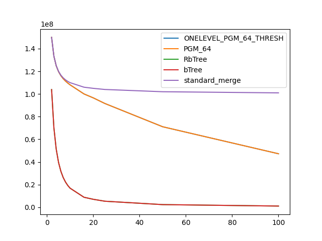

### duration_sec

|   1 |   ONELEVEL_PGM_64_THRESH |   PGM_64 |   RbTree |     bTree |   standard_merge |
|----:|-------------------------:|---------:|---------:|----------:|-----------------:|
|   2 |                 17.1785  | 29.7451  | 66.353   | 115.028   |         13.9899  |
|   3 |                 14.2476  | 23.0635  | 46.6562  |  77.9922  |         12.7593  |
|   4 |                 12.9706  | 19.5243  | 36.2104  |  59.6781  |         11.4477  |
|   5 |                 12.0206  | 17.2285  | 31.1395  |  49.2369  |         11.5767  |
|   6 |                 11.5575  | 15.8766  | 26.7868  |  41.7208  |         10.4822  |
|   7 |                 12.0491  | 15.0027  | 24.3016  |  37.4484  |         10.293   |
|   8 |                 10.9258  | 14.1323  | 22.2866  |  33.4634  |         10.7322  |
|   9 |                 10.527   | 13.6068  | 20.3923  |  29.3343  |         10.3308  |
|  10 |                 10.4082  | 13.2049  | 19.7063  |  26.7943  |          9.98225 |
|  16 |                  9.51784 | 11.2502  | 14.6044  |  19.9042  |         10.087   |
|  20 |                  9.28856 | 10.617   | 12.8653  |  16.3761  |          9.90302 |
|  25 |                  9.19376 | 10.3853  | 12.0199  |  14.0952  |         11.0546  |
|  50 |                  8.00767 |  8.64007 |  8.79077 |   9.52993 |          9.61093 |
| 100 |                  6.96406 |  7.18508 |  8.08076 |   7.43499 |         10.0652  |

### comparison_count

|   1 |   ONELEVEL_PGM_64_THRESH |      PGM_64 |      RbTree |       bTree |   standard_merge |
|----:|-------------------------:|------------:|------------:|------------:|-----------------:|
|   2 |              1.49996e+08 | 1.49996e+08 | 1.03914e+08 | 1.03914e+08 |      1.5e+08     |
|   3 |              1.33299e+08 | 1.33299e+08 | 7.00487e+07 | 7.00487e+07 |      1.33333e+08 |
|   4 |              1.24885e+08 | 1.24885e+08 | 5.12741e+07 | 5.12741e+07 |      1.25e+08    |
|   5 |              1.19742e+08 | 1.19742e+08 | 3.96293e+07 | 3.96293e+07 |      1.2e+08     |
|   6 |              1.16198e+08 | 1.16198e+08 | 3.18442e+07 | 3.18442e+07 |      1.16667e+08 |
|   7 |              1.13538e+08 | 1.13538e+08 | 2.63439e+07 | 2.63439e+07 |      1.14286e+08 |
|   8 |              1.1142e+08  | 1.1142e+08  | 2.2322e+07  | 2.2322e+07  |      1.125e+08   |
|   9 |              1.09637e+08 | 1.09637e+08 | 1.92502e+07 | 1.92502e+07 |      1.11111e+08 |
|  10 |              1.0808e+08  | 1.0808e+08  | 1.6858e+07  | 1.6858e+07  |      1.1e+08     |
|  16 |              1.00049e+08 | 1.00049e+08 | 8.85667e+06 | 8.85667e+06 |      1.06e+08    |
|  20 |              9.65942e+07 | 9.65942e+07 | 7.06215e+06 | 7.06215e+06 |      1.05e+08    |
|  25 |              9.16399e+07 | 9.16399e+07 | 5.36708e+06 | 5.36708e+06 |      1.04e+08    |
|  50 |              7.10857e+07 | 7.10857e+07 | 2.37025e+06 | 2.37025e+06 |      1.02e+08    |
| 100 |              4.72681e+07 | 4.72681e+07 | 1.09661e+06 | 1.09661e+06 |      1.01e+08    |

