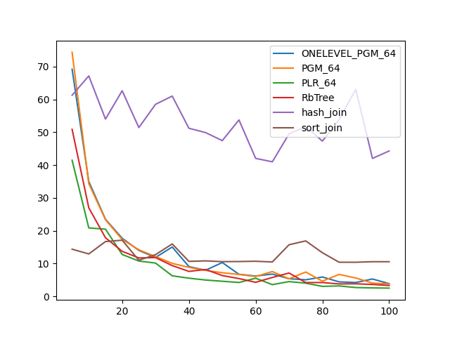
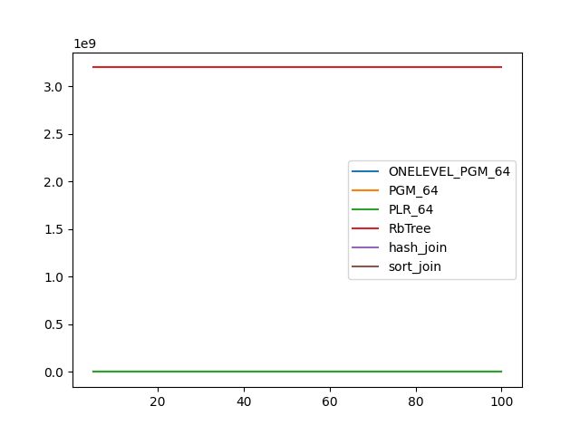
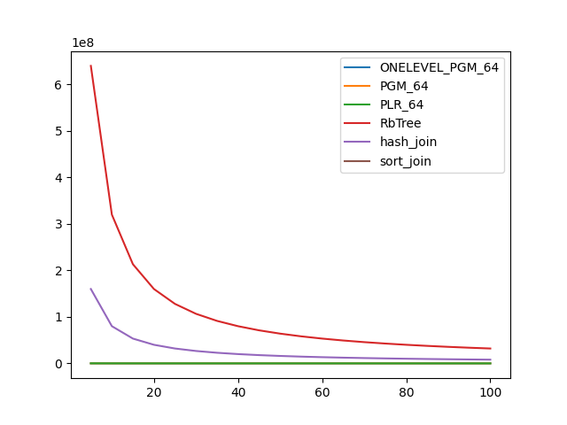

### duration_sec

|   0 |   ONELEVEL_PGM_64 |   PGM_64 |   PLR_64 |   RbTree |   hash_join |   sort_join |
|----:|------------------:|---------:|---------:|---------:|------------:|------------:|
|   5 |          69.1938  | 74.3548  | 41.4505  | 50.8551  |     61.2531 |     14.36   |
|  10 |          34.9701  | 34.3261  | 20.8375  | 26.9624  |     67.139  |     12.916  |
|  15 |          23.4706  | 23.3324  | 20.4531  | 17.8486  |     53.999  |     16.6785 |
|  20 |          17.6921  | 17.3154  | 12.7541  | 13.7154  |     62.6243 |     17.1058 |
|  25 |          13.9889  | 14.1803  | 10.7483  | 11.6963  |     51.4064 |     10.9884 |
|  30 |          11.8423  | 12.1176  | 10.1324  | 11.8056  |     58.4878 |     12.7052 |
|  35 |          15.0311  | 10.041   |  6.25124 |  9.36273 |     61.004  |     15.957  |
|  40 |           9.05509 |  8.8391  |  5.52552 |  7.59419 |     51.1886 |     10.6455 |
|  45 |           7.9397  |  7.89301 |  4.96688 |  8.18162 |     49.879  |     10.8054 |
|  50 |          10.3021  |  7.19323 |  4.59347 |  6.32918 |     47.427  |     10.5653 |
|  55 |           6.70718 |  6.66412 |  4.22147 |  5.40717 |     53.7358 |     10.6001 |
|  60 |           6.18082 |  6.02803 |  5.51524 |  4.27003 |     42.0218 |     10.6861 |
|  65 |           6.77973 |  7.5523  |  3.56251 |  5.75061 |     40.979  |     10.4656 |
|  70 |           5.36372 |  5.33067 |  4.49532 |  7.10684 |     49.4764 |     15.7141 |
|  75 |           5.03512 |  7.40548 |  4.00961 |  4.19152 |     51.6904 |     16.887  |
|  80 |           5.89419 |  4.61564 |  3.03096 |  4.19888 |     47.2947 |     13.2857 |
|  85 |           4.40755 |  6.67282 |  3.17067 |  3.77487 |     53.8439 |     10.3891 |
|  90 |           4.20701 |  5.58847 |  2.67612 |  3.8229  |     63.065  |     10.3801 |
|  95 |           5.27986 |  4.02527 |  2.56777 |  3.61373 |     42.0126 |     10.5511 |
| 100 |           3.86725 |  3.768   |  2.49636 |  3.29709 |     44.2775 |     10.5395 |

### inner_index_size

|   0 |   ONELEVEL_PGM_64 |   PGM_64 |   PLR_64 |   RbTree |   hash_join |   sort_join |
|----:|------------------:|---------:|---------:|---------:|------------:|------------:|
|   5 |            161808 |   108256 |   692608 |  3.2e+09 |         nan |         nan |
|  10 |            161808 |   108256 |   692608 |  3.2e+09 |         nan |         nan |
|  15 |            161808 |   108256 |   692608 |  3.2e+09 |         nan |         nan |
|  20 |            161808 |   108256 |   692608 |  3.2e+09 |         nan |         nan |
|  25 |            161808 |   108256 |   692608 |  3.2e+09 |         nan |         nan |
|  30 |            161808 |   108256 |   692608 |  3.2e+09 |         nan |         nan |
|  35 |            161808 |   108256 |   692608 |  3.2e+09 |         nan |         nan |
|  40 |            161808 |   108256 |   692608 |  3.2e+09 |         nan |         nan |
|  45 |            161808 |   108256 |   692608 |  3.2e+09 |         nan |         nan |
|  50 |            161808 |   108256 |   692608 |  3.2e+09 |         nan |         nan |
|  55 |            161808 |   108256 |   692608 |  3.2e+09 |         nan |         nan |
|  60 |            161808 |   108256 |   692608 |  3.2e+09 |         nan |         nan |
|  65 |            161808 |   108256 |   692608 |  3.2e+09 |         nan |         nan |
|  70 |            161808 |   108256 |   692608 |  3.2e+09 |         nan |         nan |
|  75 |            161808 |   108256 |   692608 |  3.2e+09 |         nan |         nan |
|  80 |            161808 |   108256 |   692608 |  3.2e+09 |         nan |         nan |
|  85 |            161808 |   108256 |   692608 |  3.2e+09 |         nan |         nan |
|  90 |            161808 |   108256 |   692608 |  3.2e+09 |         nan |         nan |
|  95 |            161808 |   108256 |   692608 |  3.2e+09 |         nan |         nan |
| 100 |            161808 |   108256 |   692608 |  3.2e+09 |         nan |         nan |

### outer_index_size

|   0 |   ONELEVEL_PGM_64 |   PGM_64 |   PLR_64 |      RbTree |   hash_join |   sort_join |
|----:|------------------:|---------:|---------:|------------:|------------:|------------:|
|   5 |             32040 |    21504 |   139552 | 6.4e+08     | 1.6e+08     |         nan |
|  10 |             16704 |    11264 |    68928 | 3.2e+08     | 8e+07       |         nan |
|  15 |             10464 |     7032 |    46048 | 2.13333e+08 | 5.33333e+07 |         nan |
|  20 |              8160 |     5552 |    34944 | 1.6e+08     | 4e+07       |         nan |
|  25 |              6936 |     4736 |    28192 | 1.28e+08    | 3.2e+07     |         nan |
|  30 |              5304 |     3592 |    22976 | 1.06667e+08 | 2.66667e+07 |         nan |
|  35 |              4560 |     3096 |    19744 | 9.14286e+07 | 2.28571e+07 |         nan |
|  40 |              4296 |     2920 |    17280 | 8e+07       | 2e+07       |         nan |
|  45 |              3480 |     2376 |    15136 | 7.11111e+07 | 1.77778e+07 |         nan |
|  50 |              3096 |     2120 |    13504 | 6.4e+07     | 1.6e+07     |         nan |
|  55 |              3144 |     2152 |    13152 | 5.81818e+07 | 1.45455e+07 |         nan |
|  60 |              2640 |     1872 |    11648 | 5.33333e+07 | 1.33333e+07 |         nan |
|  65 |              2664 |     1832 |    10816 | 4.92308e+07 | 1.23077e+07 |         nan |
|  70 |              2328 |     1608 |     9920 | 4.57143e+07 | 1.14286e+07 |         nan |
|  75 |              2280 |     1576 |     9216 | 4.26667e+07 | 1.06667e+07 |         nan |
|  80 |              2016 |     1400 |     8480 | 4e+07       | 1e+07       |         nan |
|  85 |              1824 |     1272 |     8160 | 3.76471e+07 | 9.41177e+06 |         nan |
|  90 |              1824 |     1272 |     7616 | 3.55556e+07 | 8.8889e+06  |         nan |
|  95 |              1776 |     1240 |     7040 | 3.36842e+07 | 8.42106e+06 |         nan |
| 100 |              1584 |     1112 |     6368 | 3.2e+07     | 8e+06       |         nan |

