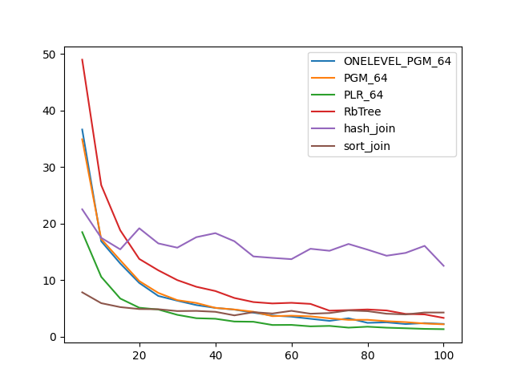
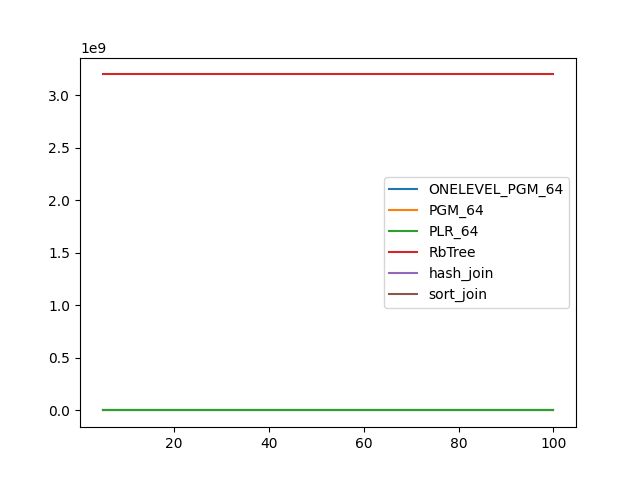
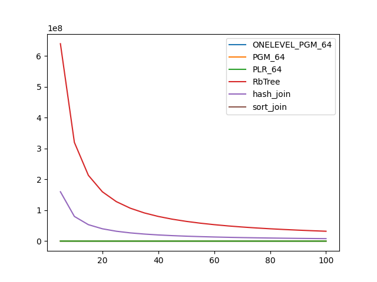

### duration_sec

|   0 |   ONELEVEL_PGM_64 |   PGM_64 |   PLR_64 |   RbTree |   hash_join |   sort_join |
|----:|------------------:|---------:|---------:|---------:|------------:|------------:|
|   5 |          36.6417  | 34.916   | 18.4799  | 49.0006  |     22.5225 |     7.82824 |
|  10 |          16.8683  | 17.2588  | 10.5713  | 26.797   |     17.4741 |     5.91017 |
|  15 |          12.9382  | 13.5078  |  6.73096 | 18.8057  |     15.4317 |     5.21371 |
|  20 |           9.48944 |  9.82212 |  5.10582 | 13.7382  |     19.1659 |     4.87164 |
|  25 |           7.18769 |  7.73136 |  4.78851 | 11.7257  |     16.4872 |     4.83885 |
|  30 |           6.34835 |  6.4438  |  3.84524 |  9.99053 |     15.7313 |     4.51412 |
|  35 |           5.57223 |  5.94923 |  3.24924 |  8.81167 |     17.5883 |     4.54223 |
|  40 |           5.07292 |  5.07801 |  3.15128 |  8.05911 |     18.3014 |     4.38092 |
|  45 |           4.76874 |  4.78819 |  2.66214 |  6.82821 |     16.8694 |     3.74946 |
|  50 |           4.22905 |  4.39137 |  2.61958 |  6.10738 |     14.1807 |     4.31975 |
|  55 |           3.71554 |  3.61107 |  2.04871 |  5.86039 |     13.9243 |     4.08117 |
|  60 |           3.52472 |  3.69246 |  2.06476 |  5.97389 |     13.6977 |     4.55264 |
|  65 |           3.14517 |  3.57583 |  1.80884 |  5.78237 |     15.5361 |     4.04226 |
|  70 |           2.77903 |  3.22736 |  1.88675 |  4.58234 |     15.1823 |     4.16078 |
|  75 |           3.23496 |  2.95664 |  1.58133 |  4.68337 |     16.386  |     4.62308 |
|  80 |           2.43054 |  2.96504 |  1.74518 |  4.79579 |     15.3807 |     4.49971 |
|  85 |           2.51781 |  2.71935 |  1.57234 |  4.61833 |     14.3048 |     4.04293 |
|  90 |           2.21901 |  2.55792 |  1.46976 |  4.0071  |     14.8035 |     3.91513 |
|  95 |           2.38202 |  2.30843 |  1.35888 |  3.91866 |     16.0518 |     4.25699 |
| 100 |           2.23263 |  2.16783 |  1.30728 |  3.30143 |     12.5218 |     4.25352 |

### inner_index_size

|   0 |   ONELEVEL_PGM_64 |   PGM_64 |   PLR_64 |   RbTree |   hash_join |   sort_join |
|----:|------------------:|---------:|---------:|---------:|------------:|------------:|
|   5 |            163680 |   109552 |   696960 |  3.2e+09 |         nan |         nan |
|  10 |            163680 |   109552 |   696960 |  3.2e+09 |         nan |         nan |
|  15 |            163680 |   109552 |   696960 |  3.2e+09 |         nan |         nan |
|  20 |            163680 |   109552 |   696960 |  3.2e+09 |         nan |         nan |
|  25 |            163680 |   109552 |   696960 |  3.2e+09 |         nan |         nan |
|  30 |            163680 |   109552 |   696960 |  3.2e+09 |         nan |         nan |
|  35 |            163680 |   109552 |   696960 |  3.2e+09 |         nan |         nan |
|  40 |            163680 |   109552 |   696960 |  3.2e+09 |         nan |         nan |
|  45 |            163680 |   109552 |   696960 |  3.2e+09 |         nan |         nan |
|  50 |            163680 |   109552 |   696960 |  3.2e+09 |         nan |         nan |
|  55 |            163680 |   109552 |   696960 |  3.2e+09 |         nan |         nan |
|  60 |            163680 |   109552 |   696960 |  3.2e+09 |         nan |         nan |
|  65 |            163680 |   109552 |   696960 |  3.2e+09 |         nan |         nan |
|  70 |            163680 |   109552 |   696960 |  3.2e+09 |         nan |         nan |
|  75 |            163680 |   109552 |   696960 |  3.2e+09 |         nan |         nan |
|  80 |            163680 |   109552 |   696960 |  3.2e+09 |         nan |         nan |
|  85 |            163680 |   109552 |   696960 |  3.2e+09 |         nan |         nan |
|  90 |            163680 |   109552 |   696960 |  3.2e+09 |         nan |         nan |
|  95 |            163680 |   109552 |   696960 |  3.2e+09 |         nan |         nan |
| 100 |            163680 |   109552 |   696960 |  3.2e+09 |         nan |         nan |

### outer_index_size

|   0 |   ONELEVEL_PGM_64 |   PGM_64 |   PLR_64 |      RbTree |   hash_join |   sort_join |
|----:|------------------:|---------:|---------:|------------:|------------:|------------:|
|   5 |             32328 |    21680 |   138912 | 6.4e+08     | 1.6e+08     |         nan |
|  10 |             16368 |    11024 |    70432 | 3.2e+08     | 8e+07       |         nan |
|  15 |             11112 |     7520 |    46496 | 2.13333e+08 | 5.33333e+07 |         nan |
|  20 |              7824 |     5328 |    34624 | 1.6e+08     | 4e+07       |         nan |
|  25 |              6552 |     4480 |    28352 | 1.28e+08    | 3.2e+07     |         nan |
|  30 |              5616 |     3800 |    22976 | 1.06667e+08 | 2.66667e+07 |         nan |
|  35 |              4752 |     3224 |    20192 | 9.14286e+07 | 2.28571e+07 |         nan |
|  40 |              3864 |     2632 |    17088 | 8e+07       | 2e+07       |         nan |
|  45 |              3648 |     2544 |    15168 | 7.11111e+07 | 1.77778e+07 |         nan |
|  50 |              3240 |     2216 |    14304 | 6.4e+07     | 1.6e+07     |         nan |
|  55 |              3024 |     2072 |    12768 | 5.81818e+07 | 1.45455e+07 |         nan |
|  60 |              2640 |     1816 |    11200 | 5.33333e+07 | 1.33333e+07 |         nan |
|  65 |              2496 |     1720 |    10720 | 4.92308e+07 | 1.23077e+07 |         nan |
|  70 |              2280 |     1576 |     9728 | 4.57143e+07 | 1.14286e+07 |         nan |
|  75 |              1992 |     1384 |     8704 | 4.26667e+07 | 1.06667e+07 |         nan |
|  80 |              1992 |     1384 |     8544 | 4e+07       | 1e+07       |         nan |
|  85 |              2016 |     1400 |     8384 | 3.76471e+07 | 9.41177e+06 |         nan |
|  90 |              1896 |     1320 |     7904 | 3.55556e+07 | 8.8889e+06  |         nan |
|  95 |              1728 |     1208 |     7584 | 3.36842e+07 | 8.42106e+06 |         nan |
| 100 |              1752 |     1224 |     7200 | 3.2e+07     | 8e+06       |         nan |

