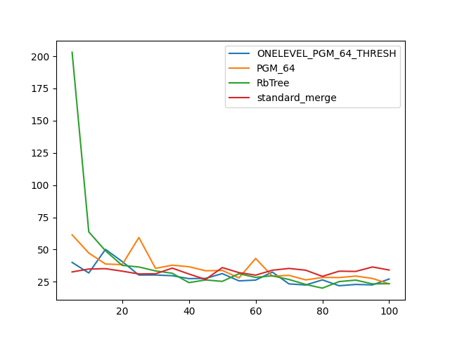

### duration_sec

|   0 |   ONELEVEL_PGM_64_THRESH |   PGM_64 |   RbTree |   standard_merge |
|----:|-------------------------:|---------:|---------:|-----------------:|
|   5 |                  40.0562 |  61.4495 | 203.052  |          32.6494 |
|  10 |                  31.8566 |  47.3347 |  63.7162 |          34.9123 |
|  15 |                  50.161  |  38.811  |  49.0639 |          35.1863 |
|  20 |                  40.7572 |  38.3036 |  37.7446 |          33.2704 |
|  25 |                  30.2521 |  59.3648 |  36.4857 |          31.0945 |
|  30 |                  30.2823 |  35.4097 |  33.4488 |          31.2036 |
|  35 |                  29.7298 |  37.9094 |  31.637  |          35.6082 |
|  40 |                  27.4684 |  36.699  |  24.368  |          31.0605 |
|  45 |                  27.6523 |  33.5554 |  26.4581 |          26.8226 |
|  50 |                  31.3673 |  33.8153 |  25.3403 |          36.027  |
|  55 |                  25.7201 |  28.024  |  31.2849 |          32.1173 |
|  60 |                  26.3498 |  43.1107 |  28.442  |          30.1762 |
|  65 |                  32.539  |  29.389  |  29.6642 |          33.9714 |
|  70 |                  23.3691 |  29.9976 |  26.7808 |          35.3813 |
|  75 |                  22.5409 |  26.4856 |  22.9471 |          33.9877 |
|  80 |                  26.4955 |  28.3635 |  20.0934 |          29.2239 |
|  85 |                  21.9631 |  28.3065 |  25.1652 |          33.2329 |
|  90 |                  22.9524 |  29.4455 |  26.3121 |          33.0572 |
|  95 |                  22.607  |  27.6055 |  23.3727 |          36.5051 |
| 100 |                  27.1548 |  23.4251 |  23.5574 |          34.1549 |

