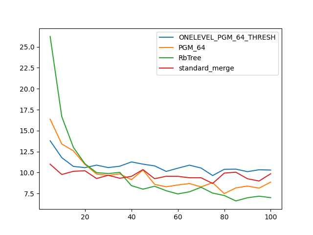

### duration_sec

|   0 |   ONELEVEL_PGM_64_THRESH |   PGM_64 |   RbTree |   standard_merge |
|----:|-------------------------:|---------:|---------:|-----------------:|
|   5 |                 13.7964  | 16.3697  | 26.2405  |         10.9994  |
|  10 |                 11.7793  | 13.4114  | 16.6803  |          9.76821 |
|  15 |                 10.7366  | 12.5936  | 13.0102  |         10.151   |
|  20 |                 10.5865  | 10.9722  | 11.0485  |         10.2156  |
|  25 |                 10.8882  |  9.82533 |  9.99089 |          9.28724 |
|  30 |                 10.5944  |  9.66232 |  9.8813  |          9.67523 |
|  35 |                 10.7596  |  9.84004 | 10.0213  |          9.32095 |
|  40 |                 11.2702  |  9.14571 |  8.44316 |          9.54354 |
|  45 |                 11.0021  | 10.3085  |  8.01929 |         10.352   |
|  50 |                 10.7983  |  8.59196 |  8.37009 |          9.26545 |
|  55 |                 10.1369  |  8.30052 |  7.83075 |          9.55444 |
|  60 |                 10.5213  |  8.51975 |  7.45227 |          9.549   |
|  65 |                 10.8815  |  8.68896 |  7.70344 |          9.3788  |
|  70 |                 10.5433  |  8.29314 |  8.24726 |          9.38039 |
|  75 |                  9.64495 |  8.79304 |  7.55162 |          8.69869 |
|  80 |                 10.3882  |  7.48847 |  7.26427 |          9.93635 |
|  85 |                 10.406   |  8.16793 |  6.6165  |         10.0443  |
|  90 |                 10.109   |  8.3891  |  6.99352 |          9.26298 |
|  95 |                 10.3323  |  8.13764 |  7.18181 |          8.99011 |
| 100 |                 10.2979  |  8.85801 |  7.00523 |          9.8584  |

