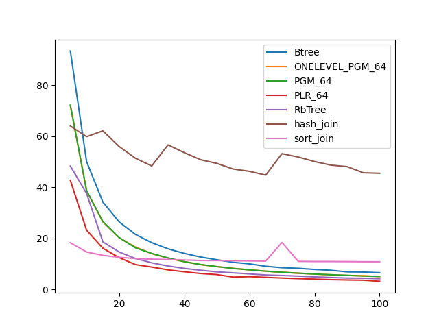
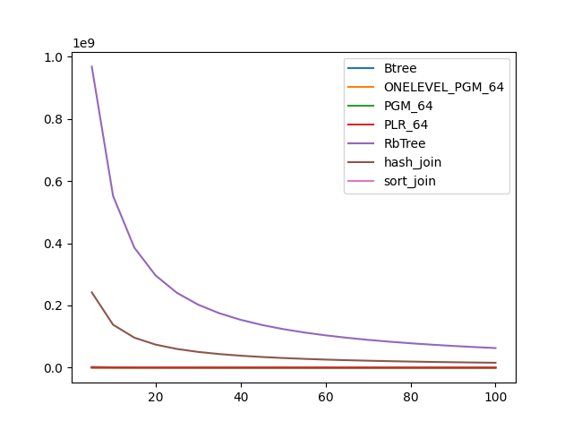

### duration_sec

|   0 |    Btree |   ONELEVEL_PGM_64 |   PGM_64 |   PLR_64 |   RbTree |   hash_join |   sort_join |
|----:|---------:|------------------:|---------:|---------:|---------:|------------:|------------:|
|   5 | 93.3175  |          72.0678  | 72.133   | 42.6908  | 48.2878  |     63.9741 |     18.2549 |
|  10 | 49.9947  |          38.543   | 38.5957  | 23.174   | 37.5397  |     59.785  |     14.6503 |
|  15 | 34.1906  |          26.4396  | 26.553   | 16.1027  | 18.5998  |     62.0813 |     13.3373 |
|  20 | 26.4096  |          20.2504  | 20.2834  | 12.442   | 14.6332  |     55.9273 |     12.5657 |
|  25 | 21.5234  |          16.557   | 16.2821  |  9.7177  | 12.0933  |     51.34   |     12.0672 |
|  30 | 18.3056  |          14.0127  | 14.0844  |  8.75259 | 10.4166  |     48.3225 |     11.8459 |
|  35 | 15.8755  |          12.2242  | 12.3243  |  7.64616 |  9.16881 |     56.5704 |     11.6851 |
|  40 | 14.0968  |          10.8664  | 10.854   |  6.90562 |  8.22394 |     53.5281 |     11.5281 |
|  45 | 12.6777  |           9.68386 |  9.7634  |  6.22779 |  7.50436 |     50.7726 |     11.3257 |
|  50 | 11.6175  |           8.94089 |  8.92683 |  5.80753 |  6.86326 |     49.3326 |     11.2994 |
|  55 | 10.622   |           8.23936 |  8.20796 |  4.82493 |  6.47782 |     47.1239 |     11.2313 |
|  60 | 10.0124  |           7.67613 |  7.65508 |  4.99804 |  6.06964 |     46.2295 |     11.1683 |
|  65 |  9.06996 |           7.12202 |  7.15525 |  4.70733 |  5.64334 |     44.7431 |     11.1027 |
|  70 |  8.50084 |           6.7155  |  6.70372 |  4.45233 |  5.44447 |     53.1249 |     18.3709 |
|  75 |  8.26359 |           6.33773 |  6.35535 |  4.21906 |  5.20298 |     51.8178 |     10.9897 |
|  80 |  7.81433 |           6.01817 |  6.01536 |  4.02675 |  4.89763 |     50.0544 |     10.9316 |
|  85 |  7.49467 |           5.743   |  5.72832 |  3.82366 |  4.66409 |     48.6585 |     10.9246 |
|  90 |  6.8642  |           5.46792 |  5.50739 |  3.69459 |  4.42966 |     48.0605 |     10.8827 |
|  95 |  6.80055 |           5.32755 |  5.23303 |  3.59667 |  4.36801 |     45.6521 |     10.8393 |
| 100 |  6.53537 |           5.03691 |  5.07425 |  3.17966 |  4.17341 |     45.4596 |     10.817  |

### inner_index_size

|   0 |      Btree |   ONELEVEL_PGM_64 |   PGM_64 |      PLR_64 |      RbTree |   hash_join |   sort_join |
|----:|-----------:|------------------:|---------:|------------:|------------:|------------:|------------:|
|   5 | 1.1943e+07 |            900384 |   603832 | 2.46384e+06 | 2.89398e+09 |         nan |         nan |
|  10 | 1.1943e+07 |            900384 |   603832 | 2.46384e+06 | 2.89398e+09 |         nan |         nan |
|  15 | 1.1943e+07 |            900384 |   603832 | 2.46384e+06 | 2.89398e+09 |         nan |         nan |
|  20 | 1.1943e+07 |            900384 |   603832 | 2.46384e+06 | 2.89398e+09 |         nan |         nan |
|  25 | 1.1943e+07 |            900384 |   603832 | 2.46384e+06 | 2.89398e+09 |         nan |         nan |
|  30 | 1.1943e+07 |            900384 |   603832 | 2.46384e+06 | 2.89398e+09 |         nan |         nan |
|  35 | 1.1943e+07 |            900384 |   603832 | 2.46384e+06 | 2.89398e+09 |         nan |         nan |
|  40 | 1.1943e+07 |            900384 |   603832 | 2.46384e+06 | 2.89398e+09 |         nan |         nan |
|  45 | 1.1943e+07 |            900384 |   603832 | 2.46384e+06 | 2.89398e+09 |         nan |         nan |
|  50 | 1.1943e+07 |            900384 |   603832 | 2.46384e+06 | 2.89398e+09 |         nan |         nan |
|  55 | 1.1943e+07 |            900384 |   603832 | 2.46384e+06 | 2.89398e+09 |         nan |         nan |
|  60 | 1.1943e+07 |            900384 |   603832 | 2.46384e+06 | 2.89398e+09 |         nan |         nan |
|  65 | 1.1943e+07 |            900384 |   603832 | 2.46384e+06 | 2.89398e+09 |         nan |         nan |
|  70 | 1.1943e+07 |            900384 |   603832 | 2.46384e+06 | 2.89398e+09 |         nan |         nan |
|  75 | 1.1943e+07 |            900384 |   603832 | 2.46384e+06 | 2.89398e+09 |         nan |         nan |
|  80 | 1.1943e+07 |            900384 |   603832 | 2.46384e+06 | 2.89398e+09 |         nan |         nan |
|  85 | 1.1943e+07 |            900384 |   603832 | 2.46384e+06 | 2.89398e+09 |         nan |         nan |
|  90 | 1.1943e+07 |            900384 |   603832 | 2.46384e+06 | 2.89398e+09 |         nan |         nan |
|  95 | 1.1943e+07 |            900384 |   603832 | 2.46384e+06 | 2.89398e+09 |         nan |         nan |
| 100 | 1.1943e+07 |            900384 |   603832 | 2.46384e+06 | 2.89398e+09 |         nan |         nan |

### outer_index_size

|   0 |            Btree |   ONELEVEL_PGM_64 |   PGM_64 |   PLR_64 |      RbTree |   hash_join |   sort_join |
|----:|-----------------:|------------------:|---------:|---------:|------------:|------------:|------------:|
|   5 |      2.16872e+06 |            236688 |   158520 |   561600 | 9.68026e+08 | 2.42006e+08 |         nan |
|  10 |      1.1425e+06  |            152640 |   102296 |   343840 | 5.52351e+08 | 1.38088e+08 |         nan |
|  15 | 769920           |            118152 |    79136 |   261440 | 3.8608e+08  | 9.652e+07   |         nan |
|  20 | 584640           |             99456 |    66672 |   214560 | 2.96666e+08 | 7.41664e+07 |         nan |
|  25 | 470384           |             84888 |    56944 |   185280 | 2.40881e+08 | 6.02202e+07 |         nan |
|  30 | 396272           |             74352 |    49888 |   163904 | 2.0271e+08  | 5.06775e+07 |         nan |
|  35 | 340688           |             65688 |    44064 |   149344 | 1.75024e+08 | 4.37559e+07 |         nan |
|  40 | 297456           |             59496 |    39936 |   136384 | 1.53961e+08 | 3.84904e+07 |         nan |
|  45 | 266576           |             56016 |    37584 |   126080 | 1.37436e+08 | 3.43591e+07 |         nan |
|  50 | 241872           |             52920 |    35488 |   116288 | 1.24097e+08 | 3.10243e+07 |         nan |
|  55 | 220256           |             50880 |    34112 |   108352 | 1.13133e+08 | 2.82834e+07 |         nan |
|  60 | 201728           |             49152 |    32976 |   101344 | 1.03939e+08 | 2.59848e+07 |         nan |
|  65 | 186288           |             47808 |    32064 |    95680 | 9.61403e+07 | 2.40351e+07 |         nan |
|  70 | 173936           |             45768 |    30704 |    89216 | 8.94124e+07 | 2.23531e+07 |         nan |
|  75 | 161584           |             44016 |    29568 |    84896 | 8.35834e+07 | 2.08958e+07 |         nan |
|  80 | 152320           |             42672 |    28672 |    80960 | 7.84713e+07 | 1.96178e+07 |         nan |
|  85 | 143056           |             41088 |    27632 |    77664 | 7.39281e+07 | 1.8482e+07  |         nan |
|  90 | 136880           |             39288 |    26432 |    75552 | 6.98848e+07 | 1.74712e+07 |         nan |
|  95 | 130704           |             37656 |    25360 |    73664 | 6.62665e+07 | 1.65666e+07 |         nan |
| 100 | 124528           |             35808 |    24128 |    71936 | 6.30076e+07 | 1.57519e+07 |         nan |

