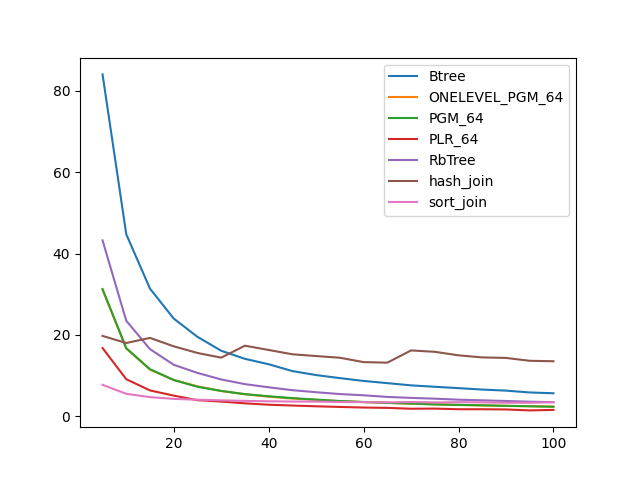
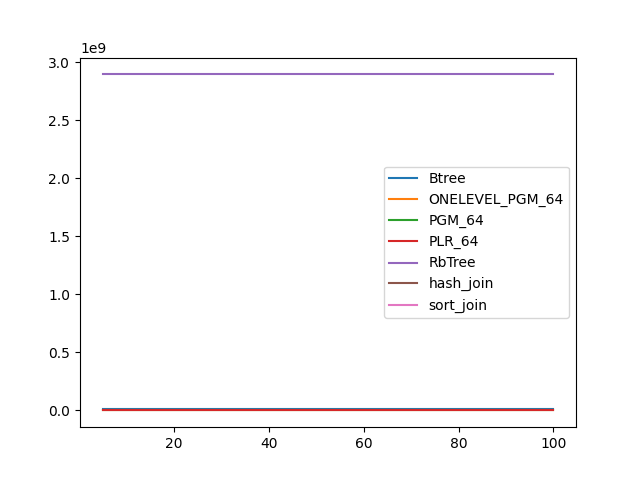
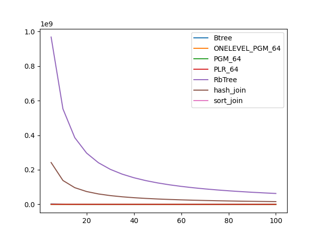

### duration_sec

|   0 |    Btree |   ONELEVEL_PGM_64 |   PGM_64 |   PLR_64 |   RbTree |   hash_join |   sort_join |
|----:|---------:|------------------:|---------:|---------:|---------:|------------:|------------:|
|   5 | 84.0714  |          31.1117  | 31.3041  | 16.7901  | 43.2591  |     19.7725 |     7.74314 |
|  10 | 44.7596  |          16.6991  | 16.7451  |  9.12378 | 23.4968  |     18.0341 |     5.54011 |
|  15 | 31.3889  |          11.4701  | 11.5954  |  6.37106 | 16.5192  |     19.284  |     4.72573 |
|  20 | 24.037   |           8.93119 |  8.93497 |  5.09537 | 12.6809  |     17.2167 |     4.29202 |
|  25 | 19.5454  |           7.36572 |  7.27232 |  3.97232 | 10.6744  |     15.5784 |     4.09012 |
|  30 | 16.1246  |           6.22955 |  6.25225 |  3.62792 |  9.06564 |     14.431  |     3.93741 |
|  35 | 14.1379  |           5.44084 |  5.45629 |  3.1982  |  7.92038 |     17.3693 |     3.79799 |
|  40 | 12.8105  |           4.83051 |  4.93771 |  2.85626 |  7.14213 |     16.3177 |     3.7037  |
|  45 | 11.121   |           4.37594 |  4.48858 |  2.65628 |  6.42647 |     15.2595 |     3.64021 |
|  50 | 10.1469  |           4.0506  |  4.11486 |  2.46851 |  5.93049 |     14.8211 |     3.62468 |
|  55 |  9.39698 |           3.70265 |  3.77288 |  2.31352 |  5.47821 |     14.4062 |     3.52651 |
|  60 |  8.70077 |           3.50324 |  3.53176 |  2.16397 |  5.17346 |     13.3317 |     3.48393 |
|  65 |  8.16178 |           3.31664 |  3.3075  |  2.0817  |  4.77547 |     13.1982 |     3.44273 |
|  70 |  7.61815 |           3.10996 |  3.1425  |  1.86944 |  4.53628 |     16.2069 |     3.52367 |
|  75 |  7.26879 |           2.97589 |  2.91443 |  1.90316 |  4.34182 |     15.8654 |     3.42496 |
|  80 |  6.93519 |           2.79185 |  2.82159 |  1.74611 |  4.09637 |     14.9986 |     3.48057 |
|  85 |  6.58174 |           2.69054 |  2.71399 |  1.74275 |  3.93348 |     14.4886 |     3.4345  |
|  90 |  6.32553 |           2.56487 |  2.58781 |  1.69427 |  3.77543 |     14.3616 |     3.33714 |
|  95 |  5.87055 |           2.48115 |  2.47929 |  1.46054 |  3.59751 |     13.6563 |     3.327   |
| 100 |  5.67769 |           2.37904 |  2.36453 |  1.58181 |  3.47992 |     13.5481 |     3.48267 |

### inner_index_size

|   0 |      Btree |   ONELEVEL_PGM_64 |   PGM_64 |      PLR_64 |      RbTree |   hash_join |   sort_join |
|----:|-----------:|------------------:|---------:|------------:|------------:|------------:|------------:|
|   5 | 1.1943e+07 |            900384 |   603832 | 2.46384e+06 | 2.89398e+09 |         nan |         nan |
|  10 | 1.1943e+07 |            900384 |   603832 | 2.46384e+06 | 2.89398e+09 |         nan |         nan |
|  15 | 1.1943e+07 |            900384 |   603832 | 2.46384e+06 | 2.89398e+09 |         nan |         nan |
|  20 | 1.1943e+07 |            900384 |   603832 | 2.46384e+06 | 2.89398e+09 |         nan |         nan |
|  25 | 1.1943e+07 |            900384 |   603832 | 2.46384e+06 | 2.89398e+09 |         nan |         nan |
|  30 | 1.1943e+07 |            900384 |   603832 | 2.46384e+06 | 2.89398e+09 |         nan |         nan |
|  35 | 1.1943e+07 |            900384 |   603832 | 2.46384e+06 | 2.89398e+09 |         nan |         nan |
|  40 | 1.1943e+07 |            900384 |   603832 | 2.46384e+06 | 2.89398e+09 |         nan |         nan |
|  45 | 1.1943e+07 |            900384 |   603832 | 2.46384e+06 | 2.89398e+09 |         nan |         nan |
|  50 | 1.1943e+07 |            900384 |   603832 | 2.46384e+06 | 2.89398e+09 |         nan |         nan |
|  55 | 1.1943e+07 |            900384 |   603832 | 2.46384e+06 | 2.89398e+09 |         nan |         nan |
|  60 | 1.1943e+07 |            900384 |   603832 | 2.46384e+06 | 2.89398e+09 |         nan |         nan |
|  65 | 1.1943e+07 |            900384 |   603832 | 2.46384e+06 | 2.89398e+09 |         nan |         nan |
|  70 | 1.1943e+07 |            900384 |   603832 | 2.46384e+06 | 2.89398e+09 |         nan |         nan |
|  75 | 1.1943e+07 |            900384 |   603832 | 2.46384e+06 | 2.89398e+09 |         nan |         nan |
|  80 | 1.1943e+07 |            900384 |   603832 | 2.46384e+06 | 2.89398e+09 |         nan |         nan |
|  85 | 1.1943e+07 |            900384 |   603832 | 2.46384e+06 | 2.89398e+09 |         nan |         nan |
|  90 | 1.1943e+07 |            900384 |   603832 | 2.46384e+06 | 2.89398e+09 |         nan |         nan |
|  95 | 1.1943e+07 |            900384 |   603832 | 2.46384e+06 | 2.89398e+09 |         nan |         nan |
| 100 | 1.1943e+07 |            900384 |   603832 | 2.46384e+06 | 2.89398e+09 |         nan |         nan |

### outer_index_size

|   0 |            Btree |   ONELEVEL_PGM_64 |   PGM_64 |   PLR_64 |      RbTree |   hash_join |   sort_join |
|----:|-----------------:|------------------:|---------:|---------:|------------:|------------:|------------:|
|   5 |      2.16872e+06 |            237000 |   158728 |   563680 | 9.68181e+08 | 2.42045e+08 |         nan |
|  10 |      1.1425e+06  |            152688 |   102280 |   344704 | 5.52443e+08 | 1.38111e+08 |         nan |
|  15 | 769920           |            118200 |    79168 |   260864 | 3.86063e+08 | 9.65157e+07 |         nan |
|  20 | 584640           |             98736 |    66192 |   214688 | 2.96644e+08 | 7.4161e+07  |         nan |
|  25 | 470384           |             84696 |    56816 |   184768 | 2.40848e+08 | 6.02121e+07 |         nan |
|  30 | 396272           |             73728 |    49456 |   164224 | 2.02701e+08 | 5.06753e+07 |         nan |
|  35 | 340688           |             65472 |    43936 |   148384 | 1.75015e+08 | 4.37538e+07 |         nan |
|  40 | 297456           |             59520 |    39952 |   137088 | 1.53974e+08 | 3.84936e+07 |         nan |
|  45 | 266576           |             55488 |    37216 |   125664 | 1.37436e+08 | 3.4359e+07  |         nan |
|  50 | 241872           |             52872 |    35472 |   116608 | 1.24108e+08 | 3.10271e+07 |         nan |
|  55 | 220256           |             51000 |    34192 |   108448 | 1.13134e+08 | 2.82836e+07 |         nan |
|  60 | 201728           |             49200 |    33008 |   100992 | 1.0395e+08  | 2.59874e+07 |         nan |
|  65 | 186288           |             47616 |    31952 |    95424 | 9.6145e+07  | 2.40362e+07 |         nan |
|  70 | 173936           |             45792 |    30736 |    88896 | 8.94168e+07 | 2.23542e+07 |         nan |
|  75 | 161584           |             44256 |    29712 |    84576 | 8.35646e+07 | 2.08912e+07 |         nan |
|  80 | 152320           |             42672 |    28688 |    81344 | 7.84485e+07 | 1.96121e+07 |         nan |
|  85 | 143056           |             40632 |    27328 |    77760 | 7.39249e+07 | 1.84812e+07 |         nan |
|  90 | 136880           |             39216 |    26384 |    74816 | 6.98994e+07 | 1.74748e+07 |         nan |
|  95 | 130704           |             37512 |    25264 |    72832 | 6.62673e+07 | 1.65668e+07 |         nan |
| 100 | 124528           |             35664 |    24032 |    71072 | 6.29997e+07 | 1.57499e+07 |         nan |

