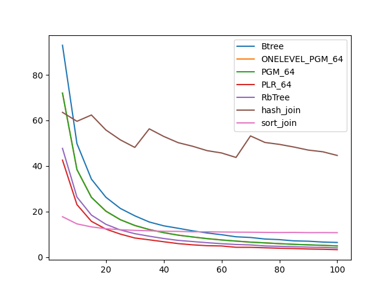
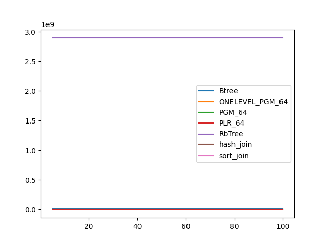
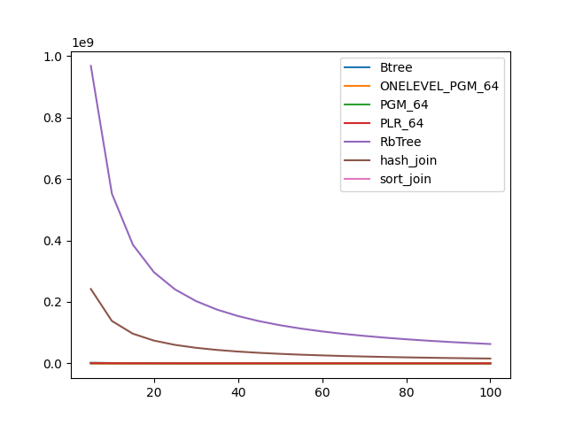

### duration_sec

|   0 |    Btree |   ONELEVEL_PGM_64 |   PGM_64 |   PLR_64 |   RbTree |   hash_join |   sort_join |
|----:|---------:|------------------:|---------:|---------:|---------:|------------:|------------:|
|   5 | 92.9718  |          71.9921  | 71.9967  | 42.5824  | 47.7484  |     63.5353 |     17.7543 |
|  10 | 49.8239  |          38.4291  | 38.4305  | 23.0605  | 26.3664  |     59.6109 |     14.6043 |
|  15 | 34.2461  |          26.2935  | 26.2482  | 15.729   | 18.4713  |     62.3737 |     13.2844 |
|  20 | 26.3024  |          20.1503  | 20.2242  | 12.3225  | 14.4283  |     55.8144 |     12.4912 |
|  25 | 21.3918  |          16.4378  | 16.4483  | 10.1316  | 11.9471  |     51.469  |     12.0536 |
|  30 | 18.1524  |          13.8879  | 13.9321  |  8.41949 | 10.3136  |     48.1531 |     11.7569 |
|  35 | 15.4353  |          12.1317  | 12.1215  |  7.61265 |  9.2031  |     56.3037 |     11.5848 |
|  40 | 13.7594  |          10.7701  | 10.7562  |  6.76898 |  8.18886 |     52.9797 |     11.3683 |
|  45 | 12.6833  |           9.69963 |  9.64262 |  5.95588 |  7.3707  |     50.2392 |     11.3171 |
|  50 | 11.5537  |           8.8508  |  8.89199 |  5.41302 |  6.8639  |     48.6609 |     11.1244 |
|  55 | 10.6184  |           8.17395 |  8.12492 |  5.03856 |  6.35471 |     46.7391 |     11.1342 |
|  60 |  9.85873 |           7.57892 |  7.54288 |  4.91783 |  5.91839 |     45.7212 |     11.0463 |
|  65 |  8.95143 |           7.03849 |  7.0696  |  4.3412  |  5.56301 |     43.7564 |     10.9839 |
|  70 |  8.64333 |           6.59007 |  6.60934 |  4.31939 |  5.37188 |     53.1994 |     10.9481 |
|  75 |  7.96725 |           6.2937  |  6.26253 |  4.11986 |  4.9288  |     50.3285 |     10.8806 |
|  80 |  7.69738 |           5.94067 |  5.94072 |  3.93097 |  4.76597 |     49.4872 |     10.8187 |
|  85 |  7.16106 |           5.65177 |  5.62339 |  3.78619 |  4.59781 |     48.3268 |     10.8698 |
|  90 |  7.0069  |           5.37819 |  5.44003 |  3.57672 |  4.39412 |     46.9823 |     10.7711 |
|  95 |  6.63936 |           5.17214 |  5.19755 |  3.46212 |  4.25886 |     46.2424 |     10.7876 |
| 100 |  6.44729 |           4.96396 |  4.92731 |  3.2991  |  4.08034 |     44.6344 |     10.7611 |

### inner_index_size

|   0 |      Btree |   ONELEVEL_PGM_64 |   PGM_64 |      PLR_64 |      RbTree |   hash_join |   sort_join |
|----:|-----------:|------------------:|---------:|------------:|------------:|------------:|------------:|
|   5 | 1.1943e+07 |            900384 |   603832 | 2.46384e+06 | 2.89398e+09 |         nan |         nan |
|  10 | 1.1943e+07 |            900384 |   603832 | 2.46384e+06 | 2.89398e+09 |         nan |         nan |
|  15 | 1.1943e+07 |            900384 |   603832 | 2.46384e+06 | 2.89398e+09 |         nan |         nan |
|  20 | 1.1943e+07 |            900384 |   603832 | 2.46384e+06 | 2.89398e+09 |         nan |         nan |
|  25 | 1.1943e+07 |            900384 |   603832 | 2.46384e+06 | 2.89398e+09 |         nan |         nan |
|  30 | 1.1943e+07 |            900384 |   603832 | 2.46384e+06 | 2.89398e+09 |         nan |         nan |
|  35 | 1.1943e+07 |            900384 |   603832 | 2.46384e+06 | 2.89398e+09 |         nan |         nan |
|  40 | 1.1943e+07 |            900384 |   603832 | 2.46384e+06 | 2.89398e+09 |         nan |         nan |
|  45 | 1.1943e+07 |            900384 |   603832 | 2.46384e+06 | 2.89398e+09 |         nan |         nan |
|  50 | 1.1943e+07 |            900384 |   603832 | 2.46384e+06 | 2.89398e+09 |         nan |         nan |
|  55 | 1.1943e+07 |            900384 |   603832 | 2.46384e+06 | 2.89398e+09 |         nan |         nan |
|  60 | 1.1943e+07 |            900384 |   603832 | 2.46384e+06 | 2.89398e+09 |         nan |         nan |
|  65 | 1.1943e+07 |            900384 |   603832 | 2.46384e+06 | 2.89398e+09 |         nan |         nan |
|  70 | 1.1943e+07 |            900384 |   603832 | 2.46384e+06 | 2.89398e+09 |         nan |         nan |
|  75 | 1.1943e+07 |            900384 |   603832 | 2.46384e+06 | 2.89398e+09 |         nan |         nan |
|  80 | 1.1943e+07 |            900384 |   603832 | 2.46384e+06 | 2.89398e+09 |         nan |         nan |
|  85 | 1.1943e+07 |            900384 |   603832 | 2.46384e+06 | 2.89398e+09 |         nan |         nan |
|  90 | 1.1943e+07 |            900384 |   603832 | 2.46384e+06 | 2.89398e+09 |         nan |         nan |
|  95 | 1.1943e+07 |            900384 |   603832 | 2.46384e+06 | 2.89398e+09 |         nan |         nan |
| 100 | 1.1943e+07 |            900384 |   603832 | 2.46384e+06 | 2.89398e+09 |         nan |         nan |

### outer_index_size

|   0 |            Btree |   ONELEVEL_PGM_64 |   PGM_64 |   PLR_64 |      RbTree |   hash_join |   sort_join |
|----:|-----------------:|------------------:|---------:|---------:|------------:|------------:|------------:|
|   5 |      2.16872e+06 |            236640 |   158488 |   564384 | 9.68064e+08 | 2.42016e+08 |         nan |
|  10 |      1.1425e+06  |            153816 |   103080 |   343552 | 5.52441e+08 | 1.3811e+08  |         nan |
|  15 | 769920           |            118776 |    79568 |   261728 | 3.86059e+08 | 9.65147e+07 |         nan |
|  20 | 584640           |             99264 |    66544 |   215712 | 2.96679e+08 | 7.41698e+07 |         nan |
|  25 | 470384           |             84432 |    56656 |   185504 | 2.40895e+08 | 6.02237e+07 |         nan |
|  30 | 396272           |             73320 |    49168 |   164064 | 2.02736e+08 | 5.0684e+07  |         nan |
|  35 | 340688           |             66120 |    44368 |   148384 | 1.75027e+08 | 4.37567e+07 |         nan |
|  40 | 297456           |             59448 |    39920 |   135520 | 1.53995e+08 | 3.84988e+07 |         nan |
|  45 | 266576           |             55776 |    37424 |   126304 | 1.37462e+08 | 3.43656e+07 |         nan |
|  50 | 241872           |             52968 |    35536 |   116832 | 1.24122e+08 | 3.10305e+07 |         nan |
|  55 | 220256           |             50784 |    34048 |   107872 | 1.13145e+08 | 2.82862e+07 |         nan |
|  60 | 201728           |             49176 |    32992 |   100704 | 1.03988e+08 | 2.59971e+07 |         nan |
|  65 | 186288           |             47616 |    31952 |    94720 | 9.61628e+07 | 2.40407e+07 |         nan |
|  70 | 173936           |             45840 |    30768 |    89376 | 8.94556e+07 | 2.23639e+07 |         nan |
|  75 | 161584           |             44544 |    29904 |    85504 | 8.36015e+07 | 2.09004e+07 |         nan |
|  80 | 152320           |             42288 |    28416 |    81536 | 7.84834e+07 | 1.96209e+07 |         nan |
|  85 | 143056           |             41160 |    27680 |    78624 | 7.39572e+07 | 1.84893e+07 |         nan |
|  90 | 136880           |             39240 |    26400 |    75104 | 6.99172e+07 | 1.74793e+07 |         nan |
|  95 | 130704           |             37896 |    25504 |    73440 | 6.62957e+07 | 1.65739e+07 |         nan |
| 100 | 124528           |             36192 |    24384 |    71360 | 6.30332e+07 | 1.57583e+07 |         nan |

