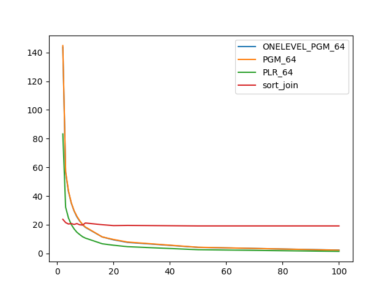
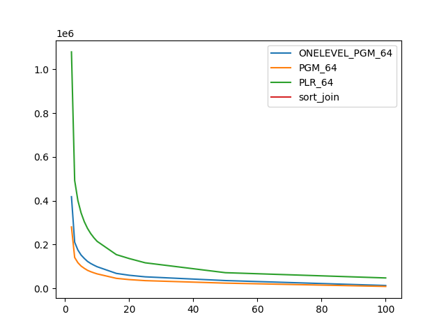

### duration_sec

|   1 |   ONELEVEL_PGM_64 |    PGM_64 |   PLR_64 |   sort_join |
|----:|------------------:|----------:|---------:|------------:|
|   2 |         143.761   | 144.871   | 83.2793  |     23.7747 |
|   3 |          56.2844  |  57.0976  | 32.1838  |     21.4874 |
|   4 |          43.1333  |  43.6727  | 24.7347  |     20.4771 |
|   5 |          35.1088  |  35.3689  | 20.1398  |     20.8071 |
|   6 |          29.5673  |  29.7635  | 17.0886  |     20.1926 |
|   7 |          25.4436  |  25.9015  | 14.7334  |     20.7898 |
|   8 |          22.493   |  22.756   | 13.1341  |     19.9459 |
|   9 |          20.0526  |  20.2236  | 11.6385  |     19.7482 |
|  10 |          18.1565  |  18.4141  | 10.6615  |     21.1864 |
|  16 |          11.4522  |  11.473   |  6.69337 |     19.9843 |
|  20 |           9.44565 |   9.69755 |  5.68684 |     19.3921 |
|  25 |           7.66332 |   7.91354 |  4.67415 |     19.5134 |
|  50 |           4.19635 |   4.27153 |  2.57333 |     19.1462 |
| 100 |           2.30684 |   2.23552 |  1.41022 |     19.1507 |

### inner_index_size

|   1 |   ONELEVEL_PGM_64 |   PGM_64 |      PLR_64 |   sort_join |
|----:|------------------:|---------:|------------:|------------:|
|   2 |            900384 |   603832 | 2.46384e+06 |         nan |
|   3 |            900384 |   603832 | 2.46384e+06 |         nan |
|   4 |            900384 |   603832 | 2.46384e+06 |         nan |
|   5 |            900384 |   603832 | 2.46384e+06 |         nan |
|   6 |            900384 |   603832 | 2.46384e+06 |         nan |
|   7 |            900384 |   603832 | 2.46384e+06 |         nan |
|   8 |            900384 |   603832 | 2.46384e+06 |         nan |
|   9 |            900384 |   603832 | 2.46384e+06 |         nan |
|  10 |            900384 |   603832 | 2.46384e+06 |         nan |
|  16 |            900384 |   603832 | 2.46384e+06 |         nan |
|  20 |            900384 |   603832 | 2.46384e+06 |         nan |
|  25 |            900384 |   603832 | 2.46384e+06 |         nan |
|  50 |            900384 |   603832 | 2.46384e+06 |         nan |
| 100 |            900384 |   603832 | 2.46384e+06 |         nan |

### outer_index_size

|   1 |   ONELEVEL_PGM_64 |   PGM_64 |           PLR_64 |   sort_join |
|----:|------------------:|---------:|-----------------:|------------:|
|   2 |            418416 |   280344 |      1.07894e+06 |         nan |
|   3 |            210576 |   141032 | 492544           |         nan |
|   4 |            175224 |   117400 | 401120           |         nan |
|   5 |            152328 |   102072 | 344704           |         nan |
|   6 |            136704 |    91656 | 304512           |         nan |
|   7 |            123288 |    82576 | 273952           |         nan |
|   8 |            113760 |    76312 | 250272           |         nan |
|   9 |            106008 |    71040 | 231104           |         nan |
|  10 |             98928 |    66320 | 214784           |         nan |
|  16 |             68448 |    45920 | 154144           |         nan |
|  20 |             60000 |    40272 | 136288           |         nan |
|  25 |             52848 |    35456 | 116864           |         nan |
|  50 |             35808 |    24128 |  71744           |         nan |
| 100 |             13248 |     9056 |  47744           |         nan |

