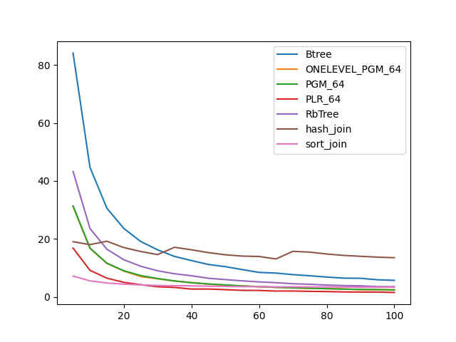
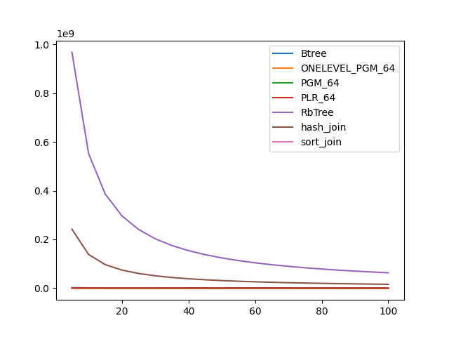

### duration_sec

|   0 |    Btree |   ONELEVEL_PGM_64 |   PGM_64 |   PLR_64 |   RbTree |   hash_join |   sort_join |
|----:|---------:|------------------:|---------:|---------:|---------:|------------:|------------:|
|   5 | 84.1593  |          31.2068  | 31.3633  | 16.8165  | 43.2772  |     19.0189 |     7.15422 |
|  10 | 44.7184  |          16.7192  | 16.8261  |  9.14289 | 23.5891  |     18.0167 |     5.50426 |
|  15 | 30.5764  |          11.5354  | 11.6064  |  6.42795 | 16.435   |     19.1851 |     4.77955 |
|  20 | 23.6151  |           8.901   |  8.99233 |  5.00126 | 12.8035  |     16.9959 |     4.36012 |
|  25 | 19.1031  |           6.99389 |  7.33776 |  4.17553 | 10.5435  |     15.6458 |     4.11105 |
|  30 | 16.2164  |           6.22069 |  6.29608 |  3.46031 |  8.98708 |     14.5737 |     3.90694 |
|  35 | 13.9387  |           5.43213 |  5.49023 |  3.23435 |  7.95435 |     17.0859 |     3.83812 |
|  40 | 12.5128  |           4.89986 |  4.86818 |  2.66893 |  7.26549 |     16.2323 |     3.7774  |
|  45 | 11.1617  |           4.36479 |  4.43321 |  2.68236 |  6.40269 |     15.2535 |     3.66369 |
|  50 | 10.4168  |           4.01981 |  4.10864 |  2.45549 |  5.9286  |     14.5098 |     3.58743 |
|  55 |  9.39693 |           3.75186 |  3.75578 |  2.23525 |  5.51473 |     14.05   |     3.50352 |
|  60 |  8.42479 |           3.48667 |  3.50415 |  2.19373 |  5.14459 |     13.9137 |     3.50777 |
|  65 |  8.18516 |           3.29007 |  3.27417 |  1.97511 |  4.86668 |     13.0673 |     3.43547 |
|  70 |  7.65796 |           3.07518 |  3.10679 |  2.00215 |  4.5059  |     15.6957 |     3.43777 |
|  75 |  7.26197 |           2.90336 |  2.97129 |  1.87653 |  4.32163 |     15.4194 |     3.42312 |
|  80 |  6.81351 |           2.81756 |  2.79767 |  1.8077  |  4.05731 |     14.7776 |     3.40588 |
|  85 |  6.44456 |           2.69427 |  2.65907 |  1.68444 |  3.88028 |     14.2859 |     3.37758 |
|  90 |  6.3843  |           2.45354 |  2.55206 |  1.646   |  3.78954 |     13.9804 |     3.32016 |
|  95 |  5.87869 |           2.46122 |  2.48767 |  1.63758 |  3.51399 |     13.6857 |     3.34715 |
| 100 |  5.67629 |           2.3918  |  2.38969 |  1.51413 |  3.49609 |     13.5004 |     3.32503 |

### inner_index_size

|   0 |      Btree |   ONELEVEL_PGM_64 |   PGM_64 |      PLR_64 |      RbTree |   hash_join |   sort_join |
|----:|-----------:|------------------:|---------:|------------:|------------:|------------:|------------:|
|   5 | 1.1943e+07 |            900384 |   603832 | 2.46384e+06 | 2.89398e+09 |         nan |         nan |
|  10 | 1.1943e+07 |            900384 |   603832 | 2.46384e+06 | 2.89398e+09 |         nan |         nan |
|  15 | 1.1943e+07 |            900384 |   603832 | 2.46384e+06 | 2.89398e+09 |         nan |         nan |
|  20 | 1.1943e+07 |            900384 |   603832 | 2.46384e+06 | 2.89398e+09 |         nan |         nan |
|  25 | 1.1943e+07 |            900384 |   603832 | 2.46384e+06 | 2.89398e+09 |         nan |         nan |
|  30 | 1.1943e+07 |            900384 |   603832 | 2.46384e+06 | 2.89398e+09 |         nan |         nan |
|  35 | 1.1943e+07 |            900384 |   603832 | 2.46384e+06 | 2.89398e+09 |         nan |         nan |
|  40 | 1.1943e+07 |            900384 |   603832 | 2.46384e+06 | 2.89398e+09 |         nan |         nan |
|  45 | 1.1943e+07 |            900384 |   603832 | 2.46384e+06 | 2.89398e+09 |         nan |         nan |
|  50 | 1.1943e+07 |            900384 |   603832 | 2.46384e+06 | 2.89398e+09 |         nan |         nan |
|  55 | 1.1943e+07 |            900384 |   603832 | 2.46384e+06 | 2.89398e+09 |         nan |         nan |
|  60 | 1.1943e+07 |            900384 |   603832 | 2.46384e+06 | 2.89398e+09 |         nan |         nan |
|  65 | 1.1943e+07 |            900384 |   603832 | 2.46384e+06 | 2.89398e+09 |         nan |         nan |
|  70 | 1.1943e+07 |            900384 |   603832 | 2.46384e+06 | 2.89398e+09 |         nan |         nan |
|  75 | 1.1943e+07 |            900384 |   603832 | 2.46384e+06 | 2.89398e+09 |         nan |         nan |
|  80 | 1.1943e+07 |            900384 |   603832 | 2.46384e+06 | 2.89398e+09 |         nan |         nan |
|  85 | 1.1943e+07 |            900384 |   603832 | 2.46384e+06 | 2.89398e+09 |         nan |         nan |
|  90 | 1.1943e+07 |            900384 |   603832 | 2.46384e+06 | 2.89398e+09 |         nan |         nan |
|  95 | 1.1943e+07 |            900384 |   603832 | 2.46384e+06 | 2.89398e+09 |         nan |         nan |
| 100 | 1.1943e+07 |            900384 |   603832 | 2.46384e+06 | 2.89398e+09 |         nan |         nan |

### outer_index_size

|   0 |            Btree |   ONELEVEL_PGM_64 |   PGM_64 |   PLR_64 |      RbTree |   hash_join |   sort_join |
|----:|-----------------:|------------------:|---------:|---------:|------------:|------------:|------------:|
|   5 |      2.16872e+06 |            235704 |   157864 |   561792 | 9.68135e+08 | 2.42034e+08 |         nan |
|  10 |      1.1425e+06  |            152592 |   102232 |   343808 | 5.52418e+08 | 1.38105e+08 |         nan |
|  15 | 769920           |            118536 |    79496 |   261760 | 3.86054e+08 | 9.65135e+07 |         nan |
|  20 | 584640           |             98760 |    66192 |   216064 | 2.96733e+08 | 7.41834e+07 |         nan |
|  25 | 470384           |             85008 |    57008 |   186080 | 2.40929e+08 | 6.02323e+07 |         nan |
|  30 | 396272           |             74208 |    49776 |   165472 | 2.02758e+08 | 5.06894e+07 |         nan |
|  35 | 340688           |             65808 |    44176 |   148576 | 1.75008e+08 | 4.3752e+07  |         nan |
|  40 | 297456           |             59664 |    40048 |   136544 | 1.53979e+08 | 3.84946e+07 |         nan |
|  45 | 266576           |             55656 |    37344 |   125696 | 1.37482e+08 | 3.43706e+07 |         nan |
|  50 | 241872           |             52920 |    35472 |   116320 | 1.24128e+08 | 3.1032e+07  |         nan |
|  55 | 220256           |             51096 |    34256 |   108352 | 1.13166e+08 | 2.82914e+07 |         nan |
|  60 | 201728           |             49152 |    32960 |   101344 | 1.03959e+08 | 2.59896e+07 |         nan |
|  65 | 186288           |             47592 |    31920 |    94784 | 9.61557e+07 | 2.40389e+07 |         nan |
|  70 | 173936           |             45864 |    30784 |    89440 | 8.94473e+07 | 2.23618e+07 |         nan |
|  75 | 161584           |             44424 |    29808 |    85184 | 8.35947e+07 | 2.08987e+07 |         nan |
|  80 | 152320           |             42504 |    28576 |    81120 | 7.84834e+07 | 1.96208e+07 |         nan |
|  85 | 143056           |             41160 |    27680 |    77696 | 7.39609e+07 | 1.84902e+07 |         nan |
|  90 | 136880           |             39288 |    26432 |    75488 | 6.9917e+07  | 1.74792e+07 |         nan |
|  95 | 130704           |             37656 |    25344 |    73152 | 6.62998e+07 | 1.6575e+07  |         nan |
| 100 | 124528           |             36024 |    24272 |    71296 | 6.30361e+07 | 1.5759e+07  |         nan |

