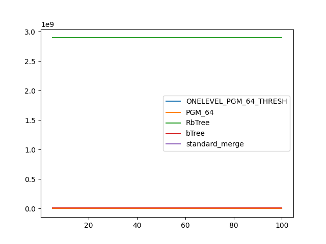
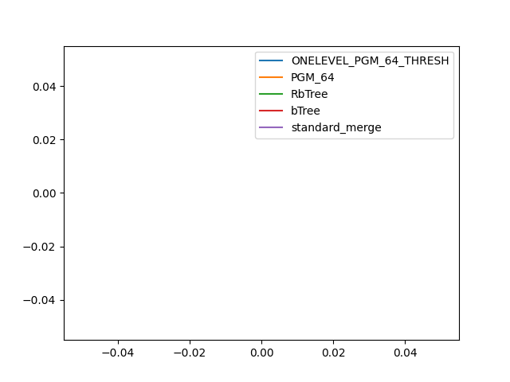

### duration_sec

|   0 |   ONELEVEL_PGM_64_THRESH |   PGM_64 |   RbTree |    bTree |   standard_merge |
|----:|-------------------------:|---------:|---------:|---------:|-----------------:|
|   5 |                  24.5502 |  36.914  |  57.781  | 101.132  |          22.1206 |
|  10 |                  21.2182 |  27.7812 |  35.701  |  58.8626 |          20.1769 |
|  15 |                  19.8512 |  24.2877 |  27.713  |  43.5318 |          19.3736 |
|  20 |                  19.024  |  22.3505 |  23.5826 |  35.5327 |          19.0398 |
|  25 |                  18.3559 |  20.9996 |  21.0067 |  30.6679 |          18.8394 |
|  30 |                  17.8199 |  20.1184 |  19.3435 |  27.4594 |          18.698  |
|  35 |                  17.3419 |  19.2329 |  18.0442 |  25.0229 |          18.5073 |
|  40 |                  16.9756 |  18.6018 |  17.1687 |  23.2603 |          18.4349 |
|  45 |                  16.5594 |  18.0417 |  16.4149 |  21.8247 |          18.4192 |
|  50 |                  16.3006 |  17.5918 |  15.8856 |  20.691  |          18.3137 |
|  55 |                  15.9224 |  17.0985 |  15.2928 |  19.6997 |          18.3229 |
|  60 |                  15.6351 |  16.822  |  14.8729 |  18.8117 |          18.2792 |
|  65 |                  15.4167 |  16.4437 |  14.6088 |  18.3588 |          18.2667 |
|  70 |                  15.217  |  16.1547 |  14.2146 |  17.7685 |          18.1949 |
|  75 |                  14.9616 |  15.8668 |  13.9782 |  17.4103 |          18.182  |
|  80 |                  14.7357 |  15.6325 |  13.7799 |  16.8624 |          18.1791 |
|  85 |                  14.5844 |  15.3639 |  13.5525 |  16.475  |          18.1454 |
|  90 |                  14.3923 |  15.1128 |  13.396  |  16.1439 |          18.1087 |
|  95 |                  14.3008 |  14.9554 |  13.1714 |  15.8214 |          18.061  |
| 100 |                  14.1212 |  14.7449 |  13.0764 |  15.4882 |          18.0793 |

### inner_index_size

|   0 |   ONELEVEL_PGM_64_THRESH |   PGM_64 |      RbTree |      bTree |   standard_merge |
|----:|-------------------------:|---------:|------------:|-----------:|-----------------:|
|   5 |                   900384 |   603832 | 2.89398e+09 | 1.1943e+07 |              nan |
|  10 |                   900384 |   603832 | 2.89398e+09 | 1.1943e+07 |              nan |
|  15 |                   900384 |   603832 | 2.89398e+09 | 1.1943e+07 |              nan |
|  20 |                   900384 |   603832 | 2.89398e+09 | 1.1943e+07 |              nan |
|  25 |                   900384 |   603832 | 2.89398e+09 | 1.1943e+07 |              nan |
|  30 |                   900384 |   603832 | 2.89398e+09 | 1.1943e+07 |              nan |
|  35 |                   900384 |   603832 | 2.89398e+09 | 1.1943e+07 |              nan |
|  40 |                   900384 |   603832 | 2.89398e+09 | 1.1943e+07 |              nan |
|  45 |                   900384 |   603832 | 2.89398e+09 | 1.1943e+07 |              nan |
|  50 |                   900384 |   603832 | 2.89398e+09 | 1.1943e+07 |              nan |
|  55 |                   900384 |   603832 | 2.89398e+09 | 1.1943e+07 |              nan |
|  60 |                   900384 |   603832 | 2.89398e+09 | 1.1943e+07 |              nan |
|  65 |                   900384 |   603832 | 2.89398e+09 | 1.1943e+07 |              nan |
|  70 |                   900384 |   603832 | 2.89398e+09 | 1.1943e+07 |              nan |
|  75 |                   900384 |   603832 | 2.89398e+09 | 1.1943e+07 |              nan |
|  80 |                   900384 |   603832 | 2.89398e+09 | 1.1943e+07 |              nan |
|  85 |                   900384 |   603832 | 2.89398e+09 | 1.1943e+07 |              nan |
|  90 |                   900384 |   603832 | 2.89398e+09 | 1.1943e+07 |              nan |
|  95 |                   900384 |   603832 | 2.89398e+09 | 1.1943e+07 |              nan |
| 100 |                   900384 |   603832 | 2.89398e+09 | 1.1943e+07 |              nan |

### outer_index_size

|   0 |   ONELEVEL_PGM_64_THRESH |   PGM_64 |   RbTree |   bTree |   standard_merge |
|----:|-------------------------:|---------:|---------:|--------:|-----------------:|
|   5 |                      nan |      nan |      nan |     nan |              nan |
|  10 |                      nan |      nan |      nan |     nan |              nan |
|  15 |                      nan |      nan |      nan |     nan |              nan |
|  20 |                      nan |      nan |      nan |     nan |              nan |
|  25 |                      nan |      nan |      nan |     nan |              nan |
|  30 |                      nan |      nan |      nan |     nan |              nan |
|  35 |                      nan |      nan |      nan |     nan |              nan |
|  40 |                      nan |      nan |      nan |     nan |              nan |
|  45 |                      nan |      nan |      nan |     nan |              nan |
|  50 |                      nan |      nan |      nan |     nan |              nan |
|  55 |                      nan |      nan |      nan |     nan |              nan |
|  60 |                      nan |      nan |      nan |     nan |              nan |
|  65 |                      nan |      nan |      nan |     nan |              nan |
|  70 |                      nan |      nan |      nan |     nan |              nan |
|  75 |                      nan |      nan |      nan |     nan |              nan |
|  80 |                      nan |      nan |      nan |     nan |              nan |
|  85 |                      nan |      nan |      nan |     nan |              nan |
|  90 |                      nan |      nan |      nan |     nan |              nan |
|  95 |                      nan |      nan |      nan |     nan |              nan |
| 100 |                      nan |      nan |      nan |     nan |              nan |

