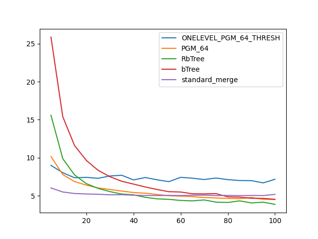

### duration_sec

|   0 |   ONELEVEL_PGM_64_THRESH |   PGM_64 |   RbTree |    bTree |   standard_merge |
|----:|-------------------------:|---------:|---------:|---------:|-----------------:|
|   5 |                  9.00256 | 10.1669  | 15.6034  | 25.8716  |          6.03436 |
|  10 |                  8.03834 |  7.80013 |  9.88414 | 15.4122  |          5.50146 |
|  15 |                  7.37006 |  6.8687  |  7.7482  | 11.6082  |          5.30286 |
|  20 |                  7.42322 |  6.40425 |  6.60135 |  9.65335 |          5.239   |
|  25 |                  7.29945 |  6.02987 |  5.97144 |  8.34773 |          5.20613 |
|  30 |                  7.60428 |  5.82927 |  5.54986 |  7.51156 |          5.13017 |
|  35 |                  7.70152 |  5.62596 |  5.22969 |  6.91178 |          5.1445  |
|  40 |                  7.08816 |  5.42682 |  5.13168 |  6.54047 |          5.07776 |
|  45 |                  7.40333 |  5.33787 |  4.79908 |  6.15879 |          5.04162 |
|  50 |                  7.10348 |  5.17974 |  4.60056 |  5.83156 |          5.03351 |
|  55 |                  6.85853 |  5.00781 |  4.53349 |  5.53657 |          5.05259 |
|  60 |                  7.42864 |  4.95748 |  4.38872 |  5.49797 |          5.03622 |
|  65 |                  7.31368 |  4.88677 |  4.33247 |  5.26767 |          5.07327 |
|  70 |                  7.13812 |  4.77839 |  4.45645 |  5.25206 |          5.09458 |
|  75 |                  7.33762 |  4.71863 |  4.16728 |  5.28702 |          5.03469 |
|  80 |                  7.12825 |  4.654   |  4.12569 |  4.86104 |          5.04849 |
|  85 |                  7.00731 |  4.61828 |  4.33485 |  4.82701 |          5.02497 |
|  90 |                  6.99056 |  4.77898 |  4.0635  |  4.67686 |          5.04437 |
|  95 |                  6.70016 |  4.54272 |  4.15874 |  4.65894 |          5.0323  |
| 100 |                  7.16701 |  4.51862 |  3.87636 |  4.53988 |          5.18718 |

