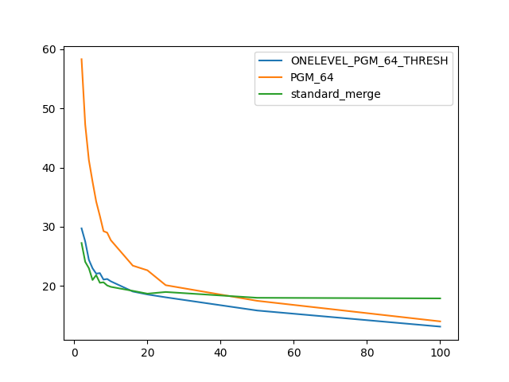

### duration_sec

|   1 |   ONELEVEL_PGM_64_THRESH |   PGM_64 |   standard_merge |
|----:|-------------------------:|---------:|-----------------:|
|   2 |                  29.7267 |  58.3229 |          27.2517 |
|   3 |                  27.5123 |  47.2751 |          24.0708 |
|   4 |                  24.4116 |  41.2651 |          22.9953 |
|   5 |                  22.982  |  37.6353 |          21.0034 |
|   6 |                  22.0742 |  34.2567 |          21.826  |
|   7 |                  22.162  |  31.8417 |          20.5303 |
|   8 |                  21.0692 |  29.2539 |          20.6107 |
|   9 |                  21.1702 |  29.0063 |          20.0763 |
|  10 |                  20.7747 |  27.7239 |          19.8406 |
|  16 |                  19.0527 |  23.4271 |          19.1646 |
|  20 |                  18.5557 |  22.6377 |          18.6859 |
|  25 |                  18.0729 |  20.1219 |          18.9715 |
|  50 |                  15.8401 |  17.4781 |          17.9917 |
| 100 |                  13.1193 |  14.0038 |          17.8876 |

