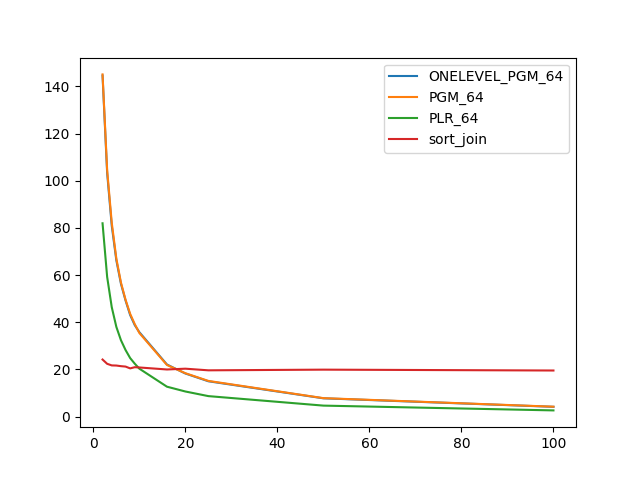
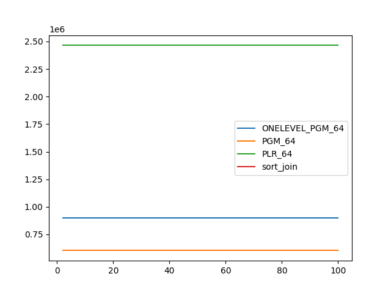
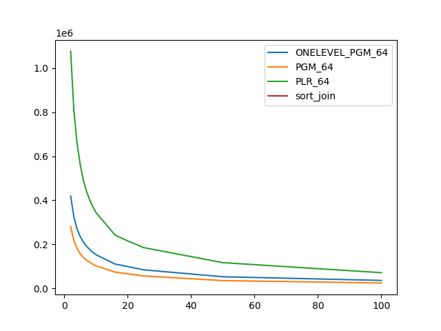

### duration_sec

|   1 |   ONELEVEL_PGM_64 |    PGM_64 |   PLR_64 |   sort_join |
|----:|------------------:|----------:|---------:|------------:|
|   2 |         144.594   | 145.072   | 81.9561  |     24.1992 |
|   3 |         103.329   | 104.52    | 59.2256  |     22.3876 |
|   4 |          80.918   |  82.1848  | 46.3952  |     21.7068 |
|   5 |          66.2455  |  66.9787  | 38.0348  |     21.6507 |
|   6 |          56.3163  |  56.8269  | 32.3883  |     21.3851 |
|   7 |          49.2207  |  49.536   | 28.2337  |     21.2112 |
|   8 |          43.0657  |  43.5685  | 24.8208  |     20.4453 |
|   9 |          38.7765  |  39.2089  | 22.4464  |     20.9429 |
|  10 |          35.792   |  35.4483  | 20.3216  |     20.8333 |
|  16 |          22.0886  |  21.8814  | 12.6831  |     19.9809 |
|  20 |          18.2719  |  18.3985  | 10.6508  |     20.3174 |
|  25 |          14.9817  |  15.1339  |  8.69091 |     19.6232 |
|  50 |           7.76063 |   7.83117 |  4.66342 |     19.9114 |
| 100 |           4.15534 |   4.20449 |  2.63499 |     19.5453 |

### inner_index_size

|   1 |   ONELEVEL_PGM_64 |   PGM_64 |      PLR_64 |   sort_join |
|----:|------------------:|---------:|------------:|------------:|
|   2 |            900384 |   603832 | 2.46384e+06 |         nan |
|   3 |            900384 |   603832 | 2.46384e+06 |         nan |
|   4 |            900384 |   603832 | 2.46384e+06 |         nan |
|   5 |            900384 |   603832 | 2.46384e+06 |         nan |
|   6 |            900384 |   603832 | 2.46384e+06 |         nan |
|   7 |            900384 |   603832 | 2.46384e+06 |         nan |
|   8 |            900384 |   603832 | 2.46384e+06 |         nan |
|   9 |            900384 |   603832 | 2.46384e+06 |         nan |
|  10 |            900384 |   603832 | 2.46384e+06 |         nan |
|  16 |            900384 |   603832 | 2.46384e+06 |         nan |
|  20 |            900384 |   603832 | 2.46384e+06 |         nan |
|  25 |            900384 |   603832 | 2.46384e+06 |         nan |
|  50 |            900384 |   603832 | 2.46384e+06 |         nan |
| 100 |            900384 |   603832 | 2.46384e+06 |         nan |

### outer_index_size

|   1 |   ONELEVEL_PGM_64 |   PGM_64 |           PLR_64 |   sort_join |
|----:|------------------:|---------:|-----------------:|------------:|
|   2 |            419064 |   280648 |      1.07693e+06 |         nan |
|   3 |            325464 |   217960 | 810720           |         nan |
|   4 |            271056 |   181528 | 660512           |         nan |
|   5 |            235752 |   157880 | 564032           |         nan |
|   6 |            210504 |   140984 | 492032           |         nan |
|   7 |            191472 |   128344 | 440864           |         nan |
|   8 |            177288 |   118760 | 401792           |         nan |
|   9 |            162984 |   109176 | 371136           |         nan |
|  10 |            152880 |   102424 | 344256           |         nan |
|  16 |            110496 |    74032 | 242272           |         nan |
|  20 |             99048 |    66400 | 215520           |         nan |
|  25 |             84216 |    56480 | 185280           |         nan |
|  50 |             52776 |    35376 | 116864           |         nan |
| 100 |             36192 |    24384 |  71296           |         nan |

