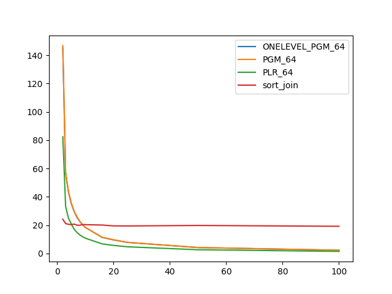
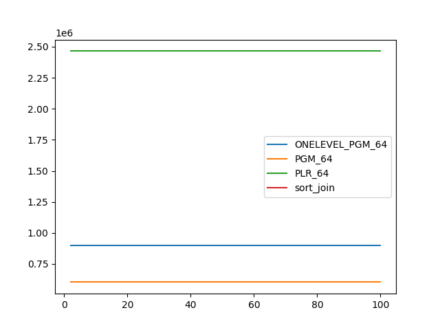
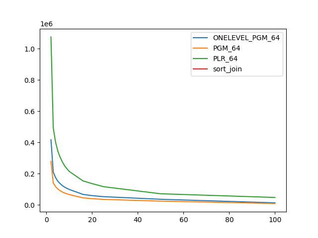

### duration_sec

|   1 |   ONELEVEL_PGM_64 |    PGM_64 |   PLR_64 |   sort_join |
|----:|------------------:|----------:|---------:|------------:|
|   2 |         145.082   | 146.869   | 82.4362  |     24.1757 |
|   3 |          56.6247  |  57.2834  | 33.2097  |     21.1026 |
|   4 |          43.3981  |  43.8437  | 24.9668  |     20.617  |
|   5 |          35.2039  |  35.776   | 20.8764  |     20.352  |
|   6 |          29.747   |  29.9868  | 17.1833  |     20.7614 |
|   7 |          25.604   |  26.0964  | 14.8714  |     19.9956 |
|   8 |          22.6279  |  22.7835  | 13.1519  |     19.9183 |
|   9 |          20.2165  |  20.4441  | 11.8193  |     20.4044 |
|  10 |          18.3785  |  18.4358  | 10.7817  |     20.3216 |
|  16 |          11.305   |  11.4073  |  6.71446 |     20.0718 |
|  20 |           9.54526 |   9.66989 |  5.69291 |     19.4769 |
|  25 |           7.79111 |   7.82702 |  4.69177 |     19.4221 |
|  50 |           4.14916 |   4.18591 |  2.61485 |     19.7737 |
| 100 |           2.25085 |   2.26589 |  1.46843 |     19.1927 |

### inner_index_size

|   1 |   ONELEVEL_PGM_64 |   PGM_64 |      PLR_64 |   sort_join |
|----:|------------------:|---------:|------------:|------------:|
|   2 |            900384 |   603832 | 2.46384e+06 |         nan |
|   3 |            900384 |   603832 | 2.46384e+06 |         nan |
|   4 |            900384 |   603832 | 2.46384e+06 |         nan |
|   5 |            900384 |   603832 | 2.46384e+06 |         nan |
|   6 |            900384 |   603832 | 2.46384e+06 |         nan |
|   7 |            900384 |   603832 | 2.46384e+06 |         nan |
|   8 |            900384 |   603832 | 2.46384e+06 |         nan |
|   9 |            900384 |   603832 | 2.46384e+06 |         nan |
|  10 |            900384 |   603832 | 2.46384e+06 |         nan |
|  16 |            900384 |   603832 | 2.46384e+06 |         nan |
|  20 |            900384 |   603832 | 2.46384e+06 |         nan |
|  25 |            900384 |   603832 | 2.46384e+06 |         nan |
|  50 |            900384 |   603832 | 2.46384e+06 |         nan |
| 100 |            900384 |   603832 | 2.46384e+06 |         nan |

### outer_index_size

|   1 |   ONELEVEL_PGM_64 |   PGM_64 |           PLR_64 |   sort_join |
|----:|------------------:|---------:|-----------------:|------------:|
|   2 |            417672 |   279800 |      1.07533e+06 |         nan |
|   3 |            210216 |   140792 | 492896           |         nan |
|   4 |            175344 |   117464 | 402912           |         nan |
|   5 |            152040 |   101864 | 344224           |         nan |
|   6 |            136344 |    91296 | 305504           |         nan |
|   7 |            123552 |    82768 | 275072           |         nan |
|   8 |            113688 |    76128 | 249952           |         nan |
|   9 |            105936 |    70976 | 231200           |         nan |
|  10 |             99072 |    66400 | 214368           |         nan |
|  16 |             67440 |    45280 | 153760           |         nan |
|  20 |             59568 |    39984 | 136448           |         nan |
|  25 |             52776 |    35408 | 116672           |         nan |
|  50 |             36192 |    24384 |  71424           |         nan |
| 100 |             13344 |     9120 |  47712           |         nan |

