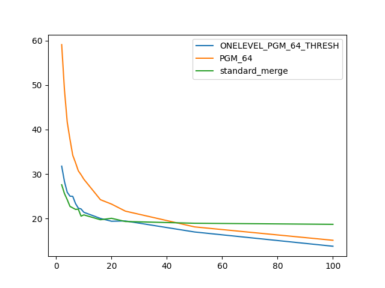
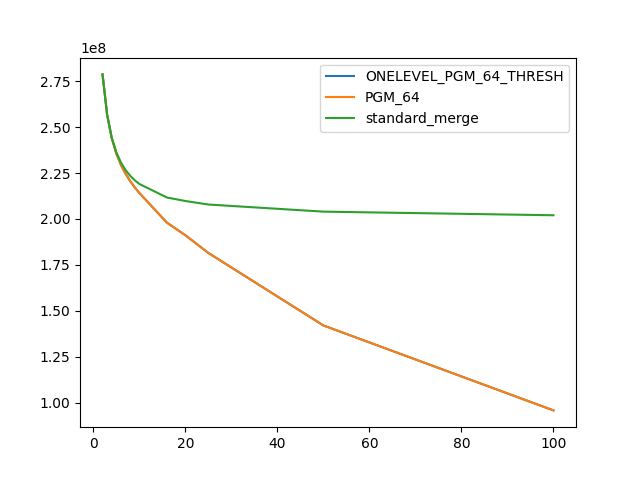

### duration_sec

|   1 |   ONELEVEL_PGM_64_THRESH |   PGM_64 |   standard_merge |
|----:|-------------------------:|---------:|-----------------:|
|   2 |                  31.7834 |  59.088  |          27.6041 |
|   3 |                  28.3221 |  48.9092 |          25.6158 |
|   4 |                  25.9187 |  41.6833 |          24.2533 |
|   5 |                  25.0368 |  37.7835 |          22.7364 |
|   6 |                  24.991  |  34.2252 |          22.4026 |
|   7 |                  23.3793 |  32.5601 |          22.0671 |
|   8 |                  22.3493 |  30.7412 |          22.122  |
|   9 |                  22.1625 |  29.8539 |          20.5478 |
|  10 |                  21.416  |  28.8516 |          20.8305 |
|  16 |                  20.035  |  24.2425 |          19.7435 |
|  20 |                  19.4036 |  23.26   |          20.063  |
|  25 |                  19.4683 |  21.6764 |          19.3455 |
|  50 |                  16.9917 |  18.1354 |          18.9526 |
| 100 |                  13.7856 |  15.1223 |          18.7089 |

### comparison_count

|   1 |   ONELEVEL_PGM_64_THRESH |      PGM_64 |   standard_merge |
|----:|-------------------------:|------------:|-----------------:|
|   2 |              2.78689e+08 | 2.78689e+08 |      2.78698e+08 |
|   3 |              2.5661e+08  | 2.5661e+08  |      2.56697e+08 |
|   4 |              2.43926e+08 | 2.43926e+08 |      2.4424e+08  |
|   5 |              2.35536e+08 | 2.35536e+08 |      2.36252e+08 |
|   6 |              2.29409e+08 | 2.29409e+08 |      2.30704e+08 |
|   7 |              2.24604e+08 | 2.24604e+08 |      2.26622e+08 |
|   8 |              2.20619e+08 | 2.20619e+08 |      2.23501e+08 |
|   9 |              2.17184e+08 | 2.17184e+08 |      2.21033e+08 |
|  10 |              2.14095e+08 | 2.14095e+08 |      2.19032e+08 |
|  16 |              1.97941e+08 | 1.97941e+08 |      2.11647e+08 |
|  20 |              1.91118e+08 | 1.91118e+08 |      2.09754e+08 |
|  25 |              1.81465e+08 | 1.81465e+08 |      2.07842e+08 |
|  50 |              1.41984e+08 | 1.41984e+08 |      2.0396e+08  |
| 100 |              9.57224e+07 | 9.57224e+07 |      2.0199e+08  |

